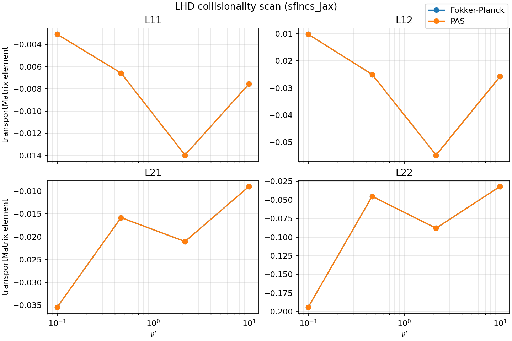
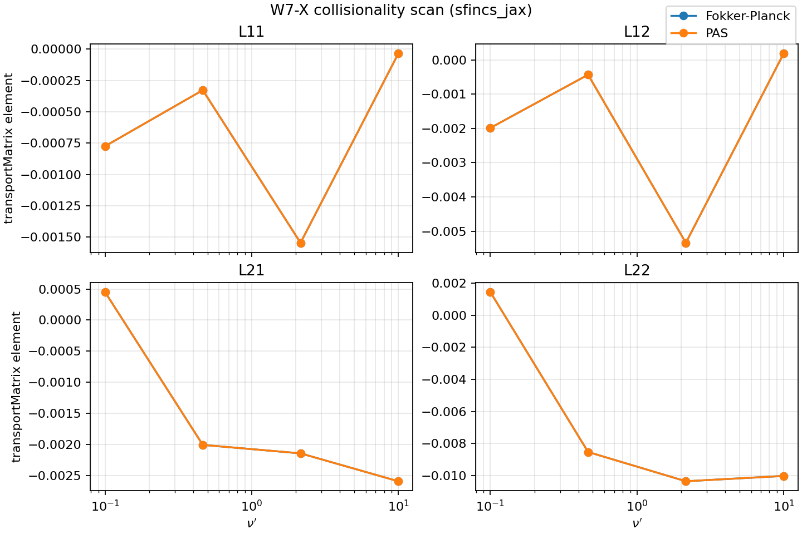
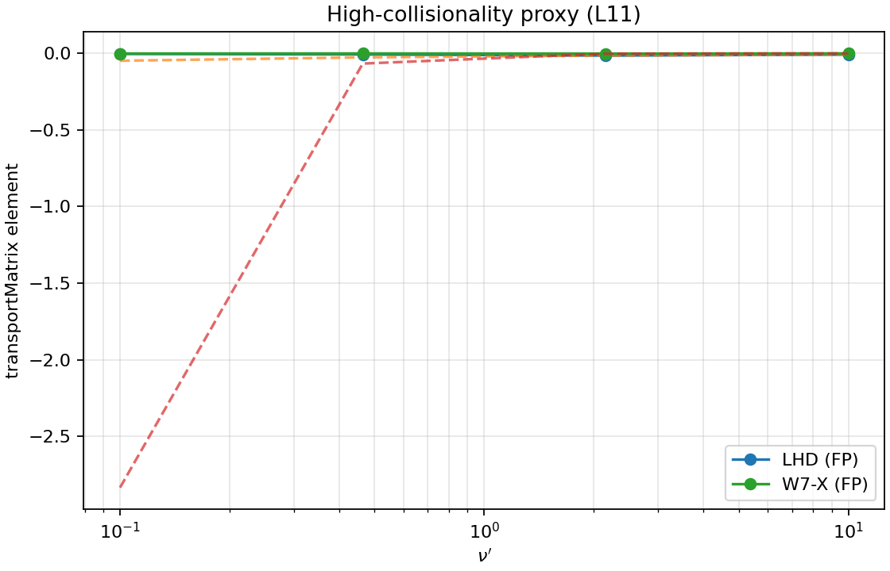

# sfincs_jax

`sfincs_jax` is a JAX implementation of the SFINCS Fortran v3 workflow, with matrix-free operators,
JIT acceleration, and end-to-end differentiable components for sensitivity and optimization studies.
Default RHSMode=1 linear solves use GMRES (incremental, parity-first) with stage-2 fallback,
while RHSMode=2/3 transport solves default to BiCGStab with a collision-diagonal preconditioner
and GMRES fallback. Implicit differentiation is enabled by default for linear solves, and
preconditioner blocks use size-based mixed precision by default for memory efficiency.


Top figure: four monoenergetic test cases (`geometryScheme=1`, `11`, `12`, and filtered `5`) comparing
relative `ΔL11 = (JAX − Fortran) / Fortran` and per-run runtime.
For the JAX path, runtime excludes compilation (warm-up run excluded).

Reproduce the figure and JSON summary:

```bash
python examples/performance/benchmark_transport_l11_vs_fortran.py --repeats 4
```

Run against a live local Fortran executable:

```bash
python examples/performance/benchmark_transport_l11_vs_fortran.py \
  --fortran-exe /path/to/sfincs \
  --repeats 4
```

Current benchmark snapshot (Fortran source: live executable, 4 repeats; JAX runtime excludes compilation):

| Case | Fortran mean (s/run) | sfincs_jax mean (s/run) | Max \|ΔL11\| |
| --- | ---: | ---: | ---: |
| scheme1 | 0.2866 | 0.1774 | 2.16e-13 |
| scheme11 | 0.2382 | 0.2103 | 1.31e-15 |
| scheme12 | 0.0761 | 0.1896 | 8.82e-08 |
| scheme5_filtered | 0.0912 | 0.2015 | 5.30e-16 |

Snapshot note: when running with a local Fortran binary, PETSc MPIUNI (serial, no MUMPS) avoids MPI init issues in sandboxed runs.

Outputs are written to:

- `examples/performance/output/transport_l11_vs_fortran/sfincs_vs_sfincs_jax_l11_runtime_2x2.png`
- `examples/performance/output/transport_l11_vs_fortran/sfincs_vs_sfincs_jax_l11_runtime_2x2.json`

Persistent-cache compile/runtime split (same four cases):

```bash
python examples/performance/profile_transport_compile_runtime_cache.py --repeats 3
```

- Figure: `examples/performance/output/compile_runtime_cache/transport_compile_runtime_cache_2x2.png`
- JSON: `examples/performance/output/compile_runtime_cache/transport_compile_runtime_cache_2x2.json`

Small dense fallback assemblies now skip JIT for modest matrix sizes (`n<=800`) to
reduce overhead in tiny PAS/transport cases while keeping large systems compiled.

## Parallel Scaling (Macbook M3 Max)

Parallel `whichRHS` scaling for an extra‑large RHSMode=2 transport‑matrix case
(`examples/performance/transport_parallel_xlarge.input.namelist`, geometryScheme=2).
Benchmark uses `SFINCS_JAX_TRANSPORT_PRECOND=xmg` to keep the single‑worker runtime
in the 1–2 minute range.


Reproduce the scaling figure and JSON summary:

```bash
python examples/performance/benchmark_transport_parallel_scaling.py \
  --workers 1 2 3 4 \
  --repeats 1 \
  --warmup 1 \
  --global-warmup 1
```

Run with explicit worker counts and a custom input:

```bash
python examples/performance/benchmark_transport_parallel_scaling.py \
  --input examples/performance/transport_parallel_xlarge.input.namelist \
  --workers 1 2 3 4 \
  --repeats 1 \
  --warmup 1 \
  --global-warmup 1

JIT note: the benchmark performs a global warm‑up and a per‑worker warm‑up so
timings exclude compilation. A persistent JAX cache is used automatically.
Override the transport preconditioner with `--precond` if needed.
```

Enable parallel whichRHS solves in normal runs:

```bash
export SFINCS_JAX_TRANSPORT_PARALLEL=process
export SFINCS_JAX_TRANSPORT_PARALLEL_WORKERS=8
```

## Installation

Install from PyPI:

```bash
pip install sfincs_jax
```

Install from source:

```bash
git clone https://github.com/uwplasma/sfincs_jax.git
cd sfincs_jax
pip install .
```

Development install:

```bash
git clone https://github.com/uwplasma/sfincs_jax.git
cd sfincs_jax
pip install -e ".[dev]"
```

Optional extras:

```bash
pip install -e ".[docs]"   # documentation build
pip install -e ".[viz]"    # plotting / figure scripts
pip install -e ".[opt]"    # optax / jaxopt workflows
```

## What the code supports

- v3 grid construction (`theta`, `zeta`, Stieltjes/polynomial `x`, monoenergetic `x=1` path)
- Geometry pipelines for `geometryScheme in {1,2,4,5,11,12}`
- Matrix-free v3 full-system operator, RHS, and residual assembly in JAX
- Linear solves via GMRES (default for RHSMode=1) with BiCGStab optional; transport-matrix
  (`RHSMode=2/3`) loops default to BiCGStab with collision-diagonal preconditioning
- Implicit-diff linear solves via `jax.lax.custom_linear_solve` (default for RHSMode=1 + transport)
- Transport-matrix recycling warm starts (optional, `SFINCS_JAX_TRANSPORT_RECYCLE_K`)
- `sfincsOutput.h5` writing from Python and CLI
- Parity tests against frozen Fortran fixtures (PETSc binaries and `sfincsOutput.h5`)
- Differentiable operator and solve-adjacent workflows (including implicit-diff helper APIs)

Detailed parity inventory and dataset coverage:

- `docs/parity.rst`
- `docs/outputs.rst`
- `docs/fortran_examples.rst`

## Parallelism

Multi-core and multi-device usage is documented in:

- `docs/parallelism.rst`

Highlights:

- Parallel `whichRHS` transport solves via `SFINCS_JAX_TRANSPORT_PARALLEL=process`.
- Parallel suite/scan runs via `python scripts/run_reduced_upstream_suite.py --jobs N`.
- Experimental sharded matvec via `SFINCS_JAX_MATVEC_SHARD_AXIS=theta|zeta`.

## Quick start (Python)

```python
from sfincs_jax.namelist import read_sfincs_input
from sfincs_jax.v3 import grids_from_namelist, geometry_from_namelist

nml = read_sfincs_input("input.namelist")
grids = grids_from_namelist(nml)
geometry = geometry_from_namelist(nml=nml, grids=grids)
print(geometry.b_hat.shape)
```

## Differentiability

The core operator, residual, and Krylov solves are implemented in JAX and are end-to-end
differentiable when you build inputs directly via the Python API. File I/O, VMEC/Boozer
parsing, and SciPy-based solver-history logging use NumPy and are not differentiable.
For gradients, supply inputs as JAX arrays and disable history logging
(``SFINCS_JAX_FORTRAN_STDOUT=0`` and ``SFINCS_JAX_SOLVER_ITER_STATS=0``).

## CLI

Write SFINCS-style output:

```bash
sfincs_jax write-output --input /path/to/input.namelist --out sfincsOutput.h5
```

Solve a supported v3 linear case (`RHSMode=1`) and save the state:

```bash
sfincs_jax solve-v3 --input /path/to/input.namelist --out-state stateVector.npy
```

Compute transport matrix (`RHSMode=2/3`):

```bash
sfincs_jax transport-matrix-v3 --input /path/to/input.namelist --out-matrix transportMatrix.npy
```

Compare two `sfincsOutput.h5` files key-by-key:

```bash
sfincs_jax compare-h5 --a sfincsOutput_jax.h5 --b sfincsOutput_fortran.h5
```

## Examples

`examples/` is organized by workflow category:

- `examples/getting_started/`: API/CLI fundamentals
- `examples/parity/`: fixture parity and validation runs
- `examples/transport/`: RHSMode=2/3 + postprocessing workflows
- `examples/autodiff/`: Jacobian-vector products, sensitivity, implicit differentiation
- `examples/optimization/`: optimization loops using JAX ecosystem tools
- `examples/performance/`: timing and JIT benchmarks
- `examples/publication_figures/`: polished figure generation
- `examples/sfincs_examples/`: vendored upstream Fortran v3 examples + helper runner

Try these first:

```bash
python examples/getting_started/build_grids_and_geometry.py
python examples/getting_started/write_sfincs_output_python.py
python examples/parity/output_parity_vs_fortran_fixture.py
python examples/autodiff/autodiff_er_xidot_term.py
python examples/transport/transport_matrix_rhsmode2_and_rhsmode3.py
python examples/transport/transport_matrix_recycle_demo.py
python examples/autodiff/implicit_diff_through_gmres_solve_scheme5.py --solver bicgstab
```

## Utils (ported upstream scripts)

The repository root `utils/` folder ports the full SFINCS v3 `utils` suite to
`sfincs_jax`. Every script runs via a Python driver (`utils/sfincs_jax_driver.py`)
and never calls the Fortran executable. Plotting and scan workflows produce the
same figure layouts as upstream.

Generate a small gallery:

```bash
python examples/utils/generate_utils_gallery.py
```

Add `--fast` for a quick pass or `--timeout-s <seconds>` to cap each step.

Reproduced SFINCS paper figures (generated by sfincs_jax, lower resolution for quick reference):

```bash
python examples/publication_figures/generate_sfincs_paper_figs.py --fast
```





The utilities honor the upstream `!ss` scan directives in `input.namelist`
(see `docs/utils.rst`) and produce the same scan layouts as the original
SFINCS v3 scripts.

## Upstream SFINCS compatibility and parity status

The repository vendors the upstream Fortran v3 example suite under `examples/sfincs_examples/`.
A generated status table reports, for every upstream example input:

1. whether `sfincs_jax` writes an output file for that input,
2. whether exact output parity for that exact input is verified in-repo,
3. and the reason when parity is not currently verified.

See:

- `docs/fortran_examples.rst`
- `docs/_generated/fortran_examples_output_status.rst`

Regenerate that table:

```bash
python scripts/generate_fortran_example_output_status.py
```

For fast parity iteration on reduced-resolution copies of the full upstream suite:

```bash
python scripts/run_reduced_upstream_suite.py --timeout-s 120 --max-attempts 1 --jax-repeats 2
```

The reduced-suite runner enables a persistent JAX compilation cache by default at
`tests/reduced_upstream_examples/.jax_compilation_cache` (override with `--jax-cache-dir`).
The CLI also defaults to a user cache directory (`~/.cache/sfincs_jax/jax_compilation_cache`)
and auto-enables JAX's persistent compilation cache unless explicitly disabled.

Target a specific case while preserving the 30s adaptive policy:

```bash
python scripts/run_reduced_upstream_suite.py --pattern 'geometryScheme5_3species_loRes' --timeout-s 120 --max-attempts 1
```

The latest reduced-suite status table is written to:

- `docs/_generated/reduced_upstream_suite_status.rst`
- `docs/_generated/reduced_upstream_suite_status_strict.rst`

And machine-readable reports are written to:

- `tests/reduced_upstream_examples/suite_report.json` (practical)
- `tests/reduced_upstream_examples/suite_report_strict.json` (strict)

Current reduced-suite snapshot (latest run):

- **Practical:** 38/38 parity_ok.
- **Strict:** 38/38 parity_ok (strict mode ignores per-case tolerance overrides; see `docs/_generated/reduced_upstream_suite_status_strict.rst`).
- **Print parity:** 38/38 cases (all emitted signals match; 7/7 or 9/9 depending on case).

Strict-mode mismatches (reduced suite, rtol=5e-4, atol=1e-10): none.

### Reduced-suite outputs and mismatches (all upstream examples, reduced resolution)

Each reduced-resolution upstream example produces the following outputs for the listed input:

- Fortran: `sfincsOutput.h5`, `sfincs.log`
- sfincs_jax: `sfincsOutput_jax.h5`, `sfincs_jax.log`

The table below enumerates every upstream example in the reduced suite, the outputs produced,
the Fortran vs `sfincs_jax` runtimes, and the number of mismatches relative to Fortran output
(`bad/total`, rtol=5e-4, atol=1e-10). The `sfincs_jax` runtime is reported as the **warm** runtime
(mean of repeats after the first run when `--jax-repeats > 1`), with persistent compilation cache enabled.
Stdout print parity signals are 7/7 or 9/9 depending on case.

Regenerate the README table after a new reduced-suite run:

```bash
python scripts/generate_readme_reduced_suite_table.py
```

<!-- BEGIN REDUCED_SUITE_TABLE -->
| Case | Fortran outputs | sfincs_jax outputs | Fortran(s) | sfincs_jax(s) | Fortran MB | sfincs_jax MB | JAX iters | Mismatches (practical/strict) | Print parity |
| --- | --- | --- | ---: | ---: | ---: | ---: | ---: | --- | --- |
| HSX_FPCollisions_DKESTrajectories | sfincsOutput.h5, sfincs.log | sfincsOutput_jax.h5, sfincs_jax.log | 0.041 | 6.494 | - | 527.6 | - | 0/193 (strict 0/193) | 9/9 |
| HSX_FPCollisions_fullTrajectories | sfincsOutput.h5, sfincs.log | sfincsOutput_jax.h5, sfincs_jax.log | 0.109 | 3.296 | - | 1340.3 | - | 0/193 (strict 0/193) | 9/9 |
| HSX_PASCollisions_DKESTrajectories | sfincsOutput.h5, sfincs.log | sfincsOutput_jax.h5, sfincs_jax.log | - | 8.488 | - | 3224.8 | - | 0/122 (strict 0/122) | 4/4 |
| HSX_PASCollisions_fullTrajectories | sfincsOutput.h5, sfincs.log | sfincsOutput_jax.h5, sfincs_jax.log | - | - | - | - | - | parity_ok | - |
| filteredW7XNetCDF_2species_magneticDrifts_noEr | sfincsOutput.h5, sfincs.log | sfincsOutput_jax.h5, sfincs_jax.log | - | 19.895 | - | 1658.0 | - | 0/122 (strict 0/122) | 4/4 |
| filteredW7XNetCDF_2species_magneticDrifts_withEr | sfincsOutput.h5, sfincs.log | sfincsOutput_jax.h5, sfincs_jax.log | - | 5.278 | - | 1085.2 | - | 0/122 (strict 0/122) | 7/7 |
| filteredW7XNetCDF_2species_noEr | sfincsOutput.h5, sfincs.log | sfincsOutput_jax.h5, sfincs_jax.log | - | 2.649 | - | 553.6 | - | 0/122 (strict 0/122) | 7/7 |
| geometryScheme4_1species_PAS_withEr_DKESTrajectories | sfincsOutput.h5, sfincs.log | sfincsOutput_jax.h5, sfincs_jax.log | - | 19.270 | - | 3374.8 | - | 0/134 (strict 0/134) | 4/4 |
| geometryScheme4_2species_PAS_noEr | sfincsOutput.h5, sfincs.log | sfincsOutput_jax.h5, sfincs_jax.log | 1.698 | - | - | - | - | parity_ok | - |
| geometryScheme4_2species_noEr | sfincsOutput.h5, sfincs.log | sfincsOutput_jax.h5, sfincs_jax.log | - | 4.247 | - | 670.9 | - | 0/134 (strict 0/134) | 4/4 |
| geometryScheme4_2species_noEr_withPhi1InDKE | sfincsOutput.h5, sfincs.log | sfincsOutput_jax.h5, sfincs_jax.log | - | - | - | - | - | parity_ok | - |
| geometryScheme4_2species_noEr_withQN | sfincsOutput.h5, sfincs.log | sfincsOutput_jax.h5, sfincs_jax.log | - | - | - | - | - | parity_ok | - |
| geometryScheme4_2species_withEr_fullTrajectories | sfincsOutput.h5, sfincs.log | sfincsOutput_jax.h5, sfincs_jax.log | - | 3.275 | - | 521.7 | - | 0/122 (strict 0/122) | 4/4 |
| geometryScheme4_2species_withEr_fullTrajectories_withQN | sfincsOutput.h5, sfincs.log | sfincsOutput_jax.h5, sfincs_jax.log | - | - | - | - | - | parity_ok | - |
| geometryScheme5_3species_loRes | sfincsOutput.h5, sfincs.log | sfincsOutput_jax.h5, sfincs_jax.log | 0.316 | 3.579 | - | 1776.8 | - | 0/193 (strict 0/193) | 9/9 |
| inductiveE_noEr | sfincsOutput.h5, sfincs.log | sfincsOutput_jax.h5, sfincs_jax.log | 0.064 | 17.700 | - | 1031.3 | - | 0/207 (strict 0/207) | 9/9 |
| monoenergetic_geometryScheme1 | sfincsOutput.h5, sfincs.log | sfincsOutput_jax.h5, sfincs_jax.log | 0.102 | 1.595 | - | 1497.3 | - | 0/203 (strict 0/203) | 9/9 |
| monoenergetic_geometryScheme11 | sfincsOutput.h5, sfincs.log | sfincsOutput_jax.h5, sfincs_jax.log | - | - | - | - | - | parity_ok | - |
| monoenergetic_geometryScheme5_ASCII | sfincsOutput.h5, sfincs.log | sfincsOutput_jax.h5, sfincs_jax.log | - | - | - | - | - | 0/208 (strict 0/208) | - |
| monoenergetic_geometryScheme5_netCDF | sfincsOutput.h5, sfincs.log | sfincsOutput_jax.h5, sfincs_jax.log | - | - | - | - | - | 0/208 (strict 0/208) | - |
| quick_2species_FPCollisions_noEr | sfincsOutput.h5, sfincs.log | sfincsOutput_jax.h5, sfincs_jax.log | 0.099 | 17.972 | - | 1023.7 | - | 0/207 (strict 0/207) | 9/9 |
| sfincsPaperFigure3_geometryScheme11_FPCollisions_2Species_DKESTrajectories | sfincsOutput.h5, sfincs.log | sfincsOutput_jax.h5, sfincs_jax.log | - | 3.437 | - | 650.1 | - | 0/134 (strict 0/134) | 4/4 |
| sfincsPaperFigure3_geometryScheme11_FPCollisions_2Species_fullTrajectories | sfincsOutput.h5, sfincs.log | sfincsOutput_jax.h5, sfincs_jax.log | - | - | - | - | - | 0/207 (strict 0/207) | - |
| sfincsPaperFigure3_geometryScheme11_PASCollisions_2Species_DKESTrajectories | sfincsOutput.h5, sfincs.log | sfincsOutput_jax.h5, sfincs_jax.log | - | 6.222 | - | 1609.7 | - | 0/134 (strict 0/134) | 4/4 |
| sfincsPaperFigure3_geometryScheme11_PASCollisions_2Species_fullTrajectories | sfincsOutput.h5, sfincs.log | sfincsOutput_jax.h5, sfincs_jax.log | - | - | - | - | - | parity_ok | - |
| tokamak_1species_FPCollisions_noEr | sfincsOutput.h5, sfincs.log | sfincsOutput_jax.h5, sfincs_jax.log | - | - | - | - | - | parity_ok | - |
| tokamak_1species_FPCollisions_noEr_withPhi1InDKE | sfincsOutput.h5, sfincs.log | sfincsOutput_jax.h5, sfincs_jax.log | 0.536 | - | - | - | - | parity_ok | - |
| tokamak_1species_FPCollisions_noEr_withQN | sfincsOutput.h5, sfincs.log | sfincsOutput_jax.h5, sfincs_jax.log | - | - | - | - | - | parity_ok | - |
| tokamak_1species_FPCollisions_withEr_DKESTrajectories | sfincsOutput.h5, sfincs.log | sfincsOutput_jax.h5, sfincs_jax.log | - | - | - | - | - | 0/141 (strict 0/141) | - |
| tokamak_1species_FPCollisions_withEr_fullTrajectories | sfincsOutput.h5, sfincs.log | sfincsOutput_jax.h5, sfincs_jax.log | 14.611 | - | - | - | - | parity_ok | - |
| tokamak_1species_PASCollisions_noEr | sfincsOutput.h5, sfincs.log | sfincsOutput_jax.h5, sfincs_jax.log | - | 117.506 | - | 4604.3 | - | 0/139 (strict 0/139) | 4/4 |
| tokamak_1species_PASCollisions_noEr_Nx1 | sfincsOutput.h5, sfincs.log | sfincsOutput_jax.h5, sfincs_jax.log | - | 22.771 | - | 4497.7 | - | 0/139 (strict 0/139) | 4/4 |
| tokamak_1species_PASCollisions_noEr_withQN | sfincsOutput.h5, sfincs.log | sfincsOutput_jax.h5, sfincs_jax.log | - | - | - | - | - | parity_ok | - |
| tokamak_1species_PASCollisions_withEr_fullTrajectories | sfincsOutput.h5, sfincs.log | sfincsOutput_jax.h5, sfincs_jax.log | - | - | - | - | - | parity_ok | - |
| tokamak_2species_PASCollisions_noEr | sfincsOutput.h5, sfincs.log | sfincsOutput_jax.h5, sfincs_jax.log | - | - | - | - | - | parity_ok | - |
| tokamak_2species_PASCollisions_withEr_fullTrajectories | sfincsOutput.h5, sfincs.log | sfincsOutput_jax.h5, sfincs_jax.log | - | - | - | - | - | parity_ok | - |
| transportMatrix_geometryScheme11 | sfincsOutput.h5, sfincs.log | sfincsOutput_jax.h5, sfincs_jax.log | - | - | - | - | - | 0/194 (strict 0/194) | - |
| transportMatrix_geometryScheme2 | sfincsOutput.h5, sfincs.log | sfincsOutput_jax.h5, sfincs_jax.log | - | 46.406 | - | 718.2 | - | 0/122 (strict 0/122) | 4/4 |
<!-- END REDUCED_SUITE_TABLE -->


For operator-level parity diagnosis against Fortran PETSc matrices:

```bash
python scripts/compare_fortran_matrix_to_jax_operator.py \
  --input /path/to/input.namelist \
  --fortran-matrix /path/to/sfincsBinary_iteration_000_whichMatrix_3 \
  --fortran-state /path/to/sfincsBinary_iteration_000_stateVector \
  --project-active-dofs \
  --out-json matrix_compare.json
```

For RHSMode=1 diagnostics isolation on a frozen state vector (to separate solver-branch
differences from postprocessing/diagnostic formulas):

```bash
python scripts/compare_rhsmode1_diagnostics_from_state.py \
  --input /path/to/input.namelist \
  --state /path/to/sfincsBinary_iteration_000_stateVector \
  --fortran-h5 /path/to/sfincsOutput.h5 \
  --out-json diagnostics_from_frozen_state.json
```

## Documentation

Build locally:

```bash
sphinx-build -b html -W docs docs/_build/html
```

Core pages:

- `docs/normalizations.rst`
- `docs/system_equations.rst`
- `docs/method.rst`
- `docs/inputs.rst`
- `docs/outputs.rst`
- `docs/performance.rst`
- `docs/examples.rst`

## Testing

Run the full test suite:

```bash
pytest -q
```

## License

See `LICENSE`.
