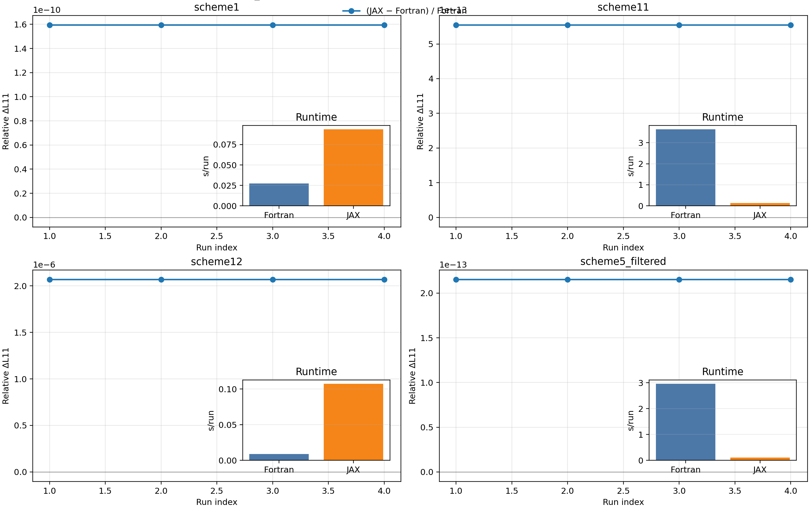

# sfincs_jax

`sfincs_jax` is a JAX implementation of the SFINCS Fortran v3 workflow, with matrix-free operators,
JIT acceleration, and end-to-end differentiable components for sensitivity and optimization studies.



Top figure: four monoenergetic test cases (`geometryScheme=1`, `11`, `12`, and filtered `5`) comparing
`L11 = transportMatrix[0,0]` and per-run runtime.
For the JAX path, runtime excludes compilation (warm-up run excluded).

Reproduce the figure and JSON summary:

```bash
python examples/performance/benchmark_transport_l11_vs_fortran.py --repeats 4
```

Outputs are written to:

- `examples/performance/output/transport_l11_vs_fortran/sfincs_vs_sfincs_jax_l11_runtime_2x2.png`
- `examples/performance/output/transport_l11_vs_fortran/sfincs_vs_sfincs_jax_l11_runtime_2x2.json`

## Installation

Install from PyPI:

```bash
pip install sfincs_jax
```

Install from source:

```bash
git clone https://github.com/uwplasma/sfincs_jax.git
cd sfincs_jax
pip install .
```

Development install:

```bash
git clone https://github.com/uwplasma/sfincs_jax.git
cd sfincs_jax
pip install -e ".[dev]"
```

Optional extras:

```bash
pip install -e ".[docs]"   # documentation build
pip install -e ".[viz]"    # plotting / figure scripts
pip install -e ".[opt]"    # optax / jaxopt workflows
```

## What the code supports

- v3 grid construction (`theta`, `zeta`, Stieltjes/polynomial `x`, monoenergetic `x=1` path)
- Geometry pipelines for `geometryScheme in {1,2,4,5,11,12}`
- Matrix-free v3 full-system operator, RHS, and residual assembly in JAX
- Linear solves via GMRES and transport-matrix (`RHSMode=2/3`) loops
- `sfincsOutput.h5` writing from Python and CLI
- Parity tests against frozen Fortran fixtures (PETSc binaries and `sfincsOutput.h5`)
- Differentiable operator and solve-adjacent workflows (including implicit-diff helper APIs)

Detailed parity inventory and dataset coverage:

- `docs/parity.rst`
- `docs/outputs.rst`
- `docs/fortran_examples.rst`

## Quick start (Python)

```python
from sfincs_jax.namelist import read_sfincs_input
from sfincs_jax.v3 import grids_from_namelist, geometry_from_namelist

nml = read_sfincs_input("input.namelist")
grids = grids_from_namelist(nml)
geometry = geometry_from_namelist(nml=nml, grids=grids)
print(geometry.b_hat.shape)
```

## CLI

Write SFINCS-style output:

```bash
sfincs_jax write-output --input /path/to/input.namelist --out sfincsOutput.h5
```

Solve a supported v3 linear case (`RHSMode=1`) and save the state:

```bash
sfincs_jax solve-v3 --input /path/to/input.namelist --out-state stateVector.npy
```

Compute transport matrix (`RHSMode=2/3`):

```bash
sfincs_jax transport-matrix-v3 --input /path/to/input.namelist --out-matrix transportMatrix.npy
```

Compare two `sfincsOutput.h5` files key-by-key:

```bash
sfincs_jax compare-h5 --a sfincsOutput_jax.h5 --b sfincsOutput_fortran.h5
```

## Examples

`examples/` is organized by workflow category:

- `examples/getting_started/`: API/CLI fundamentals
- `examples/parity/`: fixture parity and validation runs
- `examples/transport/`: RHSMode=2/3 + postprocessing workflows
- `examples/autodiff/`: Jacobian-vector products, sensitivity, implicit differentiation
- `examples/optimization/`: optimization loops using JAX ecosystem tools
- `examples/performance/`: timing and JIT benchmarks
- `examples/publication_figures/`: polished figure generation
- `examples/sfincs_examples/`: vendored upstream Fortran v3 examples + helper runner

Try these first:

```bash
python examples/getting_started/build_grids_and_geometry.py
python examples/getting_started/write_sfincs_output_python.py
python examples/parity/output_parity_vs_fortran_fixture.py
python examples/autodiff/autodiff_er_xidot_term.py
python examples/transport/transport_matrix_rhsmode2_and_rhsmode3.py
```

## Upstream SFINCS compatibility and parity status

The repository vendors the upstream Fortran v3 example suite under `examples/sfincs_examples/`.
A generated status table reports, for every upstream example input:

1. whether `sfincs_jax` writes an output file for that input,
2. whether exact output parity for that exact input is verified in-repo,
3. and the reason when parity is not currently verified.

See:

- `docs/fortran_examples.rst`
- `docs/_generated/fortran_examples_output_status.rst`

Regenerate that table:

```bash
python scripts/generate_fortran_example_output_status.py
```

## Documentation

Build locally:

```bash
sphinx-build -b html -W docs docs/_build/html
```

Core pages:

- `docs/normalizations.rst`
- `docs/system_equations.rst`
- `docs/method.rst`
- `docs/inputs.rst`
- `docs/outputs.rst`
- `docs/performance.rst`
- `docs/examples.rst`

## Testing

Run the full test suite:

```bash
pytest -q
```

## License

See `LICENSE`.
