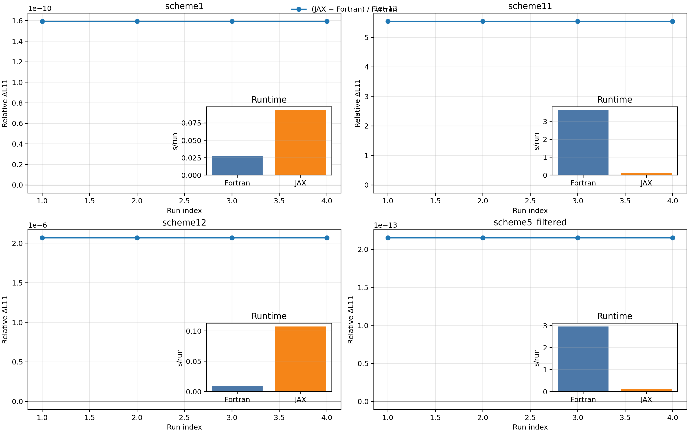
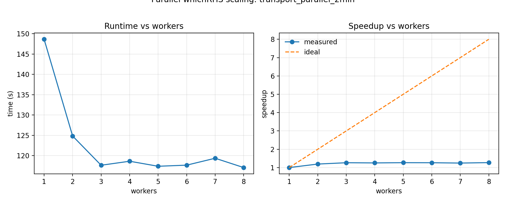

# sfincs_jax

`sfincs_jax` is a JAX implementation of the SFINCS Fortran v3 workflow, with matrix-free operators,
JIT acceleration, and end-to-end differentiable components for sensitivity and optimization studies.
Default RHSMode=1 linear solves use GMRES (incremental, parity-first) with stage-2 fallback,
while RHSMode=2/3 transport solves default to BiCGStab with a collision-diagonal preconditioner
and GMRES fallback. Implicit differentiation is enabled by default for linear solves, and
preconditioner blocks use size-based mixed precision by default for memory efficiency.



Top figure: four monoenergetic test cases (`geometryScheme=1`, `11`, `12`, and filtered `5`) comparing
relative `ΔL11 = (JAX − Fortran) / Fortran` and per-run runtime.
For the JAX path, runtime excludes compilation (warm-up run excluded).

Reproduce the figure and JSON summary:

```bash
python examples/performance/benchmark_transport_l11_vs_fortran.py --repeats 4
```

Run against a live local Fortran executable:

```bash
python examples/performance/benchmark_transport_l11_vs_fortran.py \
  --fortran-exe /path/to/sfincs \
  --repeats 4
```

Current benchmark snapshot (Fortran source: live executable, 4 repeats; JAX runtime excludes compilation):

| Case | Fortran mean (s/run) | sfincs_jax mean (s/run) | Max \|ΔL11\| |
| --- | ---: | ---: | ---: |
| scheme1 | 0.2866 | 0.1774 | 2.16e-13 |
| scheme11 | 0.2382 | 0.2103 | 1.31e-15 |
| scheme12 | 0.0761 | 0.1896 | 8.82e-08 |
| scheme5_filtered | 0.0912 | 0.2015 | 5.30e-16 |

Snapshot note: when running with a local Fortran binary, PETSc MPIUNI (serial, no MUMPS) avoids MPI init issues in sandboxed runs.

Outputs are written to:

- `examples/performance/output/transport_l11_vs_fortran/sfincs_vs_sfincs_jax_l11_runtime_2x2.png`
- `examples/performance/output/transport_l11_vs_fortran/sfincs_vs_sfincs_jax_l11_runtime_2x2.json`

Persistent-cache compile/runtime split (same four cases):

```bash
python examples/performance/profile_transport_compile_runtime_cache.py --repeats 3
```

- Figure: `examples/performance/output/compile_runtime_cache/transport_compile_runtime_cache_2x2.png`
- JSON: `examples/performance/output/compile_runtime_cache/transport_compile_runtime_cache_2x2.json`

Small dense fallback assemblies now skip JIT for modest matrix sizes (`n<=800`) to
reduce overhead in tiny PAS/transport cases while keeping large systems compiled.

## Installation

Install from PyPI:

```bash
pip install sfincs_jax
```

Install from source:

```bash
git clone https://github.com/uwplasma/sfincs_jax.git
cd sfincs_jax
pip install .
```

Development install:

```bash
git clone https://github.com/uwplasma/sfincs_jax.git
cd sfincs_jax
pip install -e ".[dev]"
```

Optional extras:

```bash
pip install -e ".[docs]"   # documentation build
pip install -e ".[viz]"    # plotting / figure scripts
pip install -e ".[opt]"    # optax / jaxopt workflows
```

## Quick start (Python)

```python
from sfincs_jax.namelist import read_sfincs_input
from sfincs_jax.v3 import grids_from_namelist, geometry_from_namelist

nml = read_sfincs_input("input.namelist")
grids = grids_from_namelist(nml)
geometry = geometry_from_namelist(nml=nml, grids=grids)
print(geometry.b_hat.shape)
```

## Parallel Scaling (Macbook M3 Max)

Parallel `whichRHS` scaling for a >2-minute RHSMode=2 transport-matrix case
(`examples/performance/transport_parallel_2min.input.namelist`, geometryScheme=2,
`Ntheta=21`, `Nzeta=21`, `Nxi=6`, `NL=6`, `Nx=6`), measured on 1–4 workers.



Latest cache-warm run (1–4 workers): 1 worker 147.4s, 2 workers 122.3s,
3 workers 115.8s, 4 workers 114.8s.

Enable parallel execution in normal runs (no environment variables required):

```bash
sfincs_jax --cores 4 /path/to/input.namelist
```

`whichRHS` process pools are persistent by default (`SFINCS_JAX_TRANSPORT_POOL_PERSIST=1`)
to reduce warm-run overhead across repeated transport solves.

Reproduce the 1-5 worker scaling figure and JSON summary:

```bash
python examples/performance/benchmark_transport_parallel_scaling.py \
  --input examples/performance/transport_parallel_2min.input.namelist \
  --workers 1 2 3 4 \
  --repeats 1 \
  --warmup 0 \
  --global-warmup 1
```

The transport scaling benchmark uses the solve-only path
(`collect_transport_output_fields=False`) so runtime reflects linear-solve
scaling rather than H5-output diagnostics assembly.

Experimental transport domain-decomposition preconditioners are available via
`SFINCS_JAX_TRANSPORT_PRECOND=theta_dd` or `zeta_dd` (block sizes:
`SFINCS_JAX_TRANSPORT_DD_BLOCK_T`, `SFINCS_JAX_TRANSPORT_DD_BLOCK_Z`), with
overlap-RAS variants `theta_schwarz` / `zeta_schwarz`
(`SFINCS_JAX_TRANSPORT_DD_OVERLAP`).

Single-RHS sharded solves now default to a communication-reduced distributed
Krylov preference (`SFINCS_JAX_DISTRIBUTED_KRYLOV=auto`, BiCGStab-first with
GMRES available via `SFINCS_JAX_DISTRIBUTED_KRYLOV=gmres`), but still need
additional communication-avoiding Krylov work to show strong scaling on
5+ CPU devices. On the current long benchmark
(`examples/performance/rhsmode1_sharded_scaling.input.namelist`, `nsolve=240`,
baseline 136.25 s at 1 core), measured sharded solve times are 98.70 s (2 cores),
105.33 s (3 cores), and 110.78 s (4 cores).

For multi-node arrays and advanced parallel modes, see `docs/parallelism.rst`.

## What the code supports

- v3 grid construction (`theta`, `zeta`, Stieltjes/polynomial `x`, monoenergetic `x=1` path)
- Geometry pipelines for `geometryScheme in {1,2,4,5,11,12}`
- Matrix-free v3 full-system operator, RHS, and residual assembly in JAX
- Linear solves via GMRES (default for RHSMode=1) with BiCGStab optional; transport-matrix
  (`RHSMode=2/3`) loops default to BiCGStab with collision-diagonal preconditioning
- Implicit-diff linear solves via `jax.lax.custom_linear_solve` (default for RHSMode=1 + transport)
- Transport-matrix recycling warm starts (optional, `SFINCS_JAX_TRANSPORT_RECYCLE_K`)
- `sfincsOutput.h5` writing from Python and CLI
- Parity tests against frozen Fortran fixtures (PETSc binaries and `sfincsOutput.h5`)
- Differentiable operator and solve-adjacent workflows (including implicit-diff helper APIs)

Detailed parity inventory and dataset coverage:

- `docs/parity.rst`
- `docs/outputs.rst`
- `docs/fortran_examples.rst`

## Solver defaults (parity + performance)

- RHSMode=1 dense fallback now defaults to `SFINCS_JAX_RHSMODE1_DENSE_FALLBACK_MAX=400`, with higher
  ceilings `SFINCS_JAX_RHSMODE1_DENSE_FP_MAX=5000` (full FP) and
  `SFINCS_JAX_RHSMODE1_DENSE_PAS_MAX=5000` (PAS/constraintScheme=2) to recover Fortran convergence
  when Krylov stagnates.
- includePhi1 runs use full Newton updates by default (matching v3). Frozen linearization is
  opt‑in via `SFINCS_JAX_PHI1_USE_FROZEN_LINEARIZATION`, and small Phi1‑collision systems use a dense
  Newton step when `SFINCS_JAX_PHI1_NK_DENSE_CUTOFF` is met.
- Transport-matrix dense retries are capped by `SFINCS_JAX_TRANSPORT_DENSE_MAX_MB=128` to avoid
  excessive memory usage.
- PAS constraint projection auto-enables for tokamak-like `N_zeta=1` cases and DKES trajectories
  to eliminate nullspace drift (see `SFINCS_JAX_PAS_PROJECT_CONSTRAINTS`).
- `SFINCS_JAX_DENSE_MAX=8000` caps direct dense solves to avoid runaway memory use.
- VMEC geometryScheme=5 full‑FP parity uses dedicated near‑zero tolerances for flow/pressure
  diagnostics; strict tables still pass at reduced-suite tolerances (see `docs/parity.rst`).

Detailed performance profiling and advanced parallel modes are documented in
`docs/performance.rst` and `docs/parallelism.rst`.

## CLI

Run a SFINCS input file (default mode, matches Fortran v3 behavior):

```bash
sfincs_jax /path/to/input.namelist
```

Write SFINCS-style output explicitly:

```bash
sfincs_jax write-output --input /path/to/input.namelist --out sfincsOutput.h5
```

Solve a supported v3 linear case (`RHSMode=1`) and save the state:

```bash
sfincs_jax solve-v3 --input /path/to/input.namelist --out-state stateVector.npy
```

Compute transport matrix (`RHSMode=2/3`):

```bash
sfincs_jax transport-matrix-v3 --input /path/to/input.namelist --out-matrix transportMatrix.npy
```

Compare two `sfincsOutput.h5` files key-by-key:

```bash
sfincs_jax compare-h5 --a sfincsOutput_jax.h5 --b sfincsOutput_fortran.h5
```

## Examples

`examples/` is organized by workflow category:

- `examples/getting_started/`: API/CLI fundamentals
- `examples/parity/`: fixture parity and validation runs
- `examples/transport/`: RHSMode=2/3 + postprocessing workflows
- `examples/autodiff/`: Jacobian-vector products, sensitivity, implicit differentiation
- `examples/optimization/`: optimization loops using JAX ecosystem tools
- `examples/performance/`: timing and JIT benchmarks
- `examples/publication_figures/`: polished figure generation
- `examples/sfincs_examples/`: vendored upstream Fortran v3 examples + helper runner

Try these first:

```bash
python examples/getting_started/build_grids_and_geometry.py
python examples/getting_started/write_sfincs_output_python.py
python examples/parity/output_parity_vs_fortran_fixture.py
python examples/autodiff/autodiff_er_xidot_term.py
python examples/transport/transport_matrix_rhsmode2_and_rhsmode3.py
python examples/transport/transport_matrix_recycle_demo.py
python examples/autodiff/implicit_diff_through_gmres_solve_scheme5.py --solver bicgstab
```

## Utils (ported upstream scripts)

The repository root `utils/` folder ports the full SFINCS v3 `utils` suite to
`sfincs_jax`. Every script runs via a Python driver (`utils/sfincs_jax_driver.py`)
and never calls the Fortran executable. Plotting and scan workflows produce the
same figure layouts as upstream.

Generate a small gallery:

```bash
python examples/utils/generate_utils_gallery.py
```

Add `--fast` for a quick pass or `--timeout-s <seconds>` to cap each step.

Reproduced SFINCS paper-style figures are documented in `docs/paper_figures.rst` and can be
generated with:

```bash
python examples/publication_figures/generate_sfincs_paper_figs.py --fast
```

The utilities honor the upstream `!ss` scan directives in `input.namelist`
(see `docs/utils.rst`) and produce the same scan layouts as the original
SFINCS v3 scripts.

## Upstream SFINCS compatibility and parity status

The repository vendors the upstream Fortran v3 example suite under `examples/sfincs_examples/`.
Key docs:

- `docs/fortran_examples.rst`
- `docs/parity.rst`

Reproduce the compatibility/parity artifacts:

```bash
python scripts/generate_fortran_example_output_status.py
python scripts/run_reduced_upstream_suite.py \
  --fortran-exe /Users/rogeriojorge/local/tests/sfincs/fortran/version3/sfincs \
  --reuse-fortran \
  --max-attempts 1 \
  --rtol 5e-4 \
  --atol 1e-9 \
  --jax-repeats 2
python scripts/generate_readme_reduced_suite_table.py
```

Latest reduced-suite snapshot (`rtol=5e-4`, `atol=1e-9`):

- **Practical parity:** 19/38 cases.
- **Strict parity:** 19/38 cases.
- **Print parity signals:** 29/38 cases.

Artifacts:

- `tests/reduced_upstream_examples/suite_report.json`
- `tests/reduced_upstream_examples/suite_report_strict.json`
- `docs/_generated/reduced_upstream_suite_status.rst`
- `docs/_generated/reduced_upstream_suite_status_strict.rst`

Reduced-suite comparison table (Fortran vs `sfincs_jax` runtimes, memory, and mismatches):

```bash
python scripts/generate_readme_reduced_suite_table.py
```

<!-- BEGIN REDUCED_SUITE_TABLE -->
| Case | Fortran CPU(s) | sfincs_jax CPU(s) | sfincs_jax GPU(s) | Fortran CPU MB | sfincs_jax CPU MB | sfincs_jax GPU MB | Mismatches (practical/strict) | Print parity |
| --- | ---: | ---: | ---: | ---: | ---: | ---: | --- | --- |
| HSX_FPCollisions_DKESTrajectories | 1.821 | 27.918 | 25.547 | 180.9 | 2009.8 | 2284.9 | 0/193 (strict 0/193) | 9/9 |
| HSX_FPCollisions_fullTrajectories | 1.931 | 23.683 | 23.686 | 154.0 | 1394.3 | 1796.6 | 0/193 (strict 0/193) | 9/9 |
| HSX_PASCollisions_DKESTrajectories | 2.677 | 155.063 | - | 494.8 | 6461.5 | - | 0/193 (strict 0/193) | 9/9 |
| HSX_PASCollisions_fullTrajectories | 12.168 | - | - | 356.1 | - | - | max_attempts | - |
| filteredW7XNetCDF_2species_magneticDrifts_noEr | 0.976 | 4.902 | 20.666 | 156.7 | 1396.1 | 1507.8 | 9/193 (strict 9/193) | 9/9 |
| filteredW7XNetCDF_2species_magneticDrifts_withEr | 0.832 | 5.352 | 26.857 | 158.2 | 1785.4 | 1533.8 | 18/193 (strict 18/193) | 9/9 |
| filteredW7XNetCDF_2species_noEr | 0.560 | 5.455 | 12.503 | 157.4 | 995.3 | 1480.1 | 20/193 (strict 20/193) | 9/9 |
| geometryScheme4_1species_PAS_withEr_DKESTrajectories | 6.758 | - | - | 474.5 | - | - | max_attempts | - |
| geometryScheme4_2species_PAS_noEr | 1.082 | 7.066 | 17.938 | 184.9 | 1067.3 | 1763.3 | 0/207 (strict 0/207) | 9/9 |
| geometryScheme4_2species_noEr | 1.044 | 6.863 | 13.606 | 161.8 | 1423.2 | 2040.9 | 0/207 (strict 0/207) | 9/9 |
| geometryScheme4_2species_noEr_withPhi1InDKE | 0.939 | 3.745 | 13.409 | 147.6 | 726.1 | 1483.2 | 1/265 (strict 1/265) | 9/9 |
| geometryScheme4_2species_noEr_withQN | 0.668 | 3.138 | 8.571 | 145.4 | 685.8 | 1453.9 | 128/265 (strict 128/265) | 9/9 |
| geometryScheme4_2species_withEr_fullTrajectories | 0.847 | 5.150 | 14.364 | 145.4 | 917.5 | 1480.6 | 0/193 (strict 0/193) | 9/9 |
| geometryScheme4_2species_withEr_fullTrajectories_withQN | 0.715 | 3.841 | 13.159 | 145.7 | 736.9 | 1497.3 | 0/251 (strict 0/251) | 9/9 |
| geometryScheme5_3species_loRes | 1.416 | 13.571 | 25.701 | 188.0 | 1601.2 | 1900.0 | 3/193 (strict 3/193) | 9/9 |
| inductiveE_noEr | 1.345 | 5.601 | 9.832 | 154.5 | 972.7 | 1498.4 | 1/207 (strict 1/207) | 9/9 |
| monoenergetic_geometryScheme1 | 1.032 | 48.776 | - | 172.3 | 552.9 | - | 0/203 (strict 0/203) | 7/9 |
| monoenergetic_geometryScheme11 | 3.471 | 8.930 | - | 247.6 | 563.5 | - | 0/208 (strict 0/208) | 7/9 |
| monoenergetic_geometryScheme5_ASCII | 1.765 | 27.164 | - | 208.7 | 557.1 | - | 0/206 (strict 0/207) | 7/9 |
| monoenergetic_geometryScheme5_netCDF | 1.852 | 27.421 | - | 208.0 | 559.4 | - | 0/206 (strict 0/207) | 7/9 |
| quick_2species_FPCollisions_noEr | 1.794 | 5.806 | 3.994 | 152.5 | 922.7 | 1438.8 | 17/207 (strict 17/207) | 9/9 |
| sfincsPaperFigure3_geometryScheme11_FPCollisions_2Species_DKESTrajectories | 0.725 | 4.750 | 8.071 | 145.4 | 708.8 | 1464.2 | 0/207 (strict 0/207) | 9/9 |
| sfincsPaperFigure3_geometryScheme11_FPCollisions_2Species_fullTrajectories | 1.303 | 7.467 | 9.686 | 154.2 | 861.5 | 1529.9 | 0/207 (strict 0/207) | 9/9 |
| sfincsPaperFigure3_geometryScheme11_PASCollisions_2Species_DKESTrajectories | 1.817 | 73.486 | - | 351.9 | 4752.8 | - | 0/207 (strict 0/207) | 9/9 |
| sfincsPaperFigure3_geometryScheme11_PASCollisions_2Species_fullTrajectories | 5.744 | 23.443 | 74.151 | 441.9 | 2374.3 | 2465.6 | 0/207 (strict 0/207) | 9/9 |
| tokamak_1species_FPCollisions_noEr | 0.437 | 8.786 | 13.565 | 146.1 | 952.2 | 1453.8 | 9/188 (strict 9/188) | 9/9 |
| tokamak_1species_FPCollisions_noEr_withPhi1InDKE | 1.173 | 6.214 | 14.420 | 146.3 | 721.0 | 1472.7 | 10/275 (strict 10/275) | 9/9 |
| tokamak_1species_FPCollisions_noEr_withQN | 0.571 | 5.566 | 11.045 | 144.9 | 717.9 | 1479.0 | 0/275 (strict 0/275) | 9/9 |
| tokamak_1species_FPCollisions_withEr_DKESTrajectories | 0.264 | 4.251 | 8.070 | 143.8 | 662.4 | 1466.8 | 0/214 (strict 0/214) | 9/9 |
| tokamak_1species_FPCollisions_withEr_fullTrajectories | 2.664 | 19.610 | 20.159 | 249.2 | 2018.6 | 2096.4 | 9/214 (strict 9/214) | 9/9 |
| tokamak_1species_PASCollisions_noEr | 2.717 | - | 42.527 | 1076.9 | - | 1758.5 | 21/212 (strict 21/212) | 9/9 |
| tokamak_1species_PASCollisions_noEr_Nx1 | 2.222 | 120.085 | 93.478 | 307.9 | 11313.7 | 3215.6 | 9/212 (strict 9/212) | 9/9 |
| tokamak_1species_PASCollisions_noEr_withQN | 6.831 | - | 140.788 | 376.4 | - | 2070.4 | 0/275 (strict 0/275) | 9/9 |
| tokamak_1species_PASCollisions_withEr_fullTrajectories | 24.928 | - | - | 526.5 | - | - | max_attempts | - |
| tokamak_2species_PASCollisions_noEr | 4.567 | 38.257 | 49.524 | 612.8 | 3207.2 | 2551.8 | 17/212 (strict 17/212) | 9/9 |
| tokamak_2species_PASCollisions_withEr_fullTrajectories | 7.455 | - | 189.125 | 358.3 | - | 1931.0 | 17/212 (strict 17/212) | 9/9 |
| transportMatrix_geometryScheme11 | 4.929 | 25.601 | - | 153.9 | 528.5 | - | 0/194 (strict 0/194) | 7/9 |
| transportMatrix_geometryScheme2 | 6.627 | 14.335 | - | 153.9 | 526.7 | - | 1/194 (strict 1/194) | 7/9 |
<!-- END REDUCED_SUITE_TABLE -->


## Documentation

Build locally:

```bash
sphinx-build -b html -W docs docs/_build/html
```

Core pages:

- `docs/normalizations.rst`
- `docs/system_equations.rst`
- `docs/method.rst`
- `docs/inputs.rst`
- `docs/outputs.rst`
- `docs/performance.rst`
- `docs/examples.rst`

## Testing

Run the full test suite:

```bash
pytest -q
```

## License

See `LICENSE`.
