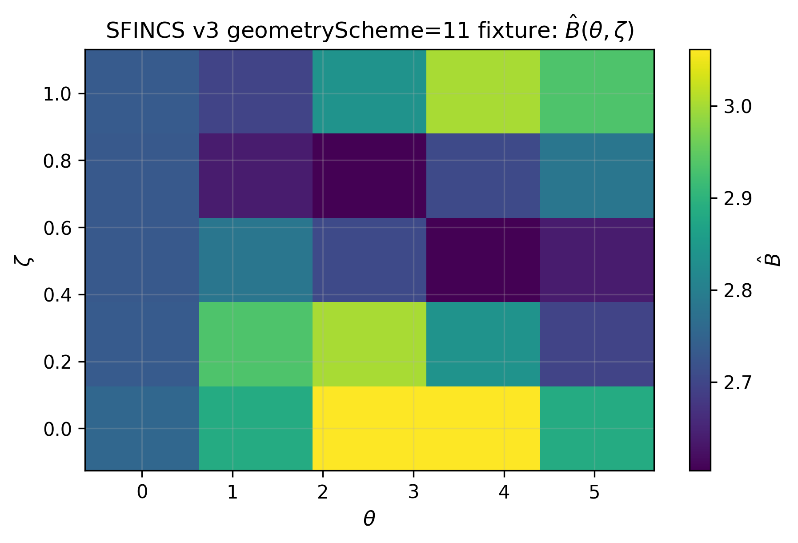

Method overview
===============

`sfincs_jax` implements the SFINCS Fortran v3 method stack in JAX, keeping
the v3 model structure while exposing matrix-free and differentiable workflows.

SFINCS (v3) computes neoclassical transport in stellarators by solving a drift-kinetic
equation (DKE) for the non-adiabatic part of the distribution function on a flux surface.
For a physics-first summary (with citations), see :doc:`physics_models`.

   Example v3 `geometryScheme=11/12` Boozer field magnitude :math:`\hat B(\theta,\zeta)` on a discrete grid.

Discretization (v3)
-------------------

SFINCS v3 uses a structured discretization that is well-suited to a JAX port:

- **Angles**: periodic grids in :math:`\theta` and :math:`\zeta` with finite-difference
  derivative matrices.
- **Speed**: a polynomial/Stieltjes grid in :math:`x` (a normalized speed-like coordinate),
  with quadrature weights used in moments/constraints.
- **Pitch angle**: a Legendre-mode expansion in :math:`\xi = v_\parallel / v`.

The primary unknown (in many modes) can be viewed as a tensor

.. math::

   f = f(s, x, L, \theta, \zeta),

where :math:`s` is the species index and :math:`L` is the Legendre index.

Geometry harmonics and resolution (v3 detail)
---------------------------------------------

For Boozer-coordinate geometries that are represented by Fourier harmonics (e.g. ``geometryScheme=11/12``),
SFINCS v3 truncates the harmonic tables to modes representable on the discrete
:math:`(\theta,\zeta)` grid. Concretely, for a grid of sizes ``Ntheta`` and ``Nzeta``,
the v3 geometry builder includes only modes satisfying

.. math::

   0 \le m \le \lfloor N_\theta/2 \rfloor,
   \qquad
   |n| \le \lfloor N_\zeta/2 \rfloor,

with additional Nyquist exclusions for sine components.

`sfincs_jax` matches this behavior when evaluating `.bc` geometries so that the resulting
arrays are consistent with the v3 Jacobian assembly at a given resolution.

Selected operator terms (ported so far)
---------------------------------------

The full v3 operator is large. `sfincs_jax` currently ports and parity-tests the following
building blocks.

Collisionless streaming + mirror (ΔL = ±1)
^^^^^^^^^^^^^^^^^^^^^^^^^^^^^^^^^^^^^^^^^^^^^^^^^^

The basic collisionless dynamics couple neighboring Legendre modes :math:`L \leftrightarrow L\pm 1`
through (i) streaming along the field line and (ii) the mirror force. These terms are
parity-tested against frozen PETSc binaries.

ExB drift terms (ΔL = 0)
^^^^^^^^^^^^^^^^^^^^^^^^^^^^

SFINCS v3 includes ExB advection in the angular directions. In the Fortran code
(`populateMatrix.F90`), these terms are assembled as dense derivative-matrix
applications in :math:`\theta` and :math:`\zeta`, with a coefficient proportional
to :math:`\partial_{\psi}\hat\Phi`.

For the default (non-DKES) form used in most parity tests, the coefficients are:

.. math::

   F_{E\times B,\theta}(\theta,\zeta)
   =
   \frac{\alpha\,\Delta\,\partial_{\psi}\hat\Phi}{2}
   \;\frac{\hat D\;\hat B_{\zeta}}{\hat B^2},
   \qquad
   F_{E\times B,\zeta}(\theta,\zeta)
   =
   -\frac{\alpha\,\Delta\,\partial_{\psi}\hat\Phi}{2}
   \;\frac{\hat D\;\hat B_{\theta}}{\hat B^2}.

In `geometryScheme=4`, :math:`\hat B_{\theta} = \hat I` is zero in the default
W7-X parameter set, so the :math:`\partial/\partial\zeta` ExB term vanishes.

Non-standard Er term in xiDot (ΔL = ±2)
^^^^^^^^^^^^^^^^^^^^^^^^^^^^^^^^^^^^^^^^

SFINCS v3 contains an additional, non-standard :math:`\partial/\partial\xi` term associated with
the radial electric field. In the Legendre basis, this term has a diagonal-in-:math:`L` piece
and couples :math:`L \leftrightarrow L\pm 2`.

In the Fortran code (`populateMatrix.F90`), the coefficient for this term is

.. math::

   F_{\xi}(\theta,\zeta) = \frac{\alpha\,\Delta\,\partial_{\psi}\hat\Phi}{4\,\hat B^3}
   \;\hat D\;\Big( \hat B_{\zeta}\,\partial_{\theta}\hat B - \hat B_{\theta}\,\partial_{\zeta}\hat B \Big),

where the hats denote v3-normalized quantities.

In the `geometryScheme=4` model used in tests, :math:`\hat B_{\theta}` is constant (and
is zero in the default W7-X parameter set), so the expression simplifies.

Collisionless Er xDot term (x-coupling and ΔL = ±2)
^^^^^^^^^^^^^^^^^^^^^^^^^^^^^^^^^^^^^^^^^^^^^^^^^^^^

When `includeXDotTerm = .true.`, v3 includes a collisionless radial-derivative term in the
kinetic equation, discretized as a dense differentiation matrix in the :math:`x` coordinate.

The v3 implementation includes:

- Dense **x-matvec** using :math:`x\,\partial/\partial x` (with optional upwinding schemes).
- Legendre couplings with :math:`L \leftrightarrow L\pm 2` (and a diagonal-in-:math:`L` piece).

In `sfincs_jax` we currently implement the default `xDotDerivativeScheme = 0`, i.e.
the same polynomial-grid differentiation matrix is used for both upwind directions.

Magnetic drift terms (ΔL = 0 and ΔL = ±2)
^^^^^^^^^^^^^^^^^^^^^^^^^^^^^^^^^^^^^^^^^^^^^^^^^^^^

SFINCS v3 includes magnetic-drift advection in the angular directions, plus an associated
non-standard :math:`\partial/\partial\xi` term.

For the v3 Jacobian assembly (`populateMatrix.F90`), the d/dtheta and d/dzeta drift terms take the form

.. math::

   \mathcal{L}_{\mathrm{md},\theta}[f]
   =
   F_{\mathrm{md}}(\theta,\zeta)\;\partial_{\theta} f
   \quad\text{(with Legendre couplings in } L\text{)},

.. math::

   \mathcal{L}_{\mathrm{md},\zeta}[f]
   =
   F_{\mathrm{md}}(\theta,\zeta)\;\partial_{\zeta} f
   \quad\text{(with Legendre couplings in } L\text{)}.

Each term includes a diagonal-in-:math:`L` piece and :math:`L\leftrightarrow L\pm 2` couplings. In the
Fortran code, the shared prefactor is

.. math::

   \mathrm{factor}(\theta,\zeta,x)
   =
   \frac{\Delta\,\hat T\,\hat D\,x^2}{2\,Z\,\hat B^3}.

For `magneticDriftScheme = 1` (the first scheme ported), the v3 code defines the geometric factors
(using v3-normalized quantities)

.. math::

   g_1^{(\theta)} = \hat B_{\zeta}\,\partial_{\psi}\hat B - \hat B_{\psi}\,\partial_{\zeta}\hat B,
   \qquad
   g_2^{(\theta)} = 2\,\hat B\,\big(\partial_{\zeta}\hat B_{\psi} - \partial_{\psi}\hat B_{\zeta}\big),

and (for the zeta drift term as implemented in `sfincs_jax` parity fixtures)

.. math::

   g_1^{(\zeta)} = \hat B_{\psi}\,\partial_{\theta}\hat B - \hat B_{\theta}\,\partial_{\psi}\hat B,
   \qquad
   g_2^{(\zeta)} = 2\,\hat B\,\big(\partial_{\psi}\hat B_{\theta} - \partial_{\theta}\hat B_{\psi}\big).

To stabilize the drift advection, v3 supports upwinded angular derivative matrices
(``ddtheta_magneticDrift_plus/minus`` and ``ddzeta_magneticDrift_plus/minus``). When
``magneticDriftDerivativeScheme != 0``, v3 selects the upwind direction at each
:math:`(\theta,\zeta)` grid point based on

.. math::

   \mathrm{use\_plus}(\theta,\zeta) = \big(g_1\,\hat D(1,1)/Z\big) > 0.

This upwind selection is implemented in `sfincs_jax.magnetic_drifts` and parity-tested against
frozen PETSc binaries for a `geometryScheme=11` fixture.

Collision operators (PAS and FP)
^^^^^^^^^^^^^^^^^^^^^^^^^^^^^^^^^^^^^^^^^^^^^^^^^^^^^^

SFINCS v3 supports two collision models controlled by ``collisionOperator``:

- ``collisionOperator = 1``: pure pitch-angle scattering (PAS) in the Legendre basis.
- ``collisionOperator = 0``: full linearized Fokker-Planck operator (Landau form), implemented via
  Rosenbluth potentials (and dense coupling in the speed coordinate :math:`x`).

For both models, the operator is diagonal in :math:`(\theta,\zeta)` and diagonal in the Legendre index :math:`L`.
For a fixed :math:`L`, the action can be written as a dense x-space matrix-vector product that couples species:

.. math::

   (\mathcal{C} f)_{a, i, L, \theta, \zeta}
   =
   \sum_b\sum_j
   \mathsf{C}^{(L)}_{a b, i j}\; f_{b, j, L, \theta, \zeta}.

In the v3 matrix assembly, the overall normalization is applied via ``nu_n`` (see ``populateMatrix.F90``).
In `sfincs_jax`, this model is implemented in `sfincs_jax.collisions` and parity-tested by comparing a full
F-block matvec against a frozen PETSc Jacobian for the v3 example ``quick_2species_FPCollisions_noEr``.

Poloidally varying collisions (Phi1 in the collision operator)
~~~~~~~~~~~~~~~~~~~~~~~~~~~~~~~~~~~~~~~~~~~~~~~~~~~~~~~~~~~~~~

When ``includePhi1InCollisionOperator = .true.`` (and ``includePhi1InKineticEquation = .true.``), v3 modifies the
collision operator coefficients through a poloidally varying effective density

.. math::

   n_a^{\mathrm{pol}}(\theta,\zeta) = n_a \exp\left(-\frac{Z_a \alpha}{T_a}\,\Phi_1(\theta,\zeta)\right),

so that the Fokker--Planck operator remains diagonal in :math:`(\theta,\zeta)` but is no longer uniform on the
flux surface.

In `sfincs_jax`, the corresponding matrix-free operator is implemented as
`sfincs_jax.collisions.FokkerPlanckV3Phi1Operator` and parity-tested against a frozen v3 PETSc matrix for the
fixture ``fp_1species_FPCollisions_noEr_tiny_withPhi1_inCollision``. For derivations and implementation details,
see the vendored upstream note linked from `docs/upstream_docs.rst`.

Why JAX?
--------

Porting to JAX enables:

- **JIT compilation** (CPU/GPU) of the operator application and solver kernels.
- **Automatic differentiation** through geometry, collision operators, and eventually the
  full kinetic solve (useful for sensitivity studies and gradient-based optimization).
- **Matrix-free linear algebra**: express the v3 Jacobian as a matvec rather than assembling
  sparse matrices, enabling scalable iterative solvers.
- An ecosystem of tools that become natural once the compute graph is differentiable:

  - `jaxopt` for implicit differentiation and robust root/linear solvers.
  - `optax` for gradient-based optimization loops (calibration, inverse problems).
  - `equinox` for clean, testable module organization and parameter handling.

Parity-first strategy
---------------------

The v3 codebase is large, so `sfincs_jax` is built in small parity-checked slices:

1. Port a well-scoped subsystem (grid, geometry piece, operator term).
2. Add a test that compares against frozen Fortran v3 reference data.
3. Only then expand functionality.

This approach keeps the port correct and refactorable while still moving quickly.

Matrix-free residual and Jacobian application
---------------------------------------------

For iterative solvers and implicit differentiation, it is useful to work with a residual
function rather than an assembled sparse matrix. For the (linear) v3 F-block this residual is

.. math::

   r(x) = A x - b,

where :math:`A` is represented by a matrix-free matvec and :math:`b` is a right-hand side.

In `sfincs_jax`, the residual interface lives in `sfincs_jax.residual`:

- :class:`sfincs_jax.residual.V3FBlockLinearSystem` computes ``residual(x)`` and
  provides a matrix-free Jacobian matvec ``jacobian_matvec(v)``.
- :class:`sfincs_jax.residual.V3FullLinearSystem` provides the same interface for the
  (currently supported subset of the) full v3 linear system operator.
- For linear operators, the Jacobian matvec is identical to the operator matvec; for nonlinear
  residuals later in the port, `jax.jvp` provides an efficient Jacobian-vector product (JVP)
  without ever forming a dense or sparse Jacobian matrix.
