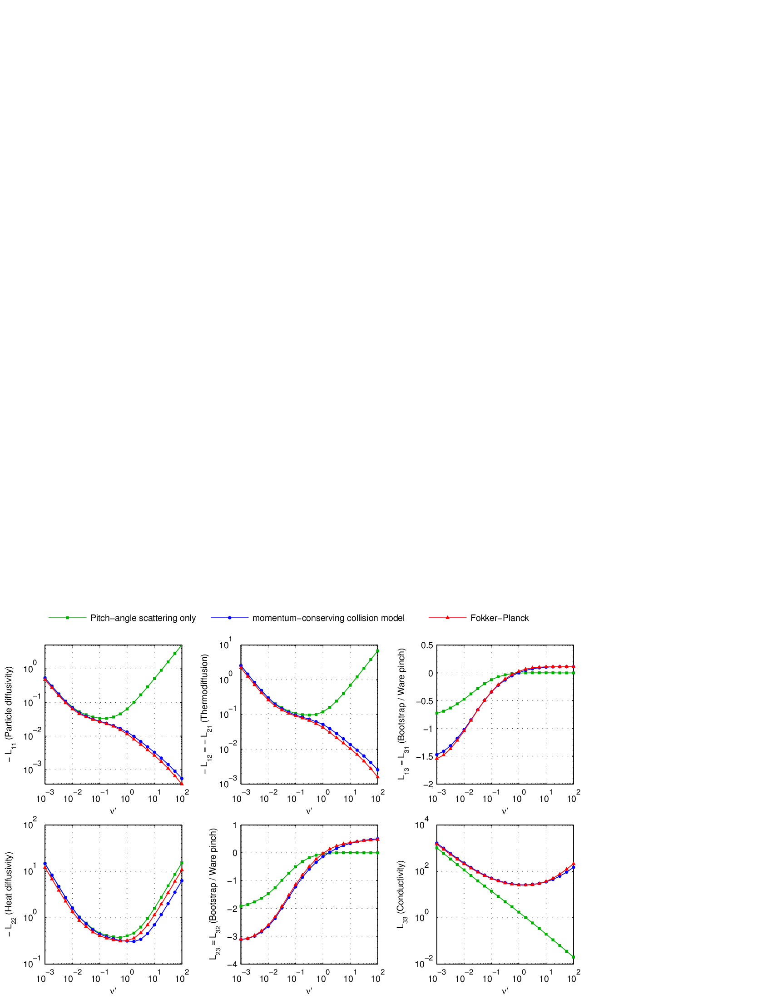
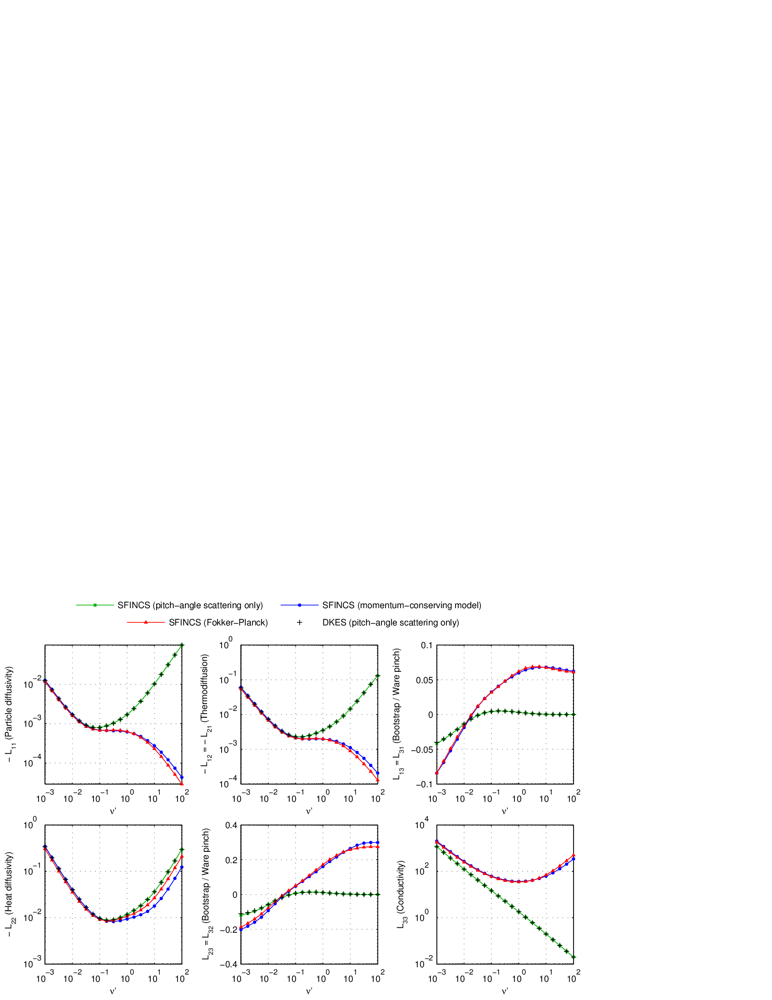
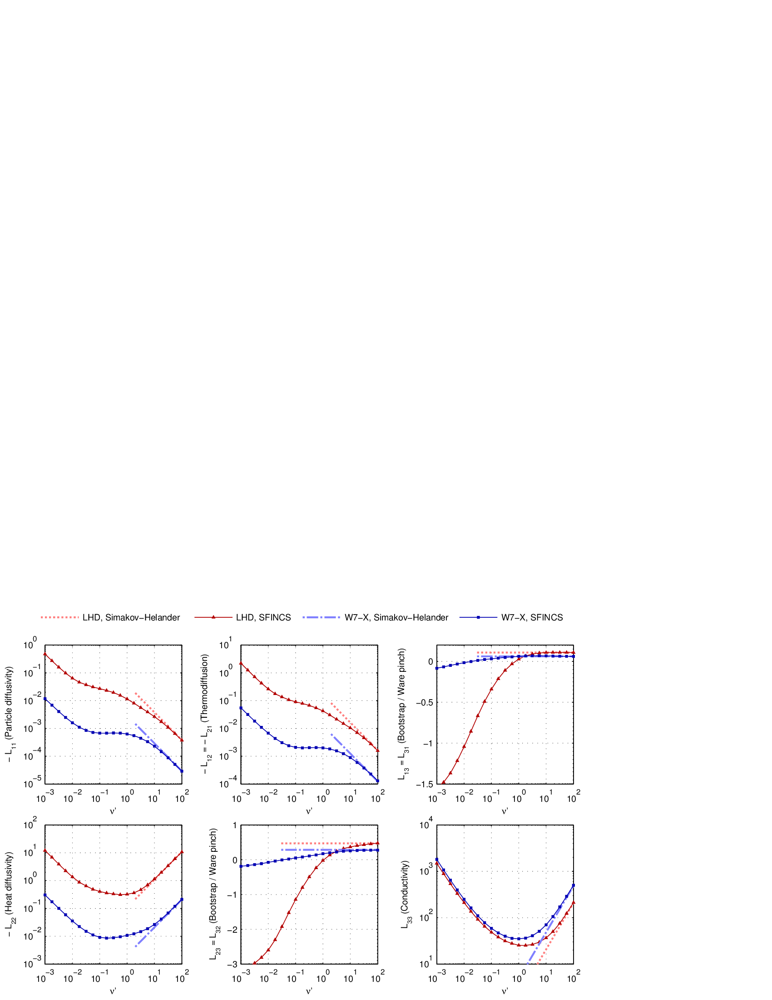

Paper figures (reproduced)
==========================

This page includes low-resolution reproductions of key figures from the original SFINCS v3
paper (sources in ``docs/upstream/sfincsPaper``). The intent is to provide quick visual
targets for parity and regression checks, not publication-quality images.

Figure 1 (LHD collisionality scan)
---------------------------------

   Ion transport matrix elements vs collisionality for LHD geometry at ``E_r = 0``.

Figure 2 (W7-X collisionality scan)
----------------------------------

   Ion transport matrix elements vs collisionality for W7-X geometry at ``E_r = 0``.

Figure 3 (Simakov–Helander limits)
----------------------------------

   Comparison of SFINCS Fokker–Planck results with analytic high-collisionality limits.
