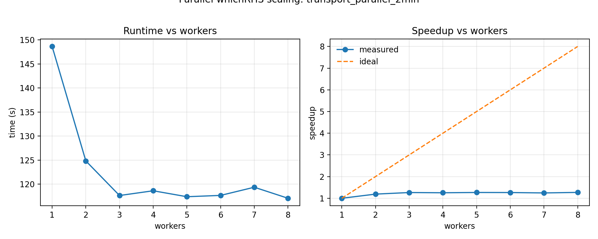
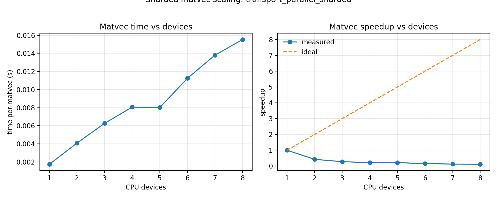
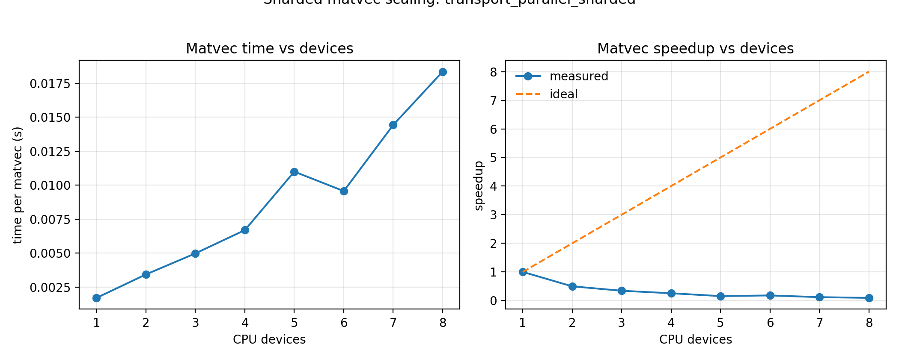
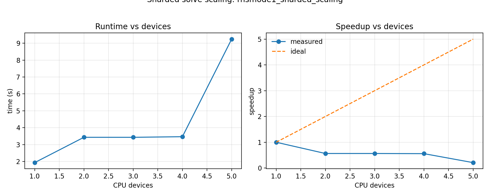

Parallelism
===========

This page explains how parallelism works in **SFINCS** and **sfincs_jax**, and how to
use it on a laptop (multi‑core CPU) and on clusters (multi‑CPU / multi‑GPU).

Why parallelism matters
-----------------------

Neoclassical transport solves are dominated by large, coupled linear systems. Even
with aggressive JIT and preconditioning, wall‑time scales roughly with the number
of Krylov iterations times the cost of each matvec. Parallelism is the primary way
to reduce time‑to‑solution once the single‑device kernels are efficient.

Two distinct patterns matter:

- **Embarrassingly parallel**: independent solves that can run concurrently
  (multiple `whichRHS`, multiple scan points, multiple cases).
- **Distributed linear algebra**: a single large linear system is split across
  devices to reduce per‑solve time.

Parallelism in JAX
------------------

JAX supports two broad modes of parallelism:

- **Multi‑process**: Run independent problems in separate Python processes. This is
  the simplest and most robust path on CPUs (and also works for GPUs if each
  process is pinned to a device).
- **SPMD / sharding**: Use `pjit` and sharded arrays to split a *single* linear
  system across multiple devices. This gives true per‑solve scaling but requires
  explicit sharding rules.

Key tradeoffs for `sfincs_jax`:

- Process parallelism is the easiest way to scale *independent* `whichRHS` solves
  and scan points on CPUs.
- Sharded matvec is the correct analogue to Fortran MPI for large single‑RHS
  solves, but it requires multi‑device setups and careful sharding constraints.

Parallelism in SFINCS (Fortran v3)
----------------------------------

SFINCS v3 uses **MPI + PETSc**:

- **Domain decomposition**: In `createGrids.F90`, PETSc DMDA splits **either**
  :math:`\theta` or :math:`\zeta` across MPI ranks (1‑D decomposition). Each rank
  owns a slab of the matrix rows for its local :math:`(\theta,\zeta)` range.
- **Distributed KSP**: In `solver.F90`, PETSc KSP solves the global linear system
  using distributed `Mat`/`Vec` objects. Direct solvers (MUMPS / SuperLU_DIST)
  handle the parallel factorization internally.

This is a classic MPI‑distributed linear‑algebra design: local matrix assembly,
parallel Krylov (or direct) solve.

Parallelism in sfincs_jax
-------------------------

`sfincs_jax` uses a layered approach that mirrors the Fortran design while
preserving differentiability:

1. **Parallel whichRHS (transport matrices)**

   RHSMode=2/3 solves are independent per `whichRHS`. We can solve multiple RHS
   in parallel across CPU processes or GPU devices.

   Implementation: `solve_v3_transport_matrix_linear_gmres` in
   `sfincs_jax.v3_driver`.

2. **Parallel cases / scan points**

   The reduced suite and scan workflows are embarrassingly parallel across
   cases or scan points. The suite runner now supports `--jobs` to execute
   multiple cases concurrently.

   Implementation: `scripts/run_reduced_upstream_suite.py`.

3. **Sharded matvec (SPMD)**

   For very large cases, a single RHS solve can be sharded across multiple
   devices by splitting the state vector along :math:`\theta` or :math:`\zeta`.

   Implementation: `apply_v3_full_system_operator_cached` in
   `sfincs_jax.v3_system` with `pjit` + `with_sharding_constraint`.

   **Host‑device setup (CPU).** To emulate MPI‑style domain decomposition on a
   multi‑core CPU, request multiple host devices *before importing JAX*. The
   simplest user‑facing knob is ``SFINCS_JAX_CORES``:

   .. code-block:: bash

      export SFINCS_JAX_CORES=8

   `sfincs_jax` will then shard the state vector along :math:`\\theta` or
   :math:`\\zeta` (whichever is larger) once the :math:`N_\\theta N_\\zeta`
   grid is large enough. This mirrors the Fortran DMDA split across angular
   coordinates.

   To disable sharding while keeping process parallelism, set:

   .. code-block:: bash

      export SFINCS_JAX_SHARD=0

Design choices and parity
-------------------------

- **Parity first**: parallel paths call the same matrix‑free operators as the
  sequential path, so outputs remain bit‑compatible up to floating reduction
  order.
- **Deterministic merges**: results are merged by column index to avoid
  nondeterministic ordering in parallel `whichRHS`.
- **Differentiability**: each worker uses the same JAX operators, so the solve
  itself remains differentiable. Cross‑process aggregation is performed in
  Python, so end‑to‑end gradients across multiple processes are not automatic.
  If you need gradients for transport matrices, compute each RHS gradient in the
  worker and combine them explicitly.

Step (1): Parallel `whichRHS`
-----------------------------

Enable process‑parallel `whichRHS` solves with:

.. code-block:: bash

   export SFINCS_JAX_TRANSPORT_PARALLEL=process
   export SFINCS_JAX_TRANSPORT_PARALLEL_WORKERS=4

This parallelizes the RHSMode=2/3 transport matrix loop across CPU processes.
Parity is preserved because each `whichRHS` solve is identical to the sequential
path; outputs are merged deterministically by column.

**Relevant code paths**

- `sfincs_jax.v3_driver.solve_v3_transport_matrix_linear_gmres`
- `sfincs_jax.v3_driver._transport_parallel_worker`

**How it works**

- The master process partitions `whichRHS` indices and launches workers with
  `ProcessPoolExecutor`.
- Each worker reads the same input file, solves its RHS subset, and returns
  per‑RHS fluxes plus transport diagnostics.
- The master merges columns deterministically and reconstructs the transport
  matrix.

**Platform note (macOS)**

macOS uses `spawn` for multiprocessing. Run from a file/module (not `python - <<EOF`)
so worker processes can import the main module cleanly.

**Measured scaling (Macbook M3 Max, 14‑core)**

Benchmark case: `examples/performance/transport_parallel_xxlarge.input.namelist`
(RHSMode=2, geometryScheme=2, Ntheta=15, Nzeta=15, Nxi=6, NL=4, Nx=5).

Benchmark preconditioner: `SFINCS_JAX_TRANSPORT_PRECOND=xmg` to keep the
single‑worker runtime near ~1 minute while preserving parity.

Latest cache‑warm sweep (1–8 workers):
1 worker 65.6s, 2 workers 46.0s, 3 workers 25.7s, 4 workers 26.0s,
5 workers 25.8s, 6 workers 25.5s, 7 workers 25.4s, 8 workers 25.6s.

Process‑parallel workers automatically disable sharded matvec and cap
XLA CPU threads per worker to avoid oversubscription when `SFINCS_JAX_CORES`
is set.

Reproduce:

.. code-block:: bash

   python examples/performance/benchmark_transport_parallel_scaling.py \
     --workers 1 2 3 4 5 6 7 8 \
     --repeats 1 \
     --warmup 0 \
     --global-warmup 1

   Parallel whichRHS scaling (runtime + speedup vs workers).

For this larger case, scaling reaches ~2.6× by 3–4 workers before flattening.
The plateau reflects process overhead and shared‑resource contention on a
laptop‑class CPU. Larger multi‑RHS runs on server‑class nodes should show
stronger scaling.

Note: RHSMode=2 has only **3** right‑hand sides. A 4th worker has no extra RHS
to solve, so speedup naturally saturates near 3 workers.

Earlier runs (smaller grids)
----------------------------

We also benchmarked smaller RHSMode=2 cases (7–45 s single‑worker time). These
showed weaker scaling because process startup and JIT overheads dominate at
small problem sizes. The longer xxlarge case above is required to observe clear
speedup on laptop CPUs.

Reduced‑suite parallel sanity checks
------------------------------------

We also timed a pair of reduced‑suite examples using `SFINCS_JAX_CORES` to see
whether CPU parallelism helps at the ~1–3 s scale. Results (cache‑warm, second run):

.. list-table::
   :header-rows: 1
   :widths: 40 12 12 12 12

   * - Case
     - 1 core
     - 2 cores
     - 4 cores
     - 8 cores
   * - HSX_PASCollisions_DKESTrajectories
     - 2.825 s
     - 2.747 s
     - 2.787 s
     - 3.043 s
   * - transportMatrix_geometryScheme11
     - 1.599 s
     - 2.404 s
     - 2.691 s
     - 2.485 s

At these tiny sizes, per‑process startup, JIT cache synchronization, and
inter‑process overhead dominate the solve time, so additional cores do not help.
This is expected; strong scaling appears only once per‑RHS work reaches tens of
seconds.

JIT/compilation notes
---------------------

To avoid skew from compilation:

- The results above were collected after a one‑off warm run (workers=1) to populate
  the persistent JAX cache, with ``--warmup 0 --global-warmup 0`` for the timing run.
- To reproduce, either run once with ``--workers 1`` before timing or set
  ``--global-warmup 1`` and keep ``--warmup 0`` for the timed measurements.
- A persistent `JAX_CACHE_DIR` is used so processes can reuse compiled kernels.

Step (2): Parallel cases / scans
--------------------------------

The reduced suite runner can now execute multiple cases in parallel:

.. code-block:: bash

   python scripts/run_reduced_upstream_suite.py --jobs 4 --reuse-fortran

Each case runs in its own process, with independent Fortran and JAX runs.
This is the highest‑ROI parallel mode for large test campaigns.

**Scan parallelism (E_r scans)**

For scans with many values, use `--jobs` to parallelize scan points:

.. code-block:: bash

   sfincs_jax scan-er \
     --input input.namelist \
     --out-dir scan_dir \
     --min -2 --max 2 --n 41 \
     --jobs 8

Parallel scan mode disables Krylov recycle between points. Use this when you
care more about throughput than per‑point warm‑start.

Scaling to dozens/hundreds (job arrays)
------------------------------------------------------------

For large ensembles, use job arrays on clusters and slice the work with
`--case-index`/`--case-stride` (suite) or `--index`/`--stride` (scan).

**Suite array (N cases across M array tasks)**

.. code-block:: bash

   #SBATCH --array=0-63
   python scripts/run_reduced_upstream_suite.py \
     --case-index ${SLURM_ARRAY_TASK_ID} \
     --case-stride 64 \
     --reuse-fortran

**Scan array (N scan points across M array tasks)**

.. code-block:: bash

   #SBATCH --array=0-63
   sfincs_jax scan-er \
     --input input.namelist \
     --out-dir scan_dir \
     --min -2 --max 2 --n 401 \
     --index ${SLURM_ARRAY_TASK_ID} \
     --stride 64

This gives near‑linear scaling to dozens or hundreds of workers, since each
task is independent.

Step (3): Sharded matvec (SPMD)
-------------------------------

Sharded matvec splits the *state vector* across devices for a **single solve**.
This is the closest analogue to the MPI / DMDA strategy in Fortran.

Enable sharding by selecting the axis (theta/zeta) or the full flat state vector:

.. code-block:: bash

   export SFINCS_JAX_MATVEC_SHARD_AXIS=zeta  # or theta
   # Optional flat sharding for distributed GMRES:
   # export SFINCS_JAX_MATVEC_SHARD_AXIS=flat

On CPUs, you can create multiple host devices with:

.. code-block:: bash

   export XLA_FLAGS=--xla_force_host_platform_device_count=4

On GPUs, JAX will automatically see all local devices.

**Notes**

- Sharding is currently **experimental** and only enabled when multiple devices
  are visible.
- When only one device is available, the code falls back to the standard JIT path
  and skips sharding constraints (no functional change).
- Sharded matvec requires the sharded dimension (``Ntheta`` or ``Nzeta``) to be
  divisible by the device count. Because v3 forces **odd** ``Ntheta``/``Nzeta``,
  only odd device counts activate theta/zeta sharding by default. Set
  ``SFINCS_JAX_SHARD_PAD=1`` (default) to pad ghost planes so even device counts
  can still shard without changing outputs.
- ``x`` sharding is available as a fallback when odd ``Ntheta``/``Nzeta`` block
  theta/zeta sharding. Use ``SFINCS_JAX_MATVEC_SHARD_AXIS=x`` or set
  ``SFINCS_JAX_MATVEC_SHARD_PREFER_X=1`` with a large ``Nx``. With
  ``SFINCS_JAX_SHARD_PAD=1`` (default), `sfincs_jax` pads ``Nx`` to the next
  multiple of the device count so x‑sharding can still activate.
- When sharding is active and no explicit RHSMode=1 preconditioner is requested,
  `sfincs_jax` defaults to a **local line preconditioner** along the sharded
  axis (theta‑line or zeta‑line). This keeps the preconditioner apply local
  to each shard, mirroring PETSc-style block‑Jacobi behavior.
- This mirrors Fortran DMDA splitting along :math:`\theta` or :math:`\zeta`,
  with the same intent: distribute matvec and preconditioner cost.

**Padding design (theta/zeta sharding).** When ``SFINCS_JAX_SHARD_PAD=1``,
`sfincs_jax` pads odd ``Ntheta``/``Nzeta`` grids with **ghost planes** so that
even device counts can shard. The padding is constructed to be
mathematically neutral: weights and integration measures are padded with zeros,
so the extra planes contribute nothing to residuals or diagnostics. We also
pad ``BHat`` with 1 and derivatives with 0 to avoid division‑by‑zero in
intermediate expressions. The final output is **un‑padded**, so the user‑visible
solution and H5 outputs match the original grid exactly. This choice preserves
parity while allowing SPMD sharding on otherwise incompatible grids.

Sharded matvec scaling (single RHS)
-----------------------------------

We also benchmarked sharded matvec performance for a larger single‑RHS operator:
`examples/performance/transport_parallel_sharded.input.namelist`.

Latest run (cache warm, Macbook M3 Max, theta‑sharded with padding):
1 device 1.74 ms, 2 devices 4.08 ms, 3 devices 6.26 ms, 4 devices 8.06 ms,
5 devices 8.01 ms, 6 devices 11.24 ms, 7 devices 13.81 ms, 8 devices 15.53 ms.
CPU sharding overhead dominates at this size; this mode is primarily intended
for **very large grids** or multi‑GPU nodes.

X‑sharded matvec scaling (single RHS)
-------------------------------------

X‑sharding avoids the odd‑grid constraint. With ``SFINCS_JAX_SHARD_PAD=1``
(default), `sfincs_jax` pads ``Nx`` to the next multiple of the device count,
so all device counts can shard without falling back.

Latest run (cache warm, Macbook M3 Max, x‑sharded with padding):
1 device 1.70 ms, 2 devices 3.43 ms, 3 devices 4.98 ms, 4 devices 6.69 ms,
5 devices 11.00 ms, 6 devices 9.57 ms, 7 devices 14.44 ms, 8 devices 18.36 ms.

Shard_map halo prototype (uneven partition evaluation)
------------------------------------------------------

We added an **experimental** `shard_map` prototype that emulates PETSc‑style
uneven partitions by performing an explicit **all‑gather halo exchange** before
computing the collisionless :math:`\partial/\partial\theta` term. This is not
wired into production runs; it is a research benchmark to quantify the
communication cost of explicit halos for dense derivative operators.

Reproduce:

.. code-block:: bash

   python examples/performance/benchmark_shard_map_halo.py \
     --input examples/performance/transport_parallel_sharded.input.namelist \
     --devices 4 \
     --axis theta \
     --repeats 5

Notes:

- The prototype uses a **full gather halo** (all_gather) because the current
  dense derivative matrices are not stencil‑sparse in every scheme. For compact
  stencils, this can be replaced with neighbor halo exchange to reduce bandwidth.
- Outputs match the baseline collisionless operator; the path is for evaluation
  only and is not enabled by default.
- Latest measurement (Macbook M3 Max, 4 devices, theta axis): 0.679 s per call.

Reproduce:

.. code-block:: bash

   python examples/performance/benchmark_sharded_matvec_scaling.py \
     --input examples/performance/transport_parallel_sharded.input.namelist \
     --axis theta \
     --pad \
     --devices 1 2 3 4 5 6 7 8 \
     --repeats 1 \
     --nrep 2000 \
     --global-warmup 1

   python examples/performance/benchmark_sharded_matvec_scaling.py \
     --input examples/performance/transport_parallel_sharded.input.namelist \
     --axis x \
     --pad \
     --devices 1 2 3 4 5 6 7 8 \
     --repeats 1 \
     --nrep 2000 \
     --global-warmup 1

Sharded solve scaling (distributed GMRES)
-----------------------------------------

We also benchmarked a **single RHSMode=1 solve** with theta‑sharded matvecs and
distributed GMRES enabled:

.. code-block:: bash

   python examples/performance/benchmark_sharded_solve_scaling.py \
     --devices 1 2 3 4 5 6 7 8 \
     --repeats 1 \
     --global-warmup 1

Input: `examples/performance/rhsmode1_sharded.input.namelist`
(``Ntheta=127, Nzeta=127, Nxi=14, NL=10, Nx=20``).

Latest run (cache warm, Macbook M3 Max):
1 device 1.22 s, 2 devices 9.93 s, 3 devices 14.88 s, 4 devices 10.15 s,
5 devices 10.42 s, 6 devices 15.50 s, 7 devices 10.87 s, 8 devices 11.07 s.

Because SFINCS enforces **odd** ``Ntheta``/``Nzeta``, theta/zeta sharding only
activates when the device count divides the sharded dimension (e.g. 1, 3, 7 for
``Ntheta=63``). With ``SFINCS_JAX_SHARD_PAD=1`` (default), `sfincs_jax` pads
ghost planes so **even device counts can still shard** without changing outputs.
Scaling is still overhead‑dominated for these medium cases; achieving strong
scaling for a *single* RHS will require a true domain‑decomposition GMRES with
local preconditioning and communication‑avoiding reductions. That remains the
next step for multi‑node scaling.

Why scaling is still poor for single‑RHS GMRES
----------------------------------------------

For RHSMode=1, each GMRES iteration performs a **global reduction** (dot products
and norms) plus one matvec and preconditioner apply. On CPUs, the per‑iteration
work is relatively small compared to the **synchronization cost** of those global
reductions, and sharded matvecs introduce additional data movement. As a result,
strong scaling stalls or reverses until the per‑iteration workload is large
enough to amortize communication and Python/JAX dispatch overhead.

Next‑step plan
--------------

To reach strong scaling on dozens of cores or multi‑node runs, we need to reduce
global synchronization and keep most work local:

- **Domain‑decomposition preconditioner** (additive Schwarz / block‑Jacobi with
  overlap) so most Krylov progress happens in local subdomains.
- **Communication‑avoiding Krylov** (pipelined or s‑step GMRES) to fuse multiple
  dot‑products per iteration and reduce global barriers.
- **Coarse grid / deflation** (local coarse solve for the nullspace‑like modes)
  so the global coupling is handled by a small, cheap correction.

These steps mirror PETSc‑style strong‑scaling strategies and are the path to
meaningful speedups for single‑RHS runs on large CPU/GPU counts.

Prototype status: a **block‑diagonal theta/zeta preconditioner** is available
for experimentation via ``SFINCS_JAX_RHSMODE1_PRECONDITIONER=theta_dd`` or
``zeta_dd`` (block size controlled by ``SFINCS_JAX_RHSMODE1_DD_BLOCK_T`` /
``SFINCS_JAX_RHSMODE1_DD_BLOCK_Z``). It is a stepping stone toward true
overlapping Schwarz and is not enabled by default.

Verification
------------

- `tests/test_transport_parallel.py` compares sequential vs. parallel `whichRHS`
  outputs and confirms identical transport matrices.
- `tests/test_sharded_matvec.py` confirms sharded matvec falls back to standard
  JIT on single‑device hosts.

Recommended workflows
---------------------

**Macbook (multi‑core CPU)**

1. Use process parallelism for transport matrices:

   .. code-block:: bash

      export SFINCS_JAX_CORES=4

2. Use `--jobs` in the suite runner for concurrent cases.

**Perlmutter (multi‑CPU / multi‑GPU)**

- Multi‑CPU: set `SFINCS_JAX_CORES=<tasks-per-node>` and use `--jobs` for case‑level
  concurrency.
- Multi‑GPU: run a few `whichRHS` workers, one per GPU, or use
  `SFINCS_JAX_MATVEC_SHARD_AXIS=zeta` for single‑RHS sharding.
- Multi‑node: enable JAX distributed initialization so sharded matvecs can span
  multiple hosts. Provide process count/id and coordinator address:

  .. code-block:: bash

     export SFINCS_JAX_DISTRIBUTED=1
     export SFINCS_JAX_PROCESS_COUNT=$SLURM_NTASKS
     export SFINCS_JAX_PROCESS_ID=$SLURM_PROCID
     export SFINCS_JAX_COORDINATOR_ADDRESS=$SLURM_NODELIST
     export SFINCS_JAX_COORDINATOR_PORT=1234

Parity and determinism
----------------------

- `whichRHS` parallelization preserves parity because each RHS is solved by the
  same matrix‑free algorithm and merged by column in deterministic order.
- Use `SFINCS_JAX_STRICT_SUM_ORDER=1` for stricter parity when combining
  reductions across devices.

Performance notes
-----------------

- Process parallelism helps most when `whichRHS` count is high (transport matrices)
  or when running many scan points.
- Sharded matvec helps most when a *single RHS* is large and dominates runtime.

See also:

- `docs/performance_techniques.rst`
- `sfincs_jax.v3_driver`
- `sfincs_jax.v3_system`
