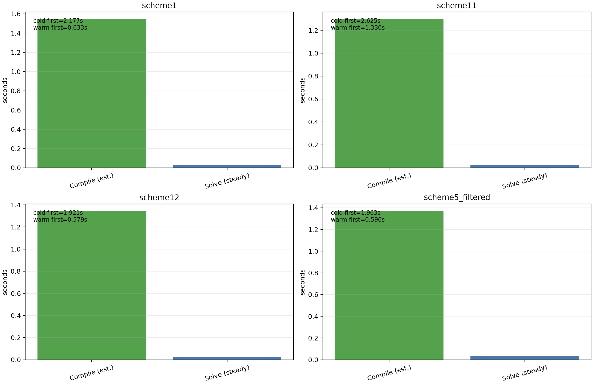

Performance and differentiability
=================================

`sfincs_jax` is designed around a few principles that enable both speed and gradients:

1) **Matrix-free operators**: avoid assembling sparse matrices; apply the discrete operator as a pure function.
2) **JIT compilation**: compile hot kernels (matvecs, residuals, linear solves) with `jax.jit`.
3) **Vectorization**: prefer `vmap`, `einsum`, and batched linear algebra over Python loops.
4) **Explicit separations of concerns**: non-differentiable I/O (reading `.bc`/`wout_*.nc`) is isolated from
   the differentiable compute graph.

What is differentiable today?
-----------------------------

Within the current parity-tested subset, the following are differentiable with respect to JAX-array parameters:

- The **matrix-free operator** application (F-block and full-system operator blocks).
- The **linear residual** ``r(x) = A x - b`` and Jacobian-vector products via ``jax.jvp``.

The Fortran v3 inputs (namelist files, `.bc`, `wout_*.nc`) are *not* differentiable.
However, once a `V3FullSystemOperator` is constructed, you can treat its fields as parameters and
differentiate objectives with respect to them. For example:

- Differentiate a residual norm w.r.t. ``nu_n`` (see ``examples/autodiff/autodiff_sensitivity_nu_n_scheme5.py``).
- Differentiate a diagnostics functional w.r.t. a differentiable geometry parameter in ``geometryScheme=4`` optimization demos.
- Differentiate **through a linear solve** via implicit differentiation (see
  ``examples/autodiff/implicit_diff_through_gmres_solve_scheme5.py``).

JAX-native performance patterns used in `sfincs_jax`
----------------------------------------------------

- **Keep arrays on-device**: build JAX arrays once and reuse them across matvec calls.
- **Use stable dtypes**: the v3 parity target requires 64-bit floats; `sfincs_jax` enables `jax_enable_x64`.
- **Avoid Python loops in hot paths**:

  - For fixed-size recurrences (e.g. Legendre-coupled pitch-angle structure), prefer `jax.lax.scan` or
    banded updates via `at[].add(...)`.
  - For dense transforms, prefer `einsum`/batched `@` so XLA can fuse.
  - For Fourier-mode operations on uniform periodic grids, prefer `jax.numpy.fft` over explicit harmonic loops
    (e.g. `uHat` in `sfincs_jax.diagnostics`).

- **Exploit linearity**: for linear runs, the operator is constant; store and reuse the assembled RHS and
  re-run only GMRES when parameters change.
- **Batch transport RHS solves when possible**: for ``RHSMode=2/3`` dense branches, `sfincs_jax`
  now assembles the dense operator once and solves all ``whichRHS`` right-hand sides in one
  batched linear solve, reducing repeated operator assembly and retracing overhead.
- **Vectorized RHSMode=1 diagnostics**: vm-only moment/flux accumulation and output shaping are
  stacked/batched in JAX for non-``Phi1`` runs, reducing Python-loop overhead during
  ``write_sfincs_jax_output_h5(..., compute_solution=True)``.
- **Fast weighted reductions in diagnostics**: transport/rhsmode1 weighted sums now use
  fused ``einsum`` kernels by default (with an opt-in strict-order fallback), reducing
  diagnostic accumulation overhead in both RHSMode=1 and RHSMode=2/3 paths.
- **Vectorized transport-matrix assembly**: RHSMode=2/3 now builds
  ``transportMatrix`` directly from batched flux arrays, avoiding per-``whichRHS``
  Python loops and repeated diagnostic tree slicing.
- **Cached Boozer `.bc` parsing**: scheme11/12 geometry loading now caches parsed
  surfaces by content digest (plus geometry scheme), so repeated localized/copy paths of
  the same equilibrium file reuse one parsed surface table.
- **Vectorized NTV accumulation across nonlinear iterates**: RHSMode=1 output writing now
  computes NTV from stacked iterates in one batched JAX call instead of Python per-iterate loops.
- **Auto active-DOF reduction for RHSMode=1 (no Phi1)**: when ``Nxi_for_x`` truncates
  the pitch basis, the linear solve now reduces to active unknowns by default, cutting
  both matrix-free solve cost and JIT work on upstream-style reduced cases.
- **Persistent cache in reduced-suite automation**: ``scripts/run_reduced_upstream_suite.py``
  now runs `sfincs_jax` subprocesses with a persistent JAX compilation cache, reducing
  repeated-iteration benchmarking overhead.
- **Remove dead Jacobian work in hot matvec paths**: direct-Phi1 ``factorJ`` kinetic-row terms
  that are absent in v3 ``whichMatrix=3`` are not assembled, improving parity and avoiding
  unnecessary FLOPs in includePhi1-in-kinetic matrix applications.
- **Use implicit differentiation for solve gradients**: for objectives that depend on the solution `x(p)` of
  a linear system `A(p) x = b(p)`, prefer `jax.lax.custom_linear_solve` (adjoint solve) over
  differentiating through Krylov iterations.

RHSMode=1 GMRES preconditioning (experimental)
----------------------------------------------

For RHSMode=1 linear solves that use matrix-free GMRES (as opposed to the dense assemble-from-matvec
path), you can enable an optional JAX-native preconditioner via an environment variable:

- ``SFINCS_JAX_RHSMODE1_PRECONDITIONER=point`` (or ``1``): point-block Jacobi on local (x,L) unknowns
  at each :math:`(\theta,\zeta)` (cheap, but can be too weak for stiff non-axisymmetric cases).
- ``SFINCS_JAX_RHSMODE1_PRECONDITIONER=theta_line``: theta-line block preconditioning that couples
  all theta points (at fixed zeta) for all local (x,L) unknowns (stronger, higher setup cost).
- ``SFINCS_JAX_RHSMODE1_PRECONDITIONER=zeta_line``: zeta-line block preconditioning that couples
  all zeta points (at fixed theta) for all local (x,L) unknowns (stronger, higher setup cost).
- ``SFINCS_JAX_RHSMODE1_PRECONDITIONER=adi``: apply theta-line then zeta-line preconditioning
  sequentially (strongest of the built-ins, highest setup + apply cost).
- ``SFINCS_JAX_RHSMODE1_PRECONDITIONER=0``: disable.

The regularization used when inverting preconditioner blocks can be tuned with:

- ``SFINCS_JAX_RHSMODE1_PRECOND_REG`` (default: ``1e-10``).

These options are most useful when you also select a Krylov solve method for RHSMode=1 via:

- ``SFINCS_JAX_RHSMODE1_SOLVE_METHOD=incremental`` (or ``batched``).

You can also control which side the preconditioner is applied on:

- ``SFINCS_JAX_GMRES_PRECONDITION_SIDE=left`` (default): left-preconditioned GMRES.
- ``SFINCS_JAX_GMRES_PRECONDITION_SIDE=right``: right-preconditioned GMRES (PETSc-like default).

.. note::

   Preconditioners change the Krylov iteration path and can therefore affect strict line-by-line
   parity with PETSc in near-singular branches. They are mainly intended to reduce runtime while
   preserving practical output parity.

Next refactor plan (performance + differentiability)
----------------------------------------------------

The next pass targets parity-preserving speedups first, then deeper solver refactors:

1. **Compilation/cache discipline**

   - Enable JAX persistent compilation cache in parity/benchmark runs to remove repeat JIT cost.
   - Keep shape signatures stable across case loops (avoid recompiling for each ``whichRHS`` call).
   - Move optional debug branches behind static flags so production traces stay minimal.

2. **Hot-path loop elimination**

   - Replace Python-side ``for which_rhs in ...`` assembly loops in transport-matrix workflows with
     ``jax.vmap``/``jax.lax.scan`` over a batched RHS vector.
   - Fuse repeated diagnostics postprocessing into one jitted batched kernel to reduce host/device transfers.
   - Keep operator branches (base vs rhs/transport) as static dispatch points to avoid XLA retraces.

3. **Linear solve modernization**

   - Keep matrix-free execution as default, and add a block preconditioner built from
     species-local pitch-angle/Fokker-Planck diagonals.
   - Add a ``custom_linear_solve`` path for end-to-end differentiable solves with implicit adjoints.
   - Reuse frozen linearizations in nonlinear includePhi1 solves when parity permits, to cut Newton cost.

4. **Profiling + acceptance gates**

   - Profile with JAX tracing/profiling tools and make ``block_until_ready()`` mandatory in benchmarks.
   - Track compile time, steady-state iteration time, and memory footprint separately in CI benchmarks.
   - Require parity + performance guardrails before enabling each optimization by default.

Primary references used to prioritize this plan:

- JAX persistent compilation cache:
  https://docs.jax.dev/en/latest/persistent_compilation_cache.html
- JAX GPU/throughput tips:
  https://docs.jax.dev/en/latest/gpu_performance_tips.html
- JAX profiling guide:
  https://docs.jax.dev/en/latest/profiling.html
- JAX "Thinking in JAX" (jit/vmap/shape discipline):
  https://docs.jax.dev/en/latest/notebooks/thinking_in_jax.html
- JAXopt status/maintenance note:
  https://jaxopt.github.io/stable/

Links to the JAX ecosystem (optional)
-------------------------------------

The package currently uses a lightweight in-repo GMRES implementation for parity control. For more advanced
workflows, the JAX ecosystem can be integrated cleanly once the residual is expressed in a differentiable way:

- `jaxopt`: implicit differentiation (root finding / linear solves) and robust optimization loops.
- `optax`: gradient-based optimization with schedules, constraints, and modern optimizers.
- `equinox`: structured parameter handling and module-style organization for larger refactors.

Parity tuning environment variables (developer)
-----------------------------------------------

For targeted parity debugging on difficult reduced fixtures, the solver exposes
opt-in environment variables:

- ``SFINCS_JAX_PHI1_NONLINEAR_RTOL``:
  override nonlinear relative stop for the includePhi1 frozen-linearization path.
- ``SFINCS_JAX_PHI1_NK_SOLVE_METHOD``:
  force Newton linear subsolve method (``dense``, ``incremental``, or ``batched``).
- ``SFINCS_JAX_PHI1_USE_FROZEN_LINEARIZATION``:
  force includePhi1 nonlinear branch to frozen/non-frozen Jacobian mode.
- ``SFINCS_JAX_PHI1_FROZEN_JAC_MODE``:
  select frozen-Jacobian variant for includePhi1 (``frozen``, ``frozen_rhs``, or ``frozen_op``; default ``frozen_rhs``).
- ``SFINCS_JAX_PHI1_GMRES_TOL``:
  override GMRES tolerance inside the includePhi1 nonlinear Newton–Krylov solves.
- ``SFINCS_JAX_PHI1_GMRES_MAXITER``:
  override GMRES max iterations inside includePhi1 Newton–Krylov solves.
- ``SFINCS_JAX_PHI1_LINESEARCH_FACTOR``:
  override the relative residual decrease required to accept a Newton step (legacy mode).
- ``SFINCS_JAX_PHI1_LINESEARCH_C1``:
  Armijo coefficient for the PETSc-style backtracking rule (default 1e-4).
- ``SFINCS_JAX_PHI1_LINESEARCH_MODE``:
  ``petsc`` (default for includePhi1 parity) uses the first step that satisfies the Armijo condition,
  ``best`` picks the step with the smallest residual among backtracking candidates,
  ``basic``/``full`` accept the full Newton step (no backtracking).
- ``SFINCS_JAX_PHI1_LINESEARCH_MAXITER``:
  override the maximum number of backtracking reductions (default 40 in ``petsc`` mode).
- ``SFINCS_JAX_PHI1_STEP_SCALE``:
  scale the Newton update step size (default 1.0); lower values damp iteration history.
- ``SFINCS_JAX_PHI1_QN_DIAG_SCALE``:
  scale the quasineutrality Phi1 diagonal stabilization (default 1.0).
- ``SFINCS_JAX_PHI1_MIN_ITERS``:
  minimum includePhi1 nonlinear iterations to record (default 4 in parity mode).
- ``SFINCS_JAX_TRANSPORT_MATVEC_MODE``:
  force transport-matrix matvec operator branch (``base`` or ``rhs``).
- ``SFINCS_JAX_TRANSPORT_DIAG_OP``:
  force diagnostics operator branch in transport-matrix runs (``base`` or ``rhs``).
- ``SFINCS_JAX_TRANSPORT_FORCE_KRYLOV``:
  disable the small-system dense fallback in RHSMode=2/3 and keep Krylov solves.
- ``SFINCS_JAX_TRANSPORT_EPAR_LOOSE``:
  opt-in looser GMRES tolerance for RHSMode=2 whichRHS=3 (E_parallel column), for parity experiments.
- ``SFINCS_JAX_TRANSPORT_EPAR_TOL``:
  override the tolerance used when ``SFINCS_JAX_TRANSPORT_EPAR_LOOSE`` is enabled (default 1e-8).
- ``SFINCS_JAX_TRANSPORT_EPAR_KRYLOV``:
  force Krylov (incremental GMRES) for RHSMode=2 whichRHS=3 regardless of dense fallback.
- ``SFINCS_JAX_TRANSPORT_PROJECT_NULLSPACE``:
  apply a constraint-space nullspace projection for RHSMode=2 whichRHS=3 (default on; set to 0 to disable).
- ``SFINCS_JAX_DENSE_REG``:
  override dense solve regularization strength for singular/near-singular systems.
- ``SFINCS_JAX_DENSE_SINGULAR_MODE``:
  choose singular branch handling in dense solves (default regularized mode; ``lstsq`` for minimum-norm).
- ``SFINCS_JAX_STRICT_SUM_ORDER``:
  force explicit loop-order weighted sums in diagnostics (debug/parity mode); by default
  fast fused ``einsum`` reductions are used.

Reference benchmark figure (README/index)
-----------------------------------------

The repository includes a reproducible script that generates the top-level parity/runtime
comparison figure used in ``README.md`` and the docs index:

.. code-block:: bash

   python examples/performance/benchmark_transport_l11_vs_fortran.py --repeats 4

By default this uses frozen Fortran fixtures from ``tests/ref`` (no local Fortran runtime required).
If a local Fortran executable is available, pass ``--fortran-exe /path/to/sfincs`` for live runs.

Latest frozen-fixture snapshot (4 repeats, compile excluded for JAX):

.. list-table::
   :header-rows: 1
   :widths: 20 20 24 16

   * - Case
     - Fortran mean (s/run)
     - sfincs_jax mean (s/run)
     - max abs(ΔL11)
   * - ``scheme1``
     - 0.0275
     - 0.0903
     - 3.11e-13
   * - ``scheme11``
     - 3.6393
     - 0.1202
     - 1.35e-15
   * - ``scheme12``
     - 0.0089
     - 0.1014
     - 8.83e-08
   * - ``scheme5_filtered``
     - 2.9621
     - 0.1096
     - 6.57e-16

Persistent-cache compile/runtime split
--------------------------------------

To separate compile cost from steady solve time with the JAX persistent cache:

.. code-block:: bash

   python examples/performance/profile_transport_compile_runtime_cache.py --repeats 3

   For each case, compile estimate = cold first call - warm first call; steady solve is the warm repeated runtime.

Latest snapshot (3 repeats):

.. list-table::
   :header-rows: 1
   :widths: 20 20 20

   * - Case
     - Compile estimate (s)
     - Warm steady solve (s/run)
   * - ``scheme1``
     - 1.5599
     - 0.0569
   * - ``scheme11``
     - 1.3253
     - 0.0650
   * - ``scheme12``
     - 1.3611
     - 0.0687
   * - ``scheme5_filtered``
     - 1.4042
     - 0.0743

Connection to MONKES / adjoint methods
--------------------------------------

The MONKES approach (see the MONKES code/paper materials and related thesis work, external to this repository) emphasizes:

- a **monoenergetic drift-kinetic equation** as a reduced model,
- a **Legendre basis** representation,
- and **adjoint properties** that enable efficient derivatives of transport coefficients.

In `sfincs_jax`, the same goals (fast derivatives for optimization) are achieved by keeping the discrete
operator/residual in JAX so that:

- Jacobian actions can be obtained via **automatic differentiation** (JVP/VJP),
- and gradients through a solve can be obtained via **implicit differentiation**
  without forming matrices.

Operator-level parity debugging utility
---------------------------------------

For difficult upstream mismatches, compare a Fortran PETSc matrix directly against the
JAX operator assembly:

.. code-block:: bash

   python scripts/compare_fortran_matrix_to_jax_operator.py \
     --input /path/to/input.namelist \
     --fortran-matrix /path/to/sfincsBinary_iteration_000_whichMatrix_3 \
     --fortran-state /path/to/sfincsBinary_iteration_000_stateVector \
     --project-active-dofs \
     --out-json matrix_compare.json

The report includes block-wise statistics (``f``/``phi``/``extra``) and top-entry deltas
to localize missing couplings quickly.
