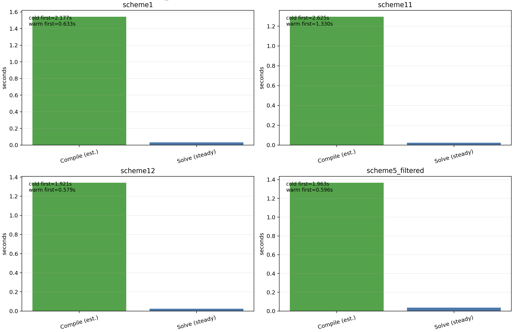

Performance and differentiability
=================================

`dkx` is designed around a few principles that enable both speed and gradients:

1) **Matrix-free operators**: avoid assembling sparse matrices; apply the discrete operator as a pure function.
2) **JIT compilation**: compile hot kernels (matvecs, residuals, linear solves) with `jax.jit`.
3) **Vectorization**: prefer `vmap`, `einsum`, and batched linear algebra over Python loops.
4) **Explicit separations of concerns**: non-differentiable I/O (reading `.bc`/`wout_*.nc`) is isolated from
   the differentiable compute graph.

The design choices behind the measured numbers are collected in the
`Performance patterns`_ section below; the equations and derivations behind them
live in :doc:`numerics` and :doc:`differentiability`.

Measured head-to-head: canonical stack vs SFINCS Fortran v3
-----------------------------------------------------------

The canonical-stack benchmark case is ``HSX_PASCollisions_DKESTrajectories``
(RHSMode=1) at ``Ntheta=25, Nzeta=51, Nxi=100, Nx=5`` — 744,610 unknowns —
measured on the same development machine (MacBook, Apple M4, ~10 cores, 24 GB)
for both codes. The Fortran reference is the conda PETSc 3.23 + MUMPS 5.8.2
build of SFINCS v3; ``dkx`` uses the truncated structured direct Legendre block
elimination (``solvax`` ``block_thomas_truncated_fn``, blocks assembled on the
fly from the analytic operator coefficients, ``keep_lowest=3`` — exact for
every RHSMode=1 output).

.. figure:: _static/figures/readme/tier1_hsx_runtime_memory.png
   :alt: Runtime and peak memory bars for dkx and SFINCS Fortran v3 on the 744k-unknown HSX PAS case.
   :align: center
   :width: 90%

   Measured warm solve time and peak process RSS. Regenerate with
   ``python tools/benchmarks/readme_figures.py``; rerun the measurement with
   ``python tools/benchmarks/tier1_hsx_head_to_head.py``.

.. list-table:: Head-to-head (744k unknowns, HSX PAS DKES, RHSMode=1)
   :header-rows: 1

   * - Configuration
     - Warm solve [s]
     - Peak RSS [GB]
   * - ``dkx`` MacBook M4 CPU, ``Nxi``-for-``x`` ramp
     - 27.2
     - 0.93
   * - ``dkx`` MacBook M4 CPU, uniform ``Nxi``
     - 44.3
     - 1.16
   * - ``dkx`` RTX A4000 GPU
     - 45.0
     - 1.88 (0.05 GB VRAM buffers)
   * - SFINCS Fortran v3, 1 MPI rank
     - 463.6
     - 3.98
   * - SFINCS Fortran v3, 2 MPI ranks (measured floor)
     - 229.5
     - 2.86

With the matched ramp discretization ``dkx`` is 17x faster than 1-rank Fortran
and 8.4x faster than Fortran's best measured parallel floor, at roughly 30% of
the memory. Three qualifications go with that row:

* Ramp-vs-uniform ``Nxi`` moves the physics outputs by at most 0.9%
  (electrons).
* GPU time equals M4 CPU time because the Legendre scan is serial in ``L`` and
  the A4000 runs FP64 at 1/32 rate. GPU upside requires batching over
  (species, ``x``, surfaces/``Er``), or fp32 factors with fp64 refinement.
* Scope is one measured 744k-unknown HSX PAS case. Further cases are promoted
  as each vertical slice lands with its own evidence.

Cold and warm solves
~~~~~~~~~~~~~~~~~~~~

Every runtime above is a **warm** solve: the second and later solves in one
process, after JAX has traced the computation and XLA has compiled it. That is
the right number for an optimizer, an ``Er`` scan, or a convergence ladder,
which solve the same shapes repeatedly. It is not the number a user sees who
opens a terminal and runs one case, so both are measured here.

Apple M3 Max, CPU, ``JAX_ENABLE_X64``, one process per row, from
``tools/benchmarks/tier1_hsx_head_to_head.py --device cpu --repeat 3 --ramp``.
Cold is the first solve in a fresh process; warm is the fastest of the three
that follow it.

.. list-table::
   :header-rows: 1

   * - Case
     - Unknowns
     - Cold [s]
     - Warm [s]
     - Cold / warm
   * - HSX PAS reduced, ``(S,X,L,T,Z) = (2,12,10,13,13)``
     - 40,584
     - 1.72
     - 0.12
     - 14x
   * - HSX PAS, ``Ntheta=25 Nzeta=51 Nxi=100 Nx=5``
     - 744,610
     - 23.6
     - 20.0
     - 1.18x

Compilation costs roughly the same for both rows, so it dominates the small one
and disappears into the large one. Two consequences:

* **Timing ``dkx`` on a toy case measures XLA, not the solver.** The 14x on the
  reduced deck is 1.6 s of compilation against a 0.12 s solve. Anyone
  benchmarking DKX against another code on a small deck, in a fresh process, is
  mostly comparing compilers.
* **The head-to-head does not depend on the warm number.** Cold, the 744k case
  is 23.6 s against 463.6 s on one Fortran rank and 229.5 s on two. A compiled
  binary has no warm solve, so those are cold by construction, and the
  comparison holds on the number a first run actually produces.

The M3 Max rows are a different machine from the M4 head-to-head above, which
is why they are reported separately rather than folded into that table. The
quantity they establish is the *ratio*, which is a property of the case size
rather than of the host.

What warm solves buy is the second case onward, and the paths that exploit it
carry more than the compilation: :func:`dkx.er.radial_current` and the
ambipolar solver thread the GCROT recycle subspace, the solved state as
``x0``, and the already-built preconditioner from one ``Er`` to the next. A
scan that runs one process per point -- which is what the ``sfincsScan``
compatibility driver does -- gets none of that, and pays a cold solve every
time.

**Read that number together with the whole-suite sweep below.** It is a
pitch-angle-scattering DKES-trajectory deck, which is to say one where ``dkx``
has a structured direct solver. That is the group it represents, and the sweep
shows the group is not the whole suite.

The whole upstream suite, both codes
~~~~~~~~~~~~~~~~~~~~~~~~~~~~~~~~~~~~

Every deck in ``fortran/version3/examples`` run end to end through both codes
(38 decks; geometry schemes 1/2/4/5/11 plus the filtered W7-X netCDF
equilibria, pitch-angle and Fokker-Planck collisions, zero and finite ``Er``,
``Phi1`` on and off, tangential magnetic drifts, one to three species, 651 to
1.9M unknowns).  Reproduce with
``tools/benchmarks/parity_performance_matrix.py``; plot with
``tools/paper_benchmarks/cross_code_matrix.py``.

.. figure:: _static/figures/paper_benchmarks/cross_code_matrix.png
   :alt: Speed-up and peak memory against problem size for dkx and SFINCS Fortran v3 across the upstream example suite.
   :align: center
   :width: 95%

   Warm ``dkx`` solve against the Fortran binary's wall time, coloured by which
   solver ``dkx`` could use.

Taken as one number the sweep is 16 of 32 completed decks faster, which reads
as a coin flip and explains nothing.  Split by solver route it is not a coin
flip:

.. list-table:: Outcome by solver route
   :header-rows: 1

   * - route
     - faster than SFINCS
     - what it is
   * - structured direct
     - **9 of 9**
     - exact block elimination over the Legendre index
   * - recycled Krylov
     - 7 of 23
     - GCROT under the coarse-operator preconditioner

The losses are not spread thinly over the suite.  They sit exactly where the
block-tridiagonal-in-``L`` structure is broken -- full Fokker-Planck collisions,
tangential magnetic drifts, the ``E_r`` ``xDot``/``xiDot`` terms, and the
``Phi1`` Newton iteration -- which is the same list as the physics ``dkx`` is
uniquely good at.  Every one of those decks is locked out of the structured
direct route and has to go through recycled Krylov, and recycled Krylov is
where the reference is usually faster.

Two more facts the sweep settles, both against ``dkx``:

* *Memory is the weak axis.*  ``dkx`` is lighter on **3 of the 32** decks it
  completed.  Below ~10k unknowns the JAX runtime floor (~0.5 GB, paid on every
  solve however small) is already larger than the whole Fortran process, which
  runs those decks in 0.1-0.2 GB.  Above ~1M the Krylov preconditioner's dense
  ``(Ntheta*Nzeta)`` bands dominate.
* *Six decks did not complete at all,* against 38 of 38 for the reference.  Five
  were killed by the operating system while the Krylov preconditioner allocated
  its bands.  Those five are the ones
  :func:`dkx.coarse_precond._coarse_bands_fit` diverts to the generated coarse route
  ("Running the decks the bands do not fit" below) rather than dying part way
  through.  The sixth wanted the LIBSTELL text form of a VMEC ``wout``, read by
  :mod:`dkx.vmec_ascii`.

Physics agreement across the sweep is a median relative difference of
``4.1e-06`` on the shared output moments, with the outliers explained
case by case under `The reference's own true residual`_ below.

Fortran strong-scaling baseline (same case, same machine)
~~~~~~~~~~~~~~~~~~~~~~~~~~~~~~~~~~~~~~~~~~~~~~~~~~~~~~~~~

.. list-table::
   :header-rows: 1

   * - MPI ranks
     - Solve time [s]
     - Speedup
     - Parallel efficiency
     - Peak RSS [GB]
   * - 1
     - 463.6
     - 1.00
     - —
     - 3.98
   * - 2
     - 229.5
     - 2.02
     - 101%
     - 2.86
   * - 4
     - 240.9
     - 1.92
     - 48%
     - 2.88
   * - 8
     - 270.5
     - 1.71
     - 21%
     - 1.61

Fortran/MUMPS saturates at 2 ranks on this machine and degrades beyond
(performance/efficiency core asymmetry plus MUMPS OpenMP contention), so the
practical Fortran floor for this case is about ``230 s``.

Cross-machine end-to-end time to solution
~~~~~~~~~~~~~~~~~~~~~~~~~~~~~~~~~~~~~~~~~

A second, independent sweep measures **end-to-end** wall time: operator build,
solve, moments and output, via ``run_profile`` on the ``dkx`` side and the full
binary run on the Fortran side. The deck is the two-species production variant
of the same HSX PAS case (1,275,010 unknowns), run on two machines against a
freshly compiled Fortran v3 (conda PETSc 3.25 + MUMPS, MPI), best of two
repetitions per configuration. The Fortran run is one linear solve dominated by
the preconditioner factorization plus a handful of Krylov applications, so
end-to-end time is the honest cross-code metric. Reproduce with
``tools/benchmarks/time_to_solution.py``.

.. list-table::
   :header-rows: 1

   * - Configuration
     - End-to-end [s]
   * - Fortran MPI, 10-core laptop, n=1
     - 350
   * - Fortran MPI, 10-core laptop, best (n=8)
     - 141
   * - ``dkx``, laptop, one process (cold / warm)
     - 62 / 46
   * - Fortran MPI, 36-core workstation, n=1
     - 1163
   * - Fortran MPI, 36-core workstation, best (n=8)
     - 802
   * - Fortran MPI, 36-core workstation, n=32
     - 1423
   * - ``dkx``, workstation, one RTX A4000 GPU (cold / warm)
     - 78 / 59
   * - ``dkx``, workstation, one CPU process (cold / warm)
     - 6132 / 1998

The MPI scaling shape repeats on both machines. Fortran/MUMPS bottoms out
around 8 ranks (1.4-2.5x over one rank) and *degrades* beyond it. At 32 ranks
the workstation run is slower than a single rank.

One ``dkx`` process beats every measured Fortran configuration on the same
hardware: 3.1x the laptop's best MPI time on CPU, and 13.6x the workstation's
best MPI time on its GPU. The workstation's CPU path is dominated by the serial
Legendre scan at that machine's low single-core throughput, so on such hardware
the GPU is the ``dkx`` backend of choice. Batched scans (:mod:`dkx.batch`,
measured in ``tools/benchmarks/batched_scan.py``) are the axis where one
process replaces an entire MPI allocation.

Memory findings
~~~~~~~~~~~~~~~

- At the full production resolution of this case
  (``Ntheta=25, Nzeta=115, Nxi=149, Nx=5``; a 2,512,760-unknown system),
  **neither** code fits a global sparse factorization on a 24 GB machine:
  Fortran/MUMPS drove macOS swap to ~46.5 GB during factorization and was
  killed, and the dense/CSR JAX host paths are size-capped well below it.
- The truncated Legendre block elimination is the locally viable direct path:
  its memory is ``O(K m^2)`` with ``m = Ntheta * Nzeta`` (one ~66 MB
  ``2875^2`` block at production resolution, independent of ``Nxi``). On the
  744k case the truncated route needs ~0.3 GB where a full-band structured
  direct factorization would need ~91 GB.

The small-deck floor, and what it is made of
~~~~~~~~~~~~~~~~~~~~~~~~~~~~~~~~~~~~~~~~~~~~

``dkx`` is lighter than Fortran SFINCS on only 3 of the 32 decks that complete,
and roughly half of that deficit sits at the *small* end, where a fixed floor
of about 0.5 GB exceeds the entire Fortran process (0.1--0.2 GB). Naming the
floor "JAX overhead" would explain nothing, so it is measured
(``tools/benchmarks/memory_floor.py``, macOS arm64, JAX 0.11):

.. list-table::
   :header-rows: 1
   :widths: 46 18 18

   * - stage (each in a fresh interpreter)
     - peak RSS
     - step
   * - bare Python
     - 0.019 GB
     -
   * - ``import numpy``
     - 0.028 GB
     - +0.009
   * - ``import jax``
     - 0.112 GB
     - +0.085
   * - first JAX operation (backend live)
     - 0.162 GB
     - +0.050
   * - ``import dkx.run``
     - 0.156 GB
     - ~0
   * - build the operator (111 unknowns)
     - 0.282 GB
     - +0.126
   * - solve it
     - 0.531 GB
     - +0.248

Two measurements decide how much of this is reachable. Inside the solved
process, ``jax.live_arrays()`` totals **under 1 MB** and the Python heap peaks
at **5 MB** (``tracemalloc``). So essentially none of the 0.5 GB is data ``dkx``
allocates, JAX arrays it holds, or Python objects it builds: it is XLA runtime
and compiler working memory, which neither instrument can see.

That is also why there is no lever. Three runs of each knob, same deck, same
machine:

.. list-table::
   :header-rows: 1
   :widths: 60 22

   * - knob
     - peak RSS
   * - default
     - 0.531 GB
   * - ``XLA_PYTHON_CLIENT_PREALLOCATE=false``
     - 0.531 GB
   * - ``XLA_PYTHON_CLIENT_ALLOCATOR=platform``
     - 0.531 GB
   * - ``JAX_DISABLE_JIT=1``
     - 0.558 GB

The allocator settings change nothing, to three decimal places and
reproducibly. Disabling ``jit`` makes the floor *worse*, because op-by-op
dispatch issues more XLA calls rather than fewer.

**The small-deck floor is a property of the XLA runtime, not of ``dkx``, and
none of it is under our control.**

Two consequences follow. The import baseline is 0.156 GB with ``dkx`` fully
imported and the backend live, already the same order as an entire small
Fortran run. No amount of trimming inside ``dkx`` reaches Fortran's small-deck
footprint; closing that gap would take a different execution backend, not a
tidier ``dkx``. The floor is also a constant, not a leak. It is paid once, and
past a few thousand unknowns the physics dominates it.

.. list-table::
   :header-rows: 1
   :widths: 20 32 22

   * - unknowns
     - route
     - peak RSS
   * - 111
     - structured direct
     - 0.527 GB
   * - 2,804
     - recycled Krylov
     - 0.741 GB
   * - 5,208
     - sparse direct
     - 1.031 GB
   * - 143,530
     - recycled Krylov
     - 3.979 GB

The reference's own true residual
~~~~~~~~~~~~~~~~~~~~~~~~~~~~~~~~~

Two codes solving the same discretized system agree only to the accuracy each
one actually reaches.  That accuracy is not always the number in the input
file.

SFINCS solves its linear system with PETSc.  For left-preconditioned Krylov
methods PETSc's default convergence test measures the *preconditioned* residual
:math:`\|M^{-1}(Ax-b)\|` rather than the true residual :math:`\|Ax-b\|`
(``KSPSetNormType``, ``KSP_NORM_PRECONDITIONED``).  SFINCS preconditions with a
simplified operator assembled separately from the full one.  On some decks the
two norms differ substantially.  The run then reports success at its requested
``solverTolerance`` while the returned state still leaves a large true
residual.

SFINCS's own binary output measures this on its own.  It carries the matrix,
the right-hand side and the state vector, so no ``dkx`` quantity enters:

.. math::

   \frac{\|Ax-b\|}{\|b\|}, \qquad
   A = \texttt{whichMatrix\_3}, \;
   x = \texttt{stateVector}, \;
   b = -\,\texttt{residual}.

.. figure:: _static/figures/paper_benchmarks/reference_convergence.png
   :alt: Reference true residual against the cross-code difference in output moments, 17 linear upstream decks.
   :align: center
   :width: 90%

   Seventeen linear decks from upstream's example suite.  Regenerate with
   ``python tools/paper_benchmarks/reference_convergence.py --results ...``
   on a sweep produced by ``tools/benchmarks/parity_performance_matrix.py
   --fortran-residual``.

``geometryScheme4_2species_PAS_noEr`` is the sharpest example.  Both codes are
handed the same system and reach very different accuracies on it.

.. list-table:: ``geometryScheme4_2species_PAS_noEr``
   :header-rows: 1
   :widths: 52 24

   * - measured quantity
     - value
   * - reference true residual
     - ``5.4e-2``
   * - ``dkx`` residual on the same system
     - ``3.1e-13``
   * - matrix agreement, random matvecs
     - ``8.5e-15``
   * - right-hand-side agreement
     - ``5.0e-15``
   * - bootstrap current, difference between the codes
     - 28%

The residual bounds how closely two solutions can agree in the *state vector*.
It is not a bound on the output moments.  Those are contractions of the state,
so a residual can cancel out of them or be amplified by them, and the measured
points fall on both sides of equality.  The data does show one thing: every
large cross-code difference here comes with a large reference residual.

A preconditioned-norm convergence test is standard practice and usually
adequate, in SFINCS and in every other code that uses one.  The rule for anyone
comparing against a reference implementation is narrow: check the reference's
own residual before blaming the code under test.
``tools/benchmarks/parity_performance_matrix.py --fortran-residual`` records
that residual alongside every comparison.  A case whose reference residual
exceeds the requested tolerance is evidence about the reference, not about
``dkx``.

Solver-noise finding
~~~~~~~~~~~~~~~~~~~~

The direct solve is more converged than the Fortran reference: Fortran's own
electron ``FSABFlow`` scatters 51% across its 1/2/4/8-rank runs of this case
(KSP ``rtol=1e-6`` iterative-solver noise), while ``dkx`` matches the
closest Fortran run to ``2e-10`` and sits inside Fortran's own spread on every
compared quantity.

Parity referees
~~~~~~~~~~~~~~~

.. figure:: _static/figures/readme/canonical_parity.png
   :alt: Measured parity envelopes of the canonical stack against Fortran and recorded references.
   :align: center
   :width: 90%

   Parity envelopes pinned by the CI referee tests
   (``tests/test_run_rhsmode1.py``, ``tests/test_run_transport.py``):
   RHSMode=1 output tables at ``8e-14``, structured direct state vectors vs recorded
   references at ``1e-11``, RHSMode=2/3 transport matrices vs Fortran golden
   data at ``6e-13 .. 9e-9``.

Known issues
~~~~~~~~~~~~

- **Singular recycled Krylov adjoints abort; they cannot be differentiated.**
  The implicit-function-theorem VJP of the Krylov solve costs one *transposed*
  solve, and that solve is the only place in ``dkx`` where a wrong answer
  leaves no trace: the physical drive stays in the range of :math:`A`, so the
  forward solve converges to ``1e-15`` and every field of ``SolveResult``
  looks healthy while the gradient is garbage. Operators whose null space the
  constraint scheme does not span hit this. An ``Er`` ``xiDot`` deck under the
  per-speed ``constraintScheme=2`` border, for instance, has a smallest
  singular value ~``4e-19`` against :math:`\|A\| \sim 15`; its transposed
  solve diverges by 50 orders of magnitude against a generic cotangent.
  ``dkx`` recomputes each differentiable solve's *true* residual from the
  operator (never the Krylov method's internal estimate), records it in
  ``SolveResult.adjoint`` (:class:`~dkx.solve.AdjointDiagnostics`), and
  raises with the residual and the remedies unless ``check_adjoint=False``.
  There is no correct gradient to return in that regime: recovering one would
  need a least-squares (pseudo-inverse) adjoint, and the offending null
  directions are spread across the whole Legendre spectrum rather than
  confined to the source/constraint border, so they cannot be deflated from
  the vectors the constraint scheme knows.
- **A large adjoint residual is not by itself a wrong gradient.** Take a
  near-singular operator: full Fokker-Planck with ``constraintScheme=1``, a
  finite ``Er``, uniform ``Nxi_for_x``, condition number ~``6e10``. A generic
  cotangent excites an almost-null direction, the adjoint solution norm
  reaches ~``7e7``, and GCROT can stagnate above the requested residual
  tolerance while a particular observable still matches finite differences.
  This does not certify other cotangents or parameters. The guard requires
  the requested ``max(atol, tol*||g||)`` by default. The capped diagnostic
  scale ``32 eps (||A|| ||y|| + ||g||)`` remains recorded but cannot widen
  admission. ``adjoint_residual_factor`` defaults to one; explicit relaxation
  or ``check_adjoint=False`` requires independent observable validation.

- **Ill-conditioned scheme-1 monoenergetic off-diagonal.** The Fortran build
  itself fails upstream's ``tests.py`` on the ``monoenergetic_geometryScheme1``
  ``transportMatrix[0,1]`` element only (``+1.62`` vs expected ``-1.08`` at
  ``solverTolerance=1e-6``; ``+26.3`` at ``1e-12`` — tolerance-unstable, so
  the element is ill-conditioned in this configuration). Parity tests pin that
  element to upstream's expected value (``-1.07986``), which the ``dkx``
  direct solve reproduces to ``4.2e-6``.

CPU and GPU: where each wins
----------------------------

The structured direct route is what lets ``dkx`` fit and finish a production
case. **A development-MacBook CPU and a workstation RTX A4000 land at parity on
that route, while the iterative and small-system paths favored the MacBook
CPU.** Those two backends live on *different machines*. The same-host
CPU-vs-GPU picture is measured in "Same-host CPU/GPU crossover" below and looks
very different.

The full 744k-unknown HSX case was re-measured on both backends after the
ramp-aware truncated kernel became the canonical route:

.. list-table:: Post-fix 744k HSX PAS/DKES head-to-head (end-to-end = build + solve)
   :header-rows: 1
   :widths: 40 32 28

   * - Backend
     - Runtime
     - Peak RSS
   * - SFINCS Fortran v3 (PETSc + MUMPS, dev MacBook)
     - > 2.6 h, unfinished
     - 3.6-5.7 GB
   * - ``dkx`` CPU (dev MacBook)
     - 41.4 s e2e (25.0 s warm solve)
     - 1.35 GB
   * - ``dkx`` GPU (RTX A4000)
     - 59.6 s e2e (26.2 s warm solve)
     - 2.3 GB

Both machines route ``block_tridiagonal_truncated`` and land within a few seconds
of each other on the warm solve; under the recycled Krylov route the same
case ran out of memory on the 16 GB GPU, so the structured direct route is what
makes it fit at all. A mid-size HSX case (336k unknowns) is at MacBook-CPU-vs-A4000
parity as well (``3.5 s`` versus ``3.3 s`` warm).

The GPU does **not** help the iterative and small-system paths *relative to a
fast development CPU*. Full Fokker-Planck GCROT, the :math:`\Phi_1` Newton
solve, ``value_and_grad``, the ambipolar Brent root, and a one-shot
monoenergetic solve all ran 2-5x slower on the A4000 than on the development
MacBook's CPU.

That comparison mixes machines. A dedicated same-host re-measurement (next
section) puts the GPU ahead of *that machine's own 36-core CPU* on essentially
every path and size, and shows the structured direct production solve to be
FP64-compute-bound on the card (1/32-rate FP64) rather than dispatch-bound.
Batched work, such as multi-:math:`E_r` or multi-surface ``vmap`` sweeps,
widens that same-host win.

Same-host CPU/GPU crossover (2026-07)
~~~~~~~~~~~~~~~~~~~~~~~~~~~~~~~~~~~~~

All numbers in this section come from one host (36-core Pop!_OS workstation,
RTX A4000 16 GB, JAX 0.10.2, ``CUDA_VISIBLE_DEVICES=0``), so CPU and GPU
columns are the clean comparison; the development-MacBook CPU column is
included to expose the cross-machine effect. Warm = second identical
``solve()`` in-process (cached executable); cold = first solve in a fresh
process with a *populated* persistent compilation cache. Reproduce with
``tools/benchmarks/gpu_cpu_ladder.py``.

**Structured direct (truncated block-Thomas, the production route)** — the GPU won
every measured size, 2.7x to 39x, so there is no same-host CPU/GPU crossover
above the smallest deck measured (6.5k unknowns):

.. list-table:: Warm structured direct solve, HSX PAS/DKES family (seconds)
   :header-rows: 1
   :widths: 26 22 22 30

   * - Unknowns
     - Workstation CPU
     - Workstation GPU
     - Dev-MacBook CPU (other machine)
   * - 6,488
     - 1.41
     - 0.53
     - —
   * - 40,584
     - 3.04
     - 1.17-2.20
     - 0.62-0.73
   * - 78,010
     - 6.32
     - 1.48
     - —
   * - 224,410
     - 45.4
     - 2.49
     - —
   * - 336,610
     - 20.8-33.1
     - 2.97-3.70
     - 1.81
   * - 688,810
     - —
     - 9.35
     - —
   * - 1,275,010 (production deck)
     - 1,036
     - 26.0-26.5
     - —

The production point is the full 2-species HSX deck, 25x51x100x5 =
1,275,010 unknowns. It is a 39x same-host GPU win:

.. list-table:: Production deck, same host (seconds)
   :header-rows: 1
   :widths: 26 24 24

   * - Stage
     - Workstation CPU
     - Workstation GPU
   * - build
     - 8.8
     - —
   * - cold solve
     - 952
     - —
   * - warm solve
     - 1,036
     - 26.0
   * - end-to-end
     - 2,000.6
     - 72

Two honesty notes. All-core CPU timings on this box carry large run-to-run
variance, at thermal steady state under ~34-thread load: the workstation CPU
warm repeat measured *slower* than its cold solve (1,036 s vs 952 s), and the
224k and 336k rungs overlap (45.4 s vs 20.8-33.1 s). Separately, the earlier
"~1,998 s office CPU warm" figure matches this end-to-end total, not the warm
solve alone.

**Recycled Krylov (GCROT-recycled FGMRES, preconditioned)** — the GPU also won every
measured size warm; again no same-host crossover down to the smallest
practical Fokker-Planck deck:

.. list-table:: Warm recycled Krylov solve, W7-X FP family (seconds)
   :header-rows: 1
   :widths: 30 24 24 22

   * - Unknowns
     - Workstation CPU
     - Workstation GPU
     - GPU speedup
   * - 2,804
     - 1.38
     - 0.93
     - 1.5x
   * - 11,884
     - 4.03
     - 2.75
     - 1.5x
   * - 78,628
     - 21.7
     - 12.0
     - 1.8x
   * - 155,524
     - 67.8
     - 25.2
     - 2.7x

Cold-including-compile favors the CPU at the small end, because GPU
compilation is slower. That is a first-run effect the persistent cache removes
on repetition.

.. list-table:: Cold recycled Krylov solve including compile (seconds)
   :header-rows: 1
   :widths: 30 24 24

   * - Unknowns
     - Workstation CPU
     - Workstation GPU
   * - 2.8k
     - 21.0
     - 24.3
   * - 11.9k
     - 19.2
     - 28.5

**Iterative and small-system paths, same host.**

.. list-table:: Iterative and small-system paths (seconds)
   :header-rows: 1
   :widths: 40 18 18 24

   * - Path
     - CPU
     - GPU
     - Measurement
   * - ``value_and_grad`` through structured direct (39.3k unknowns)
     - 4.21
     - 3.03
     - warm
   * - ambipolar Brent root (2 species)
     - 92.8
     - 48.4
     - end-to-end
   * - :math:`\Phi_1` Newton solve (3,975 unknowns)
     - 0.048
     - 0.159
     - warm re-solve
   * - :math:`\Phi_1` Newton solve (3,975 unknowns)
     - 40.3
     - 52.2
     - cold

The :math:`\Phi_1` Newton solve is the single measured CPU-wins case, by 2.6x
warm. Its unpreconditioned inner GCROT systems are capped at 6,000 unknowns.
Routing only those inner solves to the CPU per ``solve()`` did *not* recover
the win: it lands at 0.12-0.13 s, because the per-iteration Newton residuals
stay on the GPU and each routed solve pays device transfers plus a one-time CPU
compile. Small :math:`\Phi_1`-heavy workloads are best run whole-process on the
CPU (``JAX_PLATFORMS=cpu``).

**Where the GPU time goes (profiler trace).** A ``jax.profiler`` capture of the
warm 336k structured direct GPU solve records 31,953 kernel launches at a mean
kernel duration of 0.086 ms. The device is busy 2.74 s of the 3.18 s device span
(13.8% idle), against an untraced warm solve of 2.97 s. That GPU solve is
therefore ~90% device compute, *not* host-dispatch-bound: the async dispatch
pipeline keeps the serial Legendre scan's small kernels queued ahead of
execution.

The top kernels are FP64 dense linear algebra: ``getrf`` (0.90 s), FP64
tensor-core GEMMs (0.80 s), ``trsm`` (0.45 s). The production solve therefore
sits within ~2.7x of the card's FP64 arithmetic floor (~5.5 TFlop at
~0.6 TFLOPS FP64). Faster-FP64 hardware, not lower launch latency, is what
would speed this path up.

**Device routing knob.** ``solve(device=...)`` gives explicit control:
``"cpu"``/``"gpu"``/a ``jax.Device`` move the solve (inputs via
``jax.device_put``, solution returned on the input's device; inert under
``jit``/``grad`` tracing), and ``"auto"`` (default, env
``DKX_SOLVE_DEVICE``) additionally consults the size thresholds
``DKX_SOLVE_CPU_MAX_SIZE_TIER1`` / ``_TIER2``. Both thresholds
default to 0 — automatic CPU-routing disabled — because the measurements
above do not support a nonzero default on the reference host; they exist for
hosts where the CPU/GPU balance differs (e.g. a strong CPU next to a weak
accelerator: set ``DKX_SOLVE_CPU_MAX_SIZE_TIER2=6000``).

**Cold starts and the persistent compilation cache.** The cache configured by
``dkx.__init__`` (default ``~/.cache/dkx/jax_compilation_cache``,
min-compile-time and min-entry-size forced to 0, GPU per-fusion autotune cache
on by JAX default) was audited working cross-process on this host:

.. list-table:: Cold solve, cache unpopulated vs populated (seconds)
   :header-rows: 1
   :widths: 40 24 24

   * - Cold solve
     - Cache unpopulated
     - Cache populated
   * - small deck, GPU
     - 10.8
     - 1.7
   * - small deck, CPU
     - 7.8
     - 3.0
   * - :math:`\Phi_1`, GPU
     - 52.2
     - 15.0

At the production size the CPU cold solve ran at warm speed: 952 s against
1,036 s warm. First-ever runs on a clean machine still pay full XLA
compilation, historically ~2,100 s extra on the production CPU case. The
cold-vs-warm expectation is therefore: the first run per (shape, backend)
compiles, and every later process reuses the cache and starts at warm speed
plus a few seconds of cache loading.

**Cyclic-reduction assessment (evaluation only, not adopted).** Block cyclic
reduction would replace the serial length-:math:`L` block-Thomas recurrence
with :math:`\log_2 L` parallel levels, at 2-3x the arithmetic and a working
set touching all :math:`L` blocks per level. The regime it would need is a
device idled by the serial scan, and the trace above shows that regime does not
occur at production size: the A4000 is ~86% busy and FP64-throughput-bound, so
inflating flops 2-3x to shorten the dependency chain would slow the solve down.
At small sizes the device *is* latency-bound, but the absolute times are
already sub-second and the memory-lean ``lax.map`` batching would have to be
abandoned to expose the parallelism. Cyclic reduction only makes sense on
hardware with FP64 headroom (data-center cards) combined with small
:math:`N_\theta N_\zeta` blocks and long :math:`L` chains. That is the opposite
corner from the production decks, so it is left unimplemented.

Measured GPU anatomy and memory headroom (RTX A4000)
~~~~~~~~~~~~~~~~~~~~~~~~~~~~~~~~~~~~~~~~~~~~~~~~~~~~~~~

The same host quantifies how far the structured direct route stretches a 16 GB
card. All rows are warm best-of-N ``block_tridiagonal_truncated`` solves of
HSX-family decks on the RTX A4000 (12.56 GB usable device budget), with the
device peak read from ``jax`` device-memory statistics; every solve converged
with residuals in ``1e-13 .. 1e-15``.

.. figure:: _static/figures/gpu_anatomy_memory.png
   :alt: Left, single RTX A4000 device-peak memory versus unknown count against the 12.56 GB budget; right, mid-deck warm CPU solve versus pinned core count with the 8-core optimum.
   :align: center
   :width: 92%

   Left: single-GPU memory ladder — device peak stays far under the 12.56 GB
   budget, a 2.53M-unknown solve peaking at 2.21 GB. Right: 36-core CPU
   single-solve thread scaling on the mid deck (336,610 unknowns), warm solve
   versus pinned cores, bottoming at the 8-core optimum and inverting past it.
   Regenerate with ``python tools/benchmarks/gpu_anatomy_figure.py``.

.. list-table:: Warm structured direct solve, single RTX A4000: memory ladder
   :header-rows: 1
   :widths: 36 22 22

   * - Unknowns
     - Device peak [GB]
     - Warm solve [s]
   * - 336,610
     - 0.18
     - 3.7
   * - 1,275,010 (production)
     - 0.61
     - 25.6
   * - 2,025,010
     - 1.42
     - 85.3
   * - 2,525,010
     - 2.21
     - 157.6

The device peak grows far slower than the unknown count, because the truncated
structured direct kernel only ever materializes its ``O(K m^2)`` working set (the lowest
Legendre blocks) rather than the full band. The 2,525,010-unknown solve peaks
at 2.21 GB where the conservative full-band charge for that system is ~208 GB,
so multi-million-unknown decks fit with large headroom on the 16 GB card. The
route-aware footprint model (`End-to-end pipeline efficiency`_) is what lets
the ``auto`` policy account for this truncated working set rather than the
full-band peak.

The first over-budget rung above 2,525,010 unknowns is the only measured
out-of-memory point: its truncated working-set estimate is 26.25 GB, past the
12.56 GB device budget.

Per-phase anatomy for the production and mid decks (warm, same host):

.. list-table:: Warm-solve phase breakdown [s]
   :header-rows: 1
   :widths: 34 16 16 16 18

   * - Deck (unknowns)
     - Build
     - RHS
     - Warm solve
     - Moments
   * - Mid (336,610)
     - 2.85
     - 1.55
     - 3.7
     - 3.78
   * - Production (1,275,010)
     - 6.36
     - 2.74
     - 25.6
     - 5.57

The truncated solve dominates end-to-end time at the production size, while
operator build, right-hand-side assembly, and moment evaluation stay a few
seconds each. The device-memory budget knob (``DKX_TIER1_MEMORY_BUDGET_GB``)
gates only batch chunking, not the single truncated solve: sweeping it across
``2``/``8``/``32`` on the mid deck leaves the warm solve at ~3.6-4.0 s and the
device peak at ~0.12 GB in all three, confirming the single-solve footprint is
budget-independent.

Production profiling battery
~~~~~~~~~~~~~~~~~~~~~~~~~~~~~~

The per-case picture on CPU (development MacBook, idle, one fresh subprocess per
case, via ``tools/benchmarks/profile_production.py``):

.. list-table::
   :header-rows: 1
   :widths: 30 14 26 16 14

   * - Case
     - Unknowns
     - Method
     - Solve cold / warm
     - Peak RSS
   * - HSX PAS/DKES, mid (ramp)
     - 336,610
     - ``block_tridiagonal_truncated``
     - 4.1 s / 3.5 s
     - 885 MB
   * - W7-X full Fokker-Planck, 2 species
     - 78,628
     - GCROT, 115 iters
     - 17.5 s / 7.6 s
     - 4.1 GB
   * - Monoenergetic RHSMode=3, scheme 1
     - —
     - ``block_tridiagonal``
     - 4.8 s e2e
     - 2.0 GB
   * - PAS gradient (``value_and_grad``)
     - 39,318
     - structured direct, differentiable
     - 5.3 s / 2.1 s
     - 4.3 GB
   * - :math:`\Phi_1` Newton
     - 4,548
     - unpreconditioned GCROT
     - 232 s / 0.04 s
     - 1.4 GB
   * - Ambipolar :math:`E_r`, 2 species
     - —
     - Brent root
     - 31.2 s
     - 3.9 GB

Two lessons follow. The first is that promoting the ramp-aware truncated kernel
into ``solve(method="auto")`` moves the mid-size HSX case off the recycled
Krylov route:

.. list-table:: Mid-size HSX case, warm, by route
   :header-rows: 1
   :widths: 40 22 22

   * - Route
     - Memory
     - Warm solve
   * - recycled Krylov
     - ``10.8 GB``
     - ``15.4 s``
   * - ramp-aware truncated structured direct
     - ``885 MB``
     - ``3.5 s``

That is 12x less memory and roughly 4x faster on the same deck. The autodiff
gradient through the ramped route still matches finite differences at rtol
``1e-6``.

The second is that the cold ``232 s`` :math:`\Phi_1` Newton solve is the top
remaining runtime target. It is an unpreconditioned, restart-capped GCROT inner
solve at only 4.5k unknowns, and its warm re-solve is already ``0.04 s``, so
the cost is entirely first-call iteration count rather than steady state.

Example-suite benchmark
-----------------------

A broader, fast-to-reproduce benchmark complements the single production case: it
runs the full 39-case CPU/GPU example suite against SFINCS Fortran v3 and plots
every row whose Fortran reference runtime clears a ``10 s``
reference-runtime-window, so process launch, filesystem overhead, and JIT
amortization do not dominate the shorter measurements. The full suite stays the
parity audit; only the runtime/memory *plot* applies the window.

.. figure:: _static/figures/paper/dkx_fortran_suite_benchmark_summary.png
   :alt: Runtime and active-memory comparison for SFINCS Fortran v3 and dkx across the example suite.
   :align: center
   :width: 92%

   Example-suite benchmark. Runtime bars (left) and active-memory bars (right)
   for each reference-runtime-window case: SFINCS Fortran v3, ``dkx`` CPU
   cold/warm, and ``dkx`` GPU cold/warm, ordered by best warm
   ``dkx`` speedup over the Fortran v3 runtime. Fortran memory is process
   maximum RSS; JAX memory uses profiler RSS deltas over the fixed
   Python/JAX/XLA baseline. Reproduce with
   ``tools/publication_figures/generate_fortran_suite_benchmark_summary.py``.

Median JAX/Fortran ratios across the plotted rows, to the stated precision:

.. list-table:: Median JAX/Fortran ratios, plotted rows
   :header-rows: 1
   :widths: 40 20 20

   * - Ratio
     - CPU
     - GPU
   * - cold wall clock
     - ``0.021x``
     - ``0.037x``
   * - active memory
     - ``2.89x``
     - ``3.71x``
   * - process maximum RSS
     - ``4.75x``
     - ``8.80x``

The process maximum-RSS row is kept in the summary JSON audit fields. That
summary, together with the top runtime and memory cases, is recorded in
``tools/publication_figures/artifacts/dkx_fortran_suite_benchmark_summary.json``.

Krylov preconditioners: coarse block-Thomas vs multigrid
--------------------------------------------------------

Every physics ``dkx`` is uniquely good at -- full Fokker-Planck and improved
Sugama collisions, ``Phi1``/quasineutrality, tangential magnetic drifts, the
ambipolar-``E_r`` ``xDot``/``xiDot`` terms -- has no block-tridiagonal-in-L
structure, so it is locked out of the structured direct route and must go
through recycled Krylov.  The classical Krylov preconditioner
(:func:`dkx.coarse_precond.build_coarse_preconditioner`) inverts the SFINCS-simplified
operator *exactly* with a batched block-Thomas factorization whose blocks are
``Ntheta*Nzeta`` square, and rebuilds it on **every call**:
``O(Nxi Nspecies Nx (Ntheta Nzeta)^3)`` time and
``O(Nxi Nspecies Nx (Ntheta Nzeta)^2)`` memory.  At ``21 x 41`` the bands alone
are about ``10 GB``.

:mod:`dkx.multigrid` implements the obvious remedy -- keep the same simplified
operator and the same exact elimination of the bordered constraint/``Phi1``
rows, and replace only its inner f-block inverse with a semicoarsened
geometric-multigrid V-cycle over ``(theta, zeta[, xi])``, with rediscretized
coarse operators and the existing block-Thomas solve on the coarsest grid.  It
is selected with ``solve(preconditioner="multigrid")``; the default stays
``"coarse"``.

Measured ladder (MacBook, Apple M4, CPU, ``float64``; one-species NCSX VMEC
geometry, ``collisionOperator=0`` with the ``xDot`` and ``xiDot`` terms on,
``solverTolerance=1e-8``, GCROT ``m=30, k=8`` capped at 600 iterations;
reproduce with ``tools/benchmarks/tier2_multigrid_ladder.py``):

.. note::

   The coarse route's iteration counts are those of the *adaptive* ``l = 0``
   null-space pin (:func:`dkx.coarse_precond._l0_pin_gamma`).  The simplified ``l = 0``
   diagonal block is annihilated by streaming, mirror, ExB and pitch-angle
   scattering on a distribution constant over the flux surface, so that null
   vector has to be removed -- but sizing the rank-one pin that removes it by
   the mean ``|diagonal|`` over all ``L``, which the ``nu l(l+1)/2`` collision
   diagonal makes ~1e3 times larger than the ``l = 0`` block itself, lets the
   pin dominate the very block it regularizes.  Sizing it by the ``1e-8``
   invertibility floor instead, and applying it only where the block's own
   ``l = 0`` diagonal does not already clear that level, is the difference
   between 21 and 24 iterations on this ladder and 87 and 149 at identical
   residuals.

.. list-table:: Krylov preconditioner ladder, full Fokker-Planck + full trajectories
   :header-rows: 1

   * - grid (Ntheta x Nzeta x Nxi x Nx)
     - unknowns
     - route
     - iterations
     - build (s)
     - solve (s)
     - peak RSS (GB)
     - final relative residual
   * - 11 x 21 x 41 x 5
     - 47,357
     - coarse
     - 21
     - 2.6
     - 1.7
     - 2.7
     - 1.7e-11
   * - 11 x 21 x 41 x 5
     - 47,357
     - multigrid
     - 600 (cap)
     - 5.8
     - 17.2
     - 1.6
     - 2.2e-03
   * - 15 x 31 x 61 x 6
     - 170,192
     - coarse
     - 24
     - 10.8
     - 6.6
     - 7.8
     - 2.8e-11
   * - 15 x 31 x 61 x 6
     - 170,192
     - multigrid
     - 600 (cap)
     - 5.7
     - 44.0
     - 2.6
     - 3.3e-03
   * - 21 x 41 x 81 x 7
     - 488,194
     - coarse
     - did not finish
     - > 2400 (killed)
     - ---
     - 11.6
     - ---
   * - 21 x 41 x 81 x 7
     - 488,194
     - multigrid
     - 600 (cap)
     - 35.9
     - 150.2
     - 5.9
     - 4.8e-03

At 488k unknowns the classical route never emitted a row: it was killed after
40 minutes with an 11.6 GB peak and 4,670 s of *system* time (426 million page
reclaims, i.e. the machine spent its time swapping the bands rather than
factoring them).  The multigrid route ran the same case to its iteration cap in
186 s at 5.9 GB.

**Multigrid makes the large case runnable, at 186 s and half the memory where
the classical preconditioner does not finish at all.  It does not reach the
requested tolerance.**  Where the classical route does fit
in memory it is strictly better (21 and 24 iterations to ``1e-11`` against a
600-iteration cap at ``2e-3``).  The reason is measured, not guessed, and it is
a property of the drift-kinetic operator rather than of the cycle:

* *No cheap smoother is complementary to angular coarsening.*  The two
  dominant terms live in different bases -- collisions are diagonal in the
  Legendre index and **dense** in pitch collocation (keeping only the
  collocation diagonal discards 65% of the reduced collision operator in the
  2-norm; a lumped tridiagonal-in-pitch approximation still discards 31%),
  while streaming is diagonal in pitch collocation and ``L +- 1`` in Legendre.
  A relaxation that resolves one direction exactly smooths *that* direction and
  nothing else: measured on the real NCSX operator, the exact ``(L, zeta)``
  plane sweep has a smoothing factor ``mu = 0.87`` across ``zeta`` and
  ``mu = 214`` across ``theta``; the best pitch-collocation sweep reaches
  ``mu ~ 1.0`` only at ``omega = 0.2``, where it barely moves the iterate.
* *The near-null directions are not grid-aligned.*  The operator's stiff
  directions are distributions constant **along the field line**, which is
  neither a ``theta`` mode nor a ``zeta`` mode.  Slicing the flux surface into
  lines or planes manufactures one spurious near-null direction per line, and a
  coarser angular grid carries a *different* discrete field-line trajectory, so
  its near-null space does not match the fine grid's either.  That is why the
  additive two-level variant (exact coarse solve plus plane relaxation) stalls
  at the same residual as the unpreconditioned solve, and why even coarsening
  ``Nzeta`` alone by a factor of two is enough to break the correction.
* *Pitch p-coarsening makes it worse.*  Restricting a smooth error, solving the
  coarse operator exactly and prolonging back recovers it to 0.056 for
  ``Nzeta 21 -> 11``, 0.415 for ``Ntheta 11 -> 5`` and 0.440 for both angles --
  but 1.023 once ``Nxi`` is halved as well, i.e. worse than doing nothing.
  ``coarsen_xi`` is therefore ``False`` by default.

What the exercise *did* buy was a measurement of how much the classical
preconditioner's own regularization costs, and that turned out to be the larger
win.  A full-strength rank-one pin of the constant-on-surface null space of the
``l = 0`` block is not free: against no regularization at all (only the ``1e-8``
invertibility floor) it costs the 47k case **87 GCROT iterations instead of
21**.  A uniform diagonal shift is worse still, at 60 iterations for ``1e-2`` of
the mean collision diagonal and no convergence at ``1.0``.

Dropping the pin outright is not an option either.  A collisionless, drift-free
f-block has an *exactly* zero ``l = 0`` diagonal, and the ``Phi1`` Newton inner
solve forces the coarse preconditioner for every deck.  That is why the pin is
adaptive (:func:`dkx.coarse_precond._l0_pin_gamma`).  Measured per deck on this
geometry at ``11 x 21 x 41 x 5``:

.. list-table:: GCROT iterations, adaptive pin against unconditional pin
   :header-rows: 1
   :widths: 44 20 20

   * - deck
     - adaptive
     - unconditional
   * - full Fokker-Planck with ``Er``
     - 21
     - 87
   * - improved Sugama with ``Er``
     - 20
     - 84
   * - pitch-angle scattering
     - 7
     - 7
   * - ``Er = 0``
     - 18
     - 18

The last two rows are the decks where the pin was already harmless, or is
genuinely needed.

Why no smoother exists in a Legendre-modal pitch basis
-------------------------------------------------------

The stalls above are not a bad choice of cycle or sweep.  They follow from one
structural fact, pinned by ``tests/test_multigrid.py`` and reproducible with
``tools/benchmarks/tier2_pitch_basis_study.py``: **parallel streaming and the
mirror force are strictly off-diagonal in the Legendre index.**  They couple
``L -> L +- 1`` and contribute nothing to the ``(L, L)`` block, so a ``theta``-
or ``zeta``-line relaxation taken at fixed ``L`` never sees the operator's
dominant term -- no angular stencil, upwinded or not, can give that block
diagonal weight from a term that has no diagonal.  The remaining line, the
``L``-line at fixed angle, contains the mirror force, which is near-*skew*-
symmetric with a diagonal (``nu_D l(l+1)/2``) that vanishes with the
collisionality.

Measured on one ``(species, speed)`` block of the real simplified operator
(W7-X standard configuration, ``9 x 11 x 13``, alternating exact line solves in
all three coordinates, ``omega = 1``), ``rho(S)`` is the spectral radius of the
relaxation's error propagator and ``rho(TG)`` the two-grid convergence factor
of a ``V(1,1)`` cycle around it:

.. list-table:: Line relaxation and two-grid factors, same operator, two pitch bases
   :header-rows: 1

   * - discretization
     - stencil ``d``
     - ``rho(S)``, ``nu_n = 8.3e-3``
     - ``rho(TG)``, ``1e-1`` / ``8.3e-3`` / ``1e-4``
   * - Legendre-modal, coarsen ``(theta, zeta)``
     - ---
     - 5.9e6
     - 1.5e7 / 4.0e13 / 3.3e24
   * - pitch grid, 1st-order upwind
     - 1.00
     - 0.97
     - 0.39 / 0.24 / 0.74
   * - pitch grid, widened 2nd order
     - 0.88
     - 0.98
     - 0.49 / 0.36 / 0.80
   * - pitch grid, widened 4th order
     - 0.62
     - 0.97
     - 0.91 / 0.49 / 1.25
   * - pitch grid, textbook 3rd order
     - 0.33
     - 1.04
     - 2.68 / 0.89 / 3.68
   * - pitch grid, centered
     - 0.00
     - 2.2e2
     - 1.3e2 / 4.7e4 / 5.1e11

``rho(S) > 1`` is fatal -- a coarse-grid correction cannot rescue a divergent
relaxation -- and the modal basis has no convergent line relaxation at any
collisionality, by three to twelve orders of magnitude.  On a pitch *grid* the
same continuum operator does have one, and the convergence factor is a monotone
function of the stencil's diagonal dominance ``d``: widening a stencil (skipping
near neighbours to keep diagonal weight at a fixed formal order, the trade
Leonard's QUICK family makes) beats the textbook upwind-biased scheme of the
same or higher order.

**Changing basis inside the preconditioner only does not rescue it.**  The
transform is cheap and exact (``Nxi**2`` per angular point,
``cond(V) ~ 7`` at ``Nalpha = Nxi``), and ``dkx.multigrid.pitch_collocation_
surrogate`` builds the surrogate -- the classical low-order-preconditions-
spectral construction (Orszag 1980; Deville & Mund 1985).  But the surrogate
has to satisfy two requirements at once and they are opposed.  GMRES on the
modal operator preconditioned by each surrogate's *exact* inverse, at
``nu_n = 8.3e-3`` on the same ``9 x 11 x 13`` block:

.. list-table:: The surrogate cannot be both accurate and smoothable
   :header-rows: 1

   * - surrogate
     - GMRES iterations
     - ``rho(TG)``
   * - centered angles, centered pitch
     - 18
     - 4.7e4
   * - centered angles, upwind pitch
     - 21
     - 4.0e4
   * - widened 2nd order everywhere
     - 199
     - 0.37
   * - 1st-order upwind everywhere
     - 201
     - 0.24
   * - no preconditioner
     - > 400
     - ---

The upwind column also degrades with angular resolution (261 at ``9 x 15``,
> 400 at ``13 x 21``) where the centered column barely moves (18, 24, 41 at
``9 x 15 x 17``, ``13 x 21 x 17``, ``17 x 25 x 33``).  One axis does the damage.
Upwinding the *pitch* direction alone is nearly free (18 -> 21).  Upwinding the
*angles*, where dkx's stencils are centered by construction (SFINCS
``thetaDerivativeScheme`` 1/2), is what costs the order of magnitude.

Double discretisation does not close the gap either.  With an accurate operator
on the fine level and upwinded smoother and coarse operators (Brandt 1982;
Trottenberg et al. section 7.4), ``rho(TG)`` is 1.46, 1.94 and 2.27 across the
same three collisionalities, divergent everywhere.

**What would be required** is a change to the *discretization*, not to the
preconditioner: pitch as a collocation grid, so that ``xi`` is a multiplication
operator and ``xi b.grad`` has a diagonal that an upwind angular stencil can
weight, with the mirror force an upwinded advection in the pitch angle and all
of ``(alpha, theta, zeta)`` coarsened together.  That changes the answers at
fixed resolution, breaks the Fortran matrix parity the repository is gated on,
and requires the Fokker-Planck and improved-Sugama collision operators to be
re-derived on a pitch grid where they are dense.  Those operators are built in
the Legendre basis, where they are ``L``-diagonal.  And it buys a
preconditioner that is *worse*
than the classical block-Thomas wherever the classical one fits in memory.  The
scope of the multigrid route is therefore unchanged: opt-in, for the grids where
the exact factorization does not fit.

A cheaper elimination order for the same exact inverse
------------------------------------------------------

The multigrid study above changes *how well* the simplified operator is
inverted.  There is a second option that changes neither the operator nor the
exactness of the inverse, only the order in which unknowns are eliminated.

The blocks the classical route factors are not dense in the operator.
:meth:`~dkx.drift_kinetic.KineticOperator.legendre_blocks` builds each one as
``alpha(theta, zeta) (D_theta (x) I) + beta(theta, zeta) (I (x) D_zeta) +
diagonal`` with the 3- or 5-point centred stencils of ``createGrids.F90``, so
about 9 of 1121 entries per row are nonzero on a ``19 x 59`` surface.
Eliminating ``L`` first is what fills them in: the Schur complement
``D_l - L_l D_{l-1}^{-1} U_{l-1}`` is dense even when every input block is
banded.

The Fortran reference does not eliminate in that order.  It assembles the same
simplified preconditioner as one sparse PETSc matrix and hands it to
MUMPS/SuperLU_DIST, which is free to choose a fill-reducing ordering.
:mod:`dkx.sparse_precond` does the same in ``dkx``: assemble the operator in
CSR from the coefficients ``legendre_blocks`` already uses, factor it on the
host with SuperLU, apply it through ``jax.pure_callback``.  Selected with
``solve(preconditioner="sparse")``.

Two properties make it usable.  The ``(species, x)`` subsystems are uncoupled
in the simplified operator, so this is ``Nspecies * Nx`` independent
factorizations rather than one.  And a preconditioner is never differentiated,
so a host callback is admissible here in a way it is not on the solve path: the
Krylov implicit-diff wrapper differentiates the *solution*, and the
preconditioner enters only the forward and transposed linear solves.  It cannot
run with traced operator leaves, and says so rather than falling back silently.

The one term that would destroy the sparsity is the rank-one ``l = 0``
null-space pin, which is a dense outer product on a single diagonal block; it
is applied by an exact Sherman-Morrison correction around the factorization
instead of being assembled into it.  Everything else -- the collision
reduction, the invertibility floor, the ``Nxi_for_x`` mask pins, the bordered
constraint and ``Phi1`` elimination -- is shared with the classical route, so
the two are the same linear map to factorization round-off.
``tests/test_sparse_precond.py`` pins that on pitch-angle scattering, full
Fokker-Planck, the improved Sugama model and a ``Phi1``-in-collision deck.

Measured structurally (nonzeros do not depend on the machine or its load;
reproduce with ``tools/benchmarks/tier2_sparse_fill.py``):

.. list-table:: What the elimination order costs, per deck
   :header-rows: 1

   * - deck
     - ``Ntheta*Nzeta``
     - classical bands
     - classical factor work
     - assembled nonzeros
     - SuperLU factors
   * - ``tokamak_2species_PAS_withEr_fullTrajectories``
     - 21
     - 0.01 GB
     - 0.4 Gflop
     - 21% of dense
     - 0.003 GB
   * - ``geometryScheme4_2species_withEr_fullTrajectories``
     - 247
     - 0.65 GB
     - 7 Gflop
     - 2.8% of dense
     - 0.09 GB
   * - ``sfincsPaperFigure3_geometryScheme11_PAS_2Species_fullTrajectories``
     - 1121
     - 16.85 GB
     - 845 Gflop
     - 0.69% of dense
     - 1.57 GB
   * - ``filteredW7XNetCDF_2species_magneticDrifts_withEr``
     - 1265
     - 42.92 GB
     - 2429 Gflop
     - 0.62% of dense
     - 5.97 GB

The exact inverse of the same operator costs 1.57 GB of factors instead of
16.85 GB of bands on the ``sfincsPaperFigure3`` deck, and 5.97 GB instead of
42.92 GB on the W7-X magnetic-drift deck.  That is a factor of 11 and a factor
of 7.  The crossover is where the angular grid is small: at
``Ntheta*Nzeta = 21`` the assembly is a fifth of the dense bands and there is
nothing to win.

**What is not measured here is wall time.**  Fill bounds the work but does not
fix it, and the callback round-trip per Krylov iteration has a cost of its own
that a shared machine cannot measure honestly.  The route is therefore opt-in,
and the default stays ``"coarse"`` until a controlled timing study lands.  The
gap that motivates it is real and measured: on the ``sfincsPaperFigure3``
two-species full-trajectory deck the Fortran reference's main solve takes 47 s
against 312 s for recycled Krylov with the classical preconditioner.

Running the decks the bands do not fit
--------------------------------------

Neither of the two routes above rescues the five decks whose bands are 42.9 GB
(``filteredW7XNetCDF_2species_magneticDrifts_noEr``/``_withEr``) and 53.3 GB
(the three HSX decks) on a 24 GB machine.  Multigrid fits and does not reach
tolerance; the fill-reducing route stores far less and was still killed on
three of the five and timed out on the other two.

The third option changes neither the operator nor the pins, only where the
blocks live, and it comes in two storage policies with very different cost
models.  Both eliminate the pinned chain from a *generator*
(:func:`dkx.coarse_precond._coarse_subsystem_block_fn`, which folds in the same
collision diagonal, the same ``1e-8`` invertibility floor, the same identity
rows on the ``Nxi_for_x``-truncated ``(x, l)`` pairs and the same rank-one
``l = 0`` pin the dense route applies to its bands; with only the floor the
chain is singular and the solve returns ``nan``, so all three are load-bearing),
and neither ever materializes a band.

``solvax.direct.block_thomas_factor_fn(..., store_offdiagonals=False)`` keeps
the Schur LU factors and drops the two off-diagonal bands, regenerating them one
block at a time inside each substitution sweep.  Retained state is one
``(Nxi, m, m)`` array per subsystem instead of three.  That is a third of the
bands, exactly ``1/3 + 1/(6m)`` once the pivots are counted, and a sixth with
``DKX_COARSE_FACTOR_DTYPE=float32``.  The elimination still runs
**once**: an application is two triangular solves and two block regenerations
per row, and no factorization, so the factors amortize over the tens of Krylov
applications a solve makes.  This is the route the oversized decks take
(:func:`dkx.coarse_precond._coarse_factors_fit`).

``solvax.direct.block_thomas_checkpointed_fn`` retains no band-sized state at
all: one Schur checkpoint per ``cs = ceil(sqrt(Nxi))`` rows plus the one segment
it is substituting back through, ``Nxi/cs + 3 cs`` blocks against ``3 Nxi``.
On the W7-X magnetic-drift decks that is 0.48 GB per subsystem instead of
3.58 GB.  It
returns a solution rather than reusable factors, so it repeats the entire
elimination on every application.  **This is not a speedup and must not be
reported as one.**  It is kept for the one thing the reusable route cannot do:
chains where even the Schur LU alone does not fit.

What generating the rows costs, measured on
``geometryScheme4_2species_withEr_fullTrajectories`` (``Nxi = 48``,
``Ntheta*Nzeta = 247``, 10 subsystems, 10-core Apple M4), where every route fits
and they are therefore comparable.  All are timed under ``jax.jit``, so the
number is the elimination and not Python dispatch (reproduce with
``tools/benchmarks/tier2_generated_coarse.py``):

.. list-table:: Cost of generating the rows instead of storing them
   :header-rows: 1

   * - route
     - build + first application
     - per warm application
     - bands stored
   * - dense (default)
     - 3.3 s
     - 0.047 s
     - 0.65 GB
   * - checkpointed (one-shot)
     - 32.9 s
     - 1.46 s
     - none

The two routes agree to ``5e-14`` forward and ``9e-14`` transposed on that
deck, which is what two exact eliminations of the same near-singular chain
should do.

The same deck end to end, as a whole ``run_transport_matrix`` solve rather than
a per-application microbenchmark, on 12 pinned cores of a 36-core Xeon with two
other users on the box (load 2.3-3.9 across the timed runs; the checkpointed run
is excluded because it was still going at 6 minutes and overlapped a test run,
so its wall time would not have been a clean number):

.. list-table:: Whole solve, ``geometryScheme4_2species_withEr_fullTrajectories``
   :header-rows: 1

   * - route
     - GCROT iterations
     - final residual
     - wall
     - peak RSS
   * - dense (default)
     - 29
     - 2.85e-14
     - 51 s
     - 4.6 GB
   * - reusable Schur LU, float64
     - 29
     - 2.85e-14
     - 113 s
     - 7.7 GB
   * - reusable Schur LU, float32
     - 29
     - 2.86e-14
     - 83 s
     - 4.4 GB

The iteration count is the number to read here, and it is *identical* across the
three: the routes are the same linear map, so the preconditioner changes where
the blocks are kept and nothing about the Krylov path.  The float32 LU cost no
extra iterations at all on this deck and reached the same residual, which is the
evidence for offering it.  It is not the default, because one deck is not a
licence to change everyone's preconditioner precision.

Peak RSS on a deck this small is dominated by compilation rather than by the
factors (the bands here are 0.65 GB, so a third of them is 0.2 GB and cannot
account for these figures).  That is why the reusable route can show a *higher*
peak than dense at this size while being the only thing that fits at production
size, and it is a further reason the routing is by band size rather than by
preference.

Not yet demonstrated at production scale
~~~~~~~~~~~~~~~~~~~~~~~~~~~~~~~~~~~~~~~~

Every deck this route was built for completes with it.

Two changes made that true, and they addressed different problems. The
reusable-factor route fixed the *memory*: its row generator closed over the
``(Ntheta*Nzeta)`` ``stream`` and ``exb`` matrices, and
``GeneratedBlockTridiagFactors`` carries its generator as a *static* field, so
those matrices became compile-time constants of the lowering --- JAX reported
``A large amount of constants were captured during lowering (15.52GB total)``
and the process was OOM-killed. The bands the route had avoided storing came
back as constants. Rebuilding the generators inside the jitted application from
traced leaves fixes it, and ``tests/test_coarse_precond_constants.py`` holds it
fixed.

That left the *runtime*, and the completed campaign localized it precisely.
Measured on a 36-core, 62 GB machine, float32 reusable factors:

.. list-table:: Upstream Krylov decks whose preconditioner bands do not fit
   :header-rows: 1
   :widths: 40 12 12 14 12

   * - deck
     - magnetic drifts
     - iterations
     - wall
     - peak RSS
   * - ``HSX_PASCollisions_fullTrajectories``
     - no
     - 11
     - 50 min
     - 13.57 GB
   * - ``HSX_FPCollisions_DKESTrajectories``
     - no
     - 46
     - 69 min
     - 13.06 GB
   * - ``HSX_FPCollisions_fullTrajectories``
     - no
     - 49
     - 71 min
     - 13.22 GB
   * - ``filteredW7XNetCDF_2species_magneticDrifts_noEr``
     - yes
     - 123
     - 1 h 56 min
     - 11.66 GB
   * - ``filteredW7XNetCDF_2species_magneticDrifts_withEr``
     - yes
     - 120
     - 2 h 17 min
     - 11.72 GB

Every deck without magnetic drifts converged in at most 49 iterations from the
start. Both decks *with* them took 1260 and 3384, two orders of magnitude more,
with the drift terms as the only structural difference. Those are the terms
Fortran keeps in its preconditioner (``preconditioner_magnetic_drifts_max_L``)
and ``dkx`` used to drop. Carrying their ``L``-diagonal half closed the gap:

.. list-table:: Effect of carrying the magnetic-drift L-diagonal
   :header-rows: 1
   :widths: 40 16 16 12

   * - deck
     - iterations
     - wall
     - factor
   * - ``…magneticDrifts_noEr``
     - 1260 → 123
     - 10 h 08 → 1 h 56
     - 10.2x / 5.2x
   * - ``…magneticDrifts_withEr``
     - 3384 → 120
     - 26 h 07 → 2 h 17
     - 28.2x / 11.4x

Residuals are unchanged (1.681e-14 → 1.682e-14 and 2.325e-14 → 2.208e-14) and
the extra storage is 0.3–0.5 GB, matching the ``6 S TZ^2`` prediction. The
speedup **grows** with resolution: 1.7x on a tiny fixture at ``Nxi=6``, 2.7x on
a reduced deck at ``Nxi=40``, and 10-28x at the production ``Nxi=100``. The more
Legendre rows the streaming chain spans, the more a preconditioner loses by
omitting a term the operator has.

On precision, ``float32`` factors are better on every axis, which inverts the
expectation that they trade iterations for memory. Same machine, same commit, on
``…magneticDrifts_noEr`` before the drift diagonal:

.. list-table:: Schur-factor precision, ``…magneticDrifts_noEr``
   :header-rows: 1
   :widths: 20 16 18 16 20

   * - factor dtype
     - iterations
     - wall
     - peak RSS
     - residual
   * - float32
     - 1260
     - 10 h 08 min
     - 11.19 GB
     - 1.681e-14
   * - float64
     - 1470
     - 11 h 31 min
     - 18.26 GB
     - 1.713e-14

Two cautions on reading any of these numbers. Iteration counts are **not**
comparable across machines: the same deck and dtype gave 1041 on a laptop at an
earlier commit against 1260 here, so only same-machine, same-commit pairs mean
anything. And the sizing model is accurate but not tight: 11.19 GB against
8.9 GB predicted plus the solve's own working set, 18.26 GB against 17.9 GB.

The routing is therefore automatic and by measured size alone: the dense bands
are used whenever they fit within physical RAM
(:func:`dkx.coarse_precond._coarse_bands_fit`); failing that, the Schur-LU
factors are used whenever *they* fit
(:func:`dkx.coarse_precond._coarse_factors_fit`); failing that, the checkpointed
route runs.  Each transition warns with both sizes and says what it costs.
``DKX_TIER2_MEMORY_GUARD=off`` forces the dense route back for anyone who knows
their machine better than ``sysconf`` does, and
``DKX_COARSE_FACTOR_DTYPE=float32`` halves the Schur LU for a deck that a third
of the bands still does not fit.

Why the coarse chain is not truncated instead
---------------------------------------------

The generator above buys memory with time because it returns a solution rather
than reusable factors.  The obvious way to buy memory and keep the factors is
the lever the structured direct route already uses: keep only the lowest ``K``
Legendre blocks, which
is what runs the 744k HSX case in ``0.3 GB`` where its full-band factorization
wants ``91 GB``.  Factoring the coarse preconditioner's leading ``K`` blocks
would store ``O(K m^2)`` with ``m = Ntheta*Nzeta`` instead of ``O(Nxi m^2)``,
cost ``O(K m^3)`` to factor, and — unlike the generator — be built once and
reused on every Krylov application.  It does not work, and the measurement is
recorded here so that the ladder is not climbed a second time.

The two truncations are not the same operation.
``solvax.direct.block_thomas_truncated_fn`` sweeps *every* block and truncates
the retained solution, not the elimination, which is precisely why its head is
exact.  Factoring only the leading ``K`` blocks instead severs the ``L +- 1``
streaming coupling at ``l = K``, and in the coarse operator that coupling is the
leading term rather than a perturbation: the Schur complements propagate down
the whole chain, so every block above ``K`` contributes to the ``l = 0`` inverse
that carries the density, flow and heat-flux physics.

Measured on ``geometryScheme4_2species_noEr`` (``Nxi = 48``,
``Ntheta*Nzeta = 247``, 10 subsystems).  Every block above ``K`` is inverted
*exactly*, one dense factorization each, so the ladder prices the severed
coupling and nothing else — the most favourable case truncation can be given,
and deliberately not a memory-lean one.  GCROT iteration counts are
deterministic and independent of machine load, unlike any wall time (reproduce
with ``tools/benchmarks/tier2_coarse_truncation.py``):

.. list-table:: Cutting the coarse Legendre chain at l = K
   :header-rows: 1

   * - blocks kept
     - GCROT iterations to ``1e-10``
     - relative residual reached
   * - 48 (the whole chain)
     - 26
     - 4.9e-11
   * - 47
     - 133
     - 7.9e-11
   * - 44
     - no convergence in 300
     - 1.7e-06
   * - 36
     - no convergence in 300
     - 6.9e-02
   * - 24
     - no convergence in 300
     - 4.0e-01
   * - 3
     - no convergence in 300
     - 9.8e-01

Cutting one link of forty-eight costs five times the iterations; cutting four
ends convergence.  ``tokamak_2species_PASCollisions_withEr_fullTrajectories``
(``Nxi = 40``) has the same shape with a nonzero ``Er``: 19 iterations for the
whole chain, 888 at ``K = 39`` with one link cut, and no convergence in 6000 by
``K = 36``.

Three cheaper tails were measured on that deck and are all worse than the exact
block-diagonal one above: an identity tail, a tail eliminated with diagonal
Schur complements, and an exact-head variant whose leading factors come from
the complete downward sweep and only whose tail *solve* is approximated.  None
reaches ``1e-10`` at any ``K < Nxi``.  Dropping
the ``L +- 1`` coupling everywhere (:func:`dkx.solve.build_coarse_preconditioner`
with ``drop_l_coupling=True``) is the limit of the same family and does not
converge on that deck either.

The load-bearing conclusion is narrow.  The coarse operator is cheap to
*simplify*: self-species x-diagonal collisions, no ``L +- 2`` terms and no
magnetic drifts, all of which recycled Krylov corrects for in a handful of extra
iterations.  It is not cheap to *shorten*.  Memory has to come from how the
chain is stored, not from how much of it is kept.

The same script measures an approximation on that side, which does survive.  Of
the three ``(Ntheta*Nzeta)`` blocks stored per ``(species, x, l)``, only the
Schur LU factors are irreducible: the two off-diagonal bands are one shared
streaming matrix scaled by a Legendre coefficient plus a diagonal, at every
index, which is exactly what
:func:`dkx.solve._coarse_subsystem_block_fn` regenerates for the route above.
Taking the Schur factors to float32 through
``solvax.direct.block_thomas_factor``'s ``factor_dtype`` costs between nothing
and 26% of the iterations across four decks, with every case still reaching
``1e-10``:

.. list-table:: GCROT iterations, float64 against float32 Schur factors
   :header-rows: 1
   :widths: 56 16 16

   * - deck
     - float64
     - float32
   * - ``geometryScheme4_2species_noEr``
     - 26
     - 26
   * - ``geometryScheme4_2species_withEr_fullTrajectories``
     - 29
     - 29
   * - ``filteredW7XNetCDF_2species_noEr``
     - 20
     - 22
   * - ``tokamak_2species_PASCollisions_withEr_fullTrajectories``
     - 19
     - 24

Compile time vs steady state
----------------------------

JAX pays a one-time compile cost that a persistent cache amortizes across runs.
The checked figure below separates the two for four reference transport cases:
compile estimate (cold first call minus warm first call) versus steady warm solve
time.

   Per case, compile estimate = cold first call - warm first call; steady solve
   is the warm repeated runtime. Warm solves are tens of milliseconds once
   compiled, so repeated scans and optimization loops run at steady-state speed.

For steady-state benchmarking, take repeated JAX runs and report the warm timing;
set a persistent ``JAX_COMPILATION_CACHE_DIR`` to reuse compiled kernels across
processes.

End-to-end pipeline efficiency
------------------------------

The head-to-head figures above are warm *solve* times; a production run also
parses the equilibrium, builds the operator, evaluates moments, and writes
output. Three pipeline choices keep that wall-clock envelope small.

**One build through every consumer.** A ``run_profile(out_path=...)`` call
threads a single :class:`~dkx.drift_kinetic.KineticOperator` build through the
operator apply, the run-level geometry derivation, the two writer
geometry-extras passes, and the moment evaluation, and
:func:`dkx.magnetic_geometry.read_boozer_bc` memoizes each ``.bc`` parse on
file identity. Building once, rather than re-parsing the 32 MB Boozer ``.bc``
per consumer, shortens the warm end-to-end run:

.. list-table:: Warm end-to-end run, per-consumer build against one build
   :header-rows: 1
   :widths: 44 22 22

   * - Deck
     - Per-consumer build
     - One build
   * - production HSX PAS (1,275,010 unknowns)
     - 43.6 s
     - 26.7 s
   * - small reduced deck
     - 15.6 s
     - 2.3 s

Outputs are dataset-exact on the six audited decks, the production case
included, and a counting regression test in ``tests/test_run_rhsmode1.py`` pins
the one-build behavior. Ambipolar loops, monoenergetic scans, and batched scans
inherit the memoized parse for free.

**Whole-file vectorized ``.bc`` parse.** The Boozer ``.bc`` reader parses the
whole file in one vectorized pass, bit-identical to the line-by-line reference
it falls back to on ragged blocks.

.. list-table:: Boozer ``.bc`` parse, line-by-line against whole-file
   :header-rows: 1
   :widths: 38 20 20 16

   * - File
     - Line-by-line
     - Whole-file
     - Speedup
   * - ``hsx3free.bc`` (32 MB)
     - 2.22 s
     - 0.38 s
     - 5.8x
   * - ``w7x_standardConfig.bc``
     - 1.34 s
     - 0.18 s
     - 7.3x

On the small deck the whole-file parse pulls the cold start from 6.19 s to
4.29 s, and the operator build from 5.14 s to 2.58 s.

**Route-aware memory footprint.** The ``auto`` policy's memory estimate models
the kernel the solve actually executes. A deck that routes to the truncated
structured direct block-Thomas kernel is charged its truncated working set, not the
full-band factorization peak that route never allocates.

.. list-table:: Memory estimate, full-band charge against route-aware charge
   :header-rows: 1
   :widths: 34 24 24

   * - Deck
     - Full-band charge
     - Route-aware charge
   * - production
     - 53.06 GB
     - 1.68 GB
   * - mid
     - 6.16 GB
     - 0.73 GB

The production deck's measured process peak is ~1.16 GB. Charging the full-band
peak had capped batched scans at a single chunk; the route-aware estimate
un-serializes them. At a 19.2 GB budget the
auto chunk count on the production deck rises from 1 to 11, and a mid-deck
8-point ``batched_er_scan`` runs in one chunk at 749 MB peak instead of three
chunks at 2084 MB. The per-solve footprint model is
:func:`dkx.solve.auto_solve_peak_memory_bytes`, which the batch chunker in
:mod:`dkx.batch` reads to size its ``jax.lax.map`` chunks (:doc:`parallelism`).

Performance patterns
--------------------

The design choices that produce the numbers above, in one place:

- **Matrix-free operators.** The drift-kinetic Jacobian is applied as a pure
  function (tensor contractions and directional derivatives), never assembled as
  a sparse matrix, so it JIT-compiles for CPU/GPU and differentiates cleanly.
- **Structured direct route.** The block-tridiagonal-in-:math:`L` elimination with
  truncated storage is the memory lever: ``O(K m^2)`` with ``m = Ntheta*Nzeta``,
  independent of ``Nxi`` (:doc:`numerics`).
- **The** :math:`N_\xi`-**for-**:math:`x` **ramp.** Fewer Legendre modes at high
  speed cut both work and memory; on the 744k HSX case the ramp is the difference
  between ``0.93 GB`` and ``1.16 GB`` at essentially identical physics outputs
  (:math:`\le 0.9\%`).
- **Subspace recycling.** The GCROT recycle pair warm-starts neighbouring points
  in an :math:`E_r` scan or a :math:`\Phi_1` Newton iteration, so continuation
  converges in a handful of iterations.
- **Preconditioning by a simplified exact solve.** The recycled Krylov route is
  right-preconditioned by an exact structured direct solve of a
  collision-/drift-simplified coarse operator (the Fortran
  ``preconditionerOptions`` idiom).
- **Phi1-aware bordered-Schur coarse preconditioner.** The :math:`\Phi_1`
  Newton inner solve is preconditioned by a generalized bordered Schur
  complement that eliminates the quasineutrality border (the
  :math:`\Phi_1(\theta,\zeta)` / :math:`\lambda` / source rows) exactly through
  the coarse f-block solve plus a small dense Schur solve
  (:func:`dkx.coarse_precond.build_coarse_preconditioner`). On the production PAS
  Phi1 case this took the inner Krylov solve from 9198 unpreconditioned
  iterations (about 398 s) to 5 iterations (about 13.5 s), a roughly 29x
  speedup, with answers identical to machine precision and the differentiable
  path preserved.
- **Short-recurrence Krylov for transport.** RHSMode=2/3 solves default to
  memory-lean BiCGStab with a collision-diagonal preconditioner, with GMRES as a
  fallback.
- **Gradient checkpointing.** ``jax.checkpoint`` around collision operators and
  transport diagnostics trades recomputation for lower peak memory during
  autodiff on long chains.
- **Build once, parse once.** The run pipeline threads a single operator build
  through every consumer and memoizes ``.bc`` parses on file identity, and the
  ``.bc`` reader parses the whole file in one vectorized pass. These are the
  end-to-end and cold-start levers detailed under
  `End-to-end pipeline efficiency`_.
- **Route-aware memory estimate.** The ``auto`` policy charges the truncated
  working set the solve actually allocates, not the full-band factorization
  peak, which un-serializes batched scans into memory-budgeted chunks
  (`End-to-end pipeline efficiency`_ and :doc:`parallelism`).

For the equations and derivations behind these techniques, see :doc:`numerics`
and :doc:`differentiability`; for parallel-execution knobs and batched scans,
see :doc:`parallelism`.

Differentiable paths
--------------------

Gradients are exact and cost about one extra solve, because the adjoint reuses the
forward factorization through the implicit function theorem. What is
differentiable (geometry, profiles, the ambipolar :math:`E_r`, the :math:`\Phi_1`
state, the monoenergetic transport matrix), the measured gradient-vs-finite-
difference agreement, and the honest recycled Krylov singular-Fokker-Planck
caveat are all
documented in :doc:`differentiability`.
