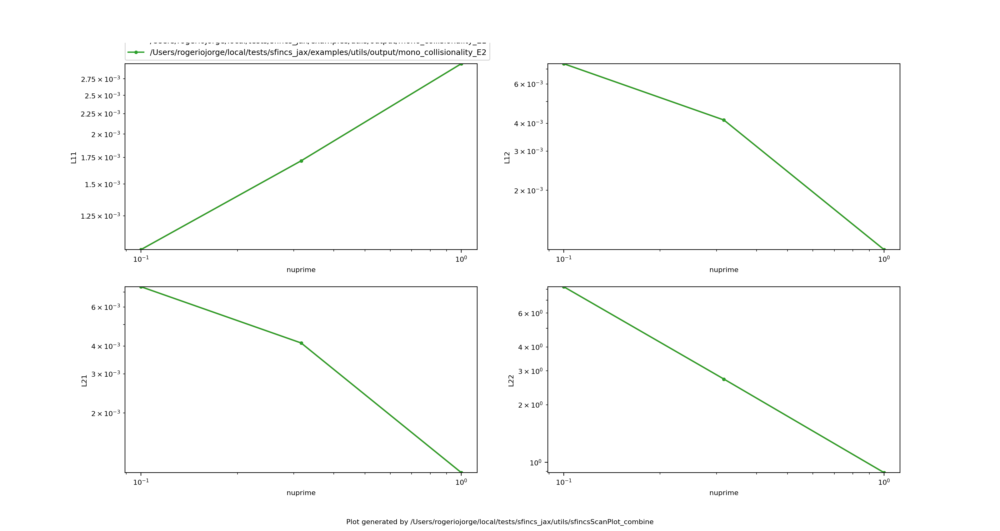
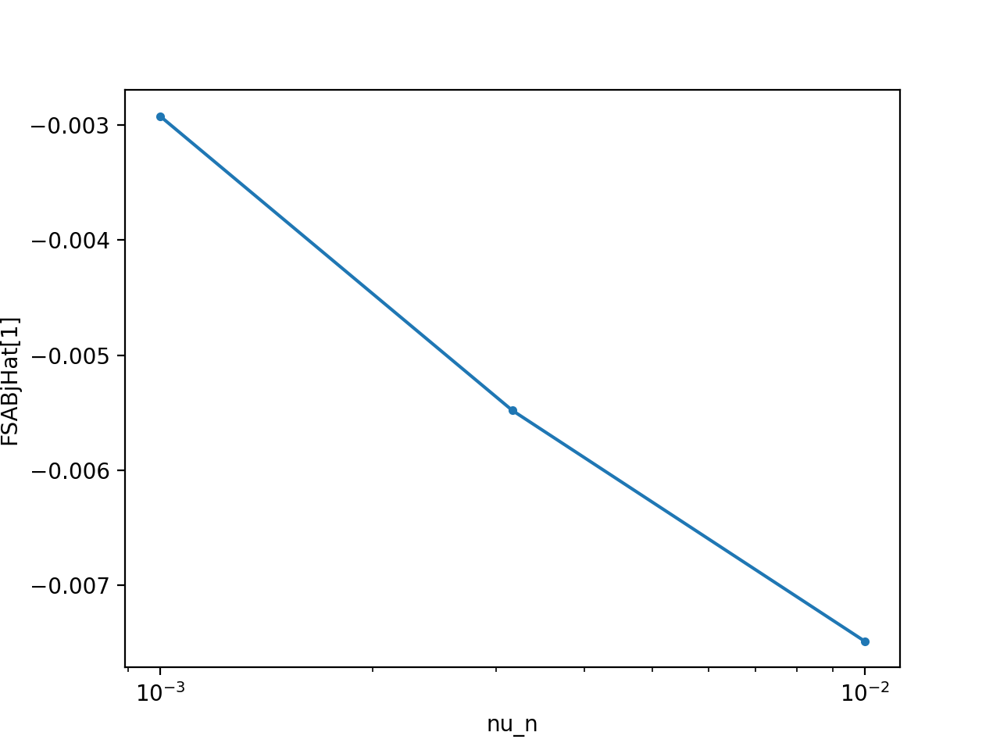

Utils (ported SFINCS v3 scripts)
================================

The ``utils/`` folder at the repository root is a direct, Python‑3 port of
``sfincs/fortran/version3/utils``. Every script runs **only** via ``sfincs_jax`` —
no Fortran executable is required. These utilities are intended for quick
diagnostics, scan workflows, and plotting in a layout that matches upstream
SFINCS v3.

All scripts can be run from any directory. If an ``sfincsOutput.h5`` file is not
present, the scripts will call ``utils/sfincs_jax_driver.py`` to generate one
from a local ``input.namelist``. For scan workflows, the scripts create run
directories and populate them with ``sfincsOutput.h5`` outputs.

.. note::
   The export‑f grid currently uses the **full internal grids**. ``sfincsPlotF``
   expects ``export_delta_f`` or ``export_full_f`` to be enabled in the input
   namelist.

Quick start
-----------

Single run:

.. code-block:: bash

   python utils/sfincsPlot --save-prefix /tmp/sfincsPlot
   python utils/sfincsPlotF --save /tmp/sfincsPlotF.png

Scan:

.. code-block:: bash

   python utils/sfincsScan --input input.namelist --yes
   python utils/sfincsScanPlot_2 --save /tmp/scan_er.png

The following sections document each script and show example figures generated
via ``examples/utils/generate_utils_gallery.py``.

Scan directives (``!ss``)
-------------------------

Upstream SFINCS v3 uses special ``!ss`` lines in ``input.namelist`` to control
scan scripts. These lines are **ignored** by the Fortran namelist reader and
are consumed only by ``sfincsScan``. Key points from the upstream user manual:

- ``!ss`` directives can appear anywhere in ``input.namelist`` (inside or
  outside namelist blocks).
- ``!ss`` directives **do not have defaults**; they must be explicitly set
  when you invoke ``sfincsScan``.
- The scan scripts assume the output file is named ``sfincsOutput.h5`` (the
  upstream default). Renaming the output file breaks the plotting utilities.

Core scan types:

- ``scanType = 1``: resolution convergence scan (``Ntheta/Nzeta/Nxi/Nx/...``)
- ``scanType = 2``: radial electric field scan
- ``scanType = 3``: scan any single numeric input parameter
- ``scanType = 4``: radial scan using a ``profiles`` file (fixed Er at each radius)
- ``scanType = 5``: radial scan with an Er scan at each radius
- ``scanType = 21``: run-spec scan driven by ``runspec.dat``
- ``scanType = 22``: run-spec radial scan with Er scans in each radius directory

Convergence scans (``scanType = 1``) use ``...MinFactor``, ``...MaxFactor``, and
``...NumRuns`` to define log-spaced resolution values (similar to Matlab's
``logspace``). ``Ntheta`` is always forced to odd values.

Example ``!ss`` block:

.. code-block:: text

   !ss scanType = 3
   !ss scanVariable = nuPrime
   !ss scanVariableMin = 0.1
   !ss scanVariableMax = 1.0
   !ss scanVariableN = 4
   !ss scanVariableScale = log

Single‑run plotting
-------------------

``sfincsPlot``
  Plot geometry and core diagnostics from a single ``sfincsOutput.h5``.
  Use ``--save-prefix`` to write ``*_figN.png`` without showing a GUI window.

.. figure:: _static/figures/utils/sfincsPlot_fig1.png
   :alt: Example sfincsPlot output.
   :align: center
   :width: 85%

``sfincsPlotF``
  Plot distribution‑function slices from ``full_f`` or ``delta_f``.
  Requires ``export_delta_f`` or ``export_full_f`` in ``input.namelist``.

.. figure:: _static/figures/utils/sfincsPlotF.png
   :alt: Example sfincsPlotF output.
   :align: center
   :width: 70%

Scan launchers (run ``sfincs_jax``)
-----------------------------------

``sfincsScan``
  Top‑level scan dispatcher. Reads ``!ss`` directives in ``input.namelist`` and
  calls the matching scan script. Use ``--yes`` to run without prompts.

``sfincsScan_1``
  Convergence scan over resolution parameters.

``sfincsScan_2``
  Scan over ``E_r`` (or ``dPhiHatd*`` based on ``inputRadialCoordinateForGradients``).

``sfincsScan_3``
  Scan any single numeric input parameter.

``sfincsScan_4``
  Radial scan using a ``profiles`` file (see ``radialScans``).

``sfincsScan_5``
  Nested radial scan + ``E_r`` scan at each radius.

``sfincsScan_21`` / ``sfincsScan_22``
  Run‑spec scans driven by ``runspec.dat`` (single runs or nested ``E_r`` scans).

Run-spec files (``runspec.dat``)
--------------------------------

``runspec.dat`` begins with one or more comment lines starting with ``!`` (or
``#``/``%``). The **last** comment line lists the variable names; each following
data line supplies values for one run. Example:

.. code-block:: text

   ! rN_wish THats_1 THats_2 dPhiHatdpsiN
     0.2     1.0     1.0     0.0
     0.4     1.2     1.1     0.3

Scan plotting
-------------

``sfincsScanPlot``
  Dispatcher for scan plot scripts. Use ``pdf`` or ``--save`` to write files.

``sfincsScanPlot_1`` – Convergence scan plots

.. figure:: _static/figures/utils/sfincsScanPlot_1.png
   :alt: Convergence scan example.
   :align: center
   :width: 85%

``sfincsScanPlot_2`` – ``E_r`` scan + ambipolar roots

.. figure:: _static/figures/utils/sfincsScanPlot_2.png
   :alt: Er scan example.
   :align: center
   :width: 85%

``sfincsScanPlot_3`` – Single‑parameter scan
  For RHSMode>1, the plot shows transport matrix elements L\ :sub:`ij` vs the
  scanned variable.

.. figure:: _static/figures/utils/sfincsScanPlot_3.png
   :alt: Parameter scan example.
   :align: center
   :width: 85%

``sfincsScanPlot_4`` – Radial scan

.. figure:: _static/figures/utils/sfincsScanPlot_4.png
   :alt: Radial scan example.
   :align: center
   :width: 85%

``sfincsScanPlot_5`` – Radial + ``E_r`` scan

.. figure:: _static/figures/utils/sfincsScanPlot_5.png
   :alt: Radial + Er scan example.
   :align: center
   :width: 85%

``sfincsScanPlot_21`` – Interactive x/y dataset plotting
  Use ``--x``, ``--y``, ``--xscale``, ``--yscale`` to run non‑interactively,
  plus ``--save`` to write a PNG (useful for batch runs/CI).

.. figure:: _static/figures/utils/sfincsScanPlot_21.png
   :alt: Interactive scan plot example.
   :align: center
   :width: 85%

``sfincsScanPlot_combine`` – Combine multiple scans
  Use ``--save`` to write a PNG when running non‑interactively.

.. figure:: _static/figures/utils/sfincsScanPlot_combine.png
   :alt: Combined scan plot example.
   :align: center
   :width: 85%

Radial scan helper
------------------

``radialScans``
  Shared helper for scan types 4 and 5. Reads ``profiles`` and interpolates
  density/temperature profiles and their gradients.

``profiles`` file format (profilesScheme=1)
-------------------------------------------

For radial scans, the default profile scheme (``!ss profilesScheme = 1``)
expects a plain-text ``profiles`` file:

- The first non-comment line is the radial coordinate index
  (``0=psiHat, 1=psiN, 2=rHat, 3=rN``).
- Each following line has ``2*Nspecies+4`` values:
  ``radius, NErs, Er_min, Er_max, nHat(1), THat(1), nHat(2), THat(2), ...``.

Example for a single species:

.. code-block:: text

   # radial coordinate: rN
   3
   0.20  3  -1e-3  1e-3  1.0  1.0
   0.30  3  -1e-3  1e-3  1.0  1.0
   0.40  3  -1e-3  1e-3  1.0  1.0

Monoenergetic transport coefficients
------------------------------------

The figure below shows monoenergetic transport coefficients L\ :sub:`ij` as a
function of collisionality (``nuPrime``) for multiple ``EStar`` values. This
plot is generated by running three scanType=3 directories and combining them
with ``sfincsScanPlot_combine``.

Bootstrap current vs collisionality
-----------------------------------

``sfincsScanPlot_21`` can plot any output dataset. The figure below shows
``FSABjHat`` versus ``nu_n`` for a simple 2‑species PAS case.

Model test (impurity density)
-----------------------------

``ModelTest_AI/testModel.py``
  Compare ``sfincsOutput.h5`` results with an analytic impurity‑density model.

.. figure:: _static/figures/utils/ModelTest_AI.png
   :alt: ModelTest_AI comparison figure.
   :align: center
   :width: 70%

Generating the gallery
----------------------

The gallery figures above are generated by:

.. code-block:: bash

   python examples/utils/generate_utils_gallery.py

Use ``--fast`` to reduce resolutions/scan points for quick sanity checks, and
``--timeout-s`` to apply a per-step timeout to each scan/plot command.
