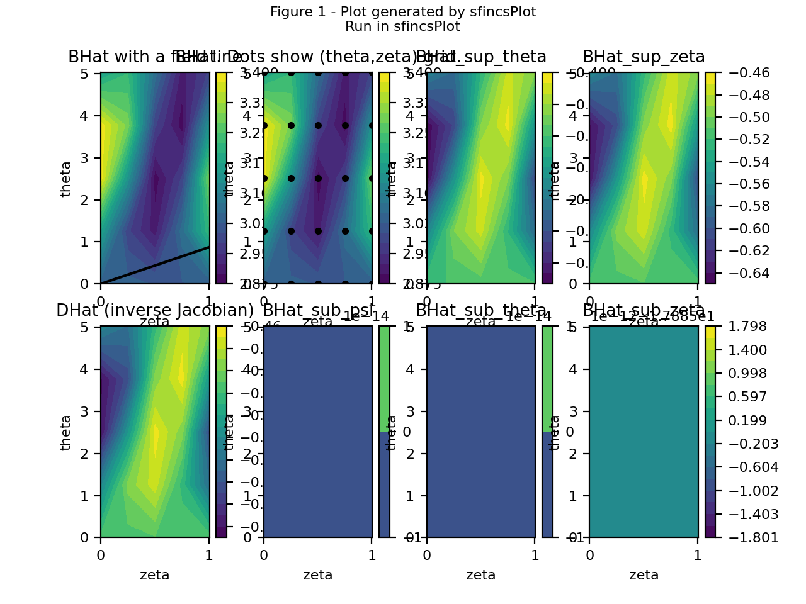
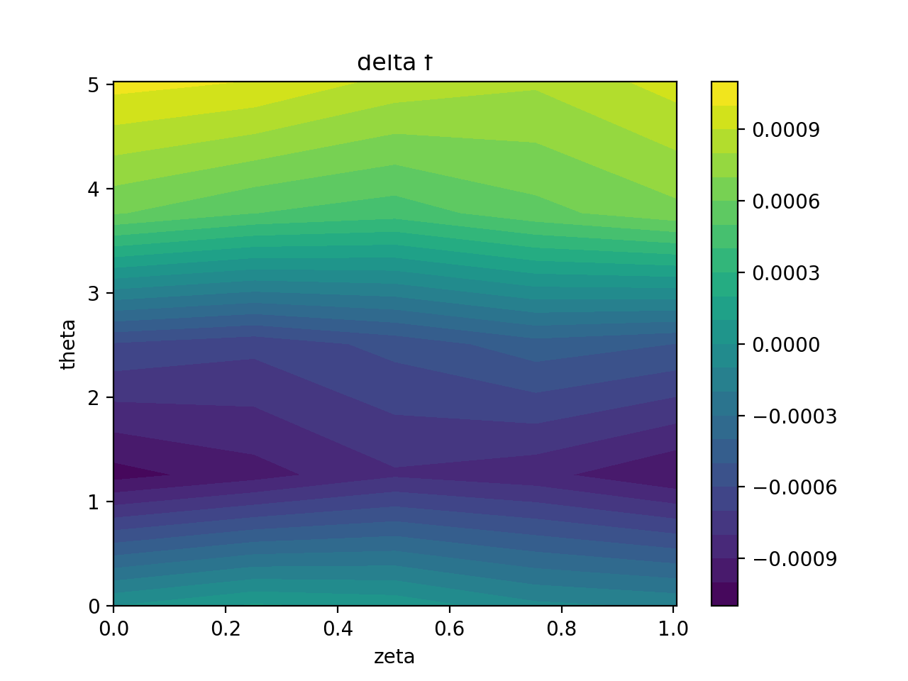
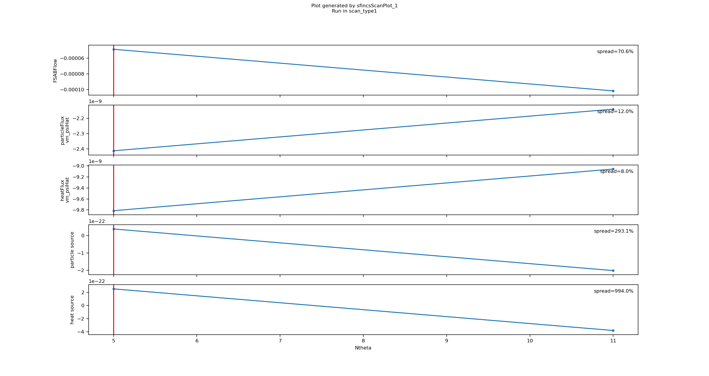
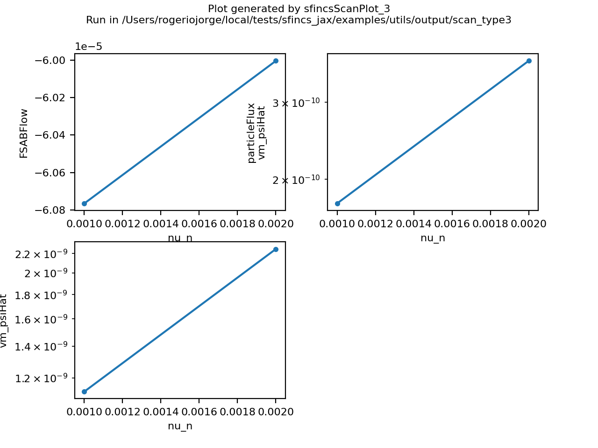
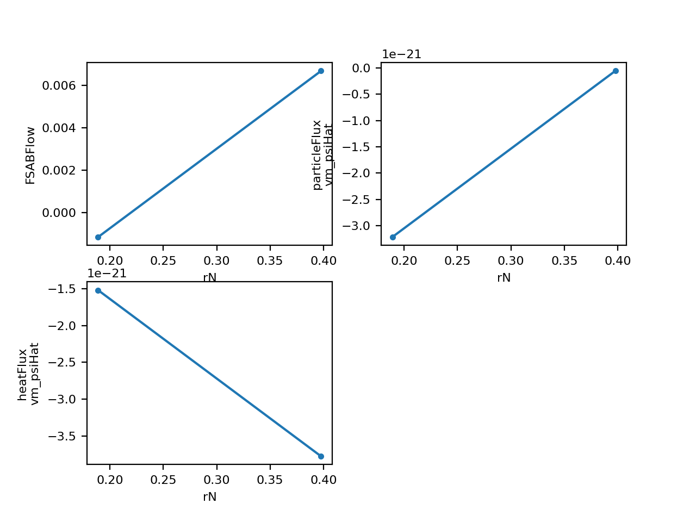
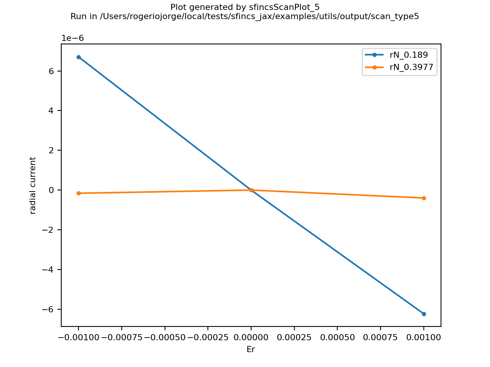
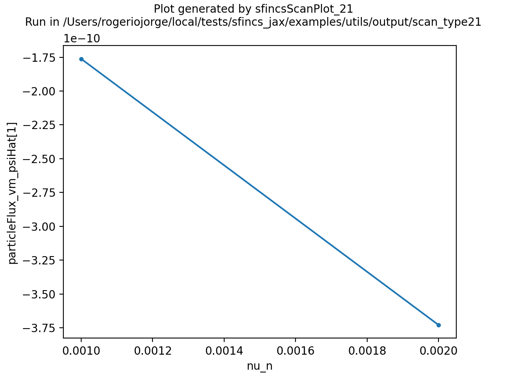
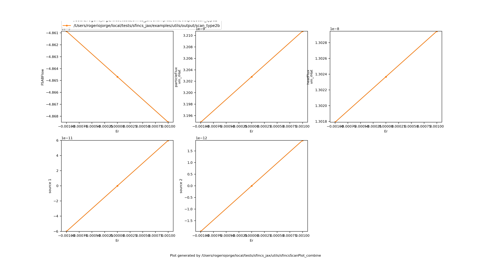
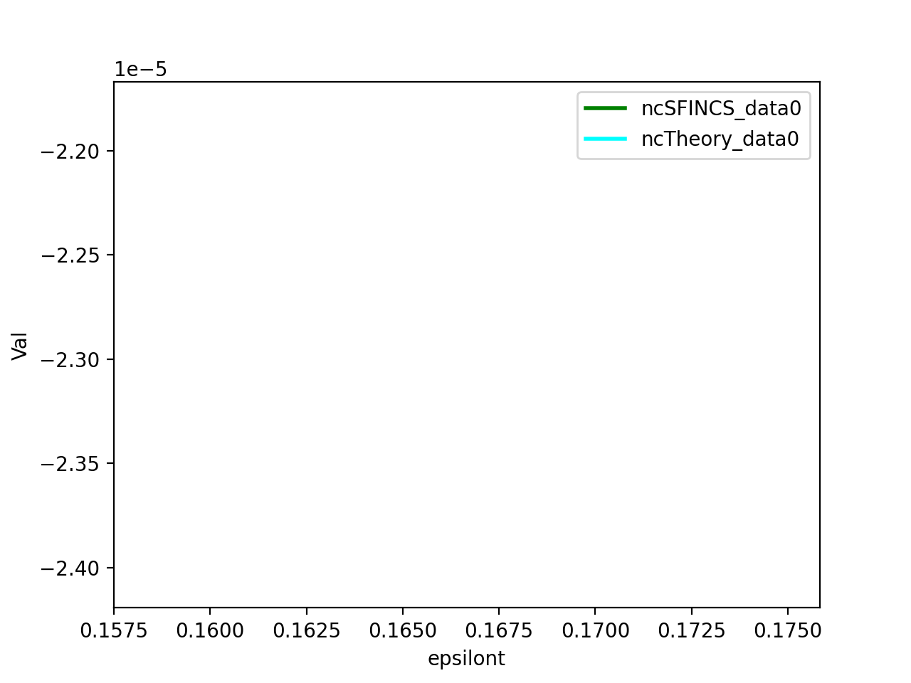

Utils (ported SFINCS v3 scripts)
================================

The ``utils/`` folder at the repository root is a direct, Python‑3 port of
``sfincs/fortran/version3/utils``. Every script runs **only** via ``sfincs_jax`` —
no Fortran executable is required. These utilities are intended for quick
diagnostics, scan workflows, and plotting in a layout that matches upstream
SFINCS v3.

All scripts can be run from any directory. If an ``sfincsOutput.h5`` file is not
present, the scripts will call ``utils/sfincs_jax_driver.py`` to generate one
from a local ``input.namelist``. For scan workflows, the scripts create run
directories and populate them with ``sfincsOutput.h5`` outputs.

.. note::
   The export‑f grid currently uses the **full internal grids**. ``sfincsPlotF``
   expects ``export_delta_f`` or ``export_full_f`` to be enabled in the input
   namelist.

Quick start
-----------

Single run:

.. code-block:: bash

   python utils/sfincsPlot --save-prefix /tmp/sfincsPlot
   python utils/sfincsPlotF --save /tmp/sfincsPlotF.png

Scan:

.. code-block:: bash

   python utils/sfincsScan --input input.namelist --yes
   python utils/sfincsScanPlot_2 --save /tmp/scan_er.png

The following sections document each script and show example figures generated
via ``examples/utils/generate_utils_gallery.py``.

Single‑run plotting
-------------------

``sfincsPlot``
  Plot geometry and core diagnostics from a single ``sfincsOutput.h5``.
  Use ``--save-prefix`` to write ``*_figN.png`` without showing a GUI window.

``sfincsPlotF``
  Plot distribution‑function slices from ``full_f`` or ``delta_f``.
  Requires ``export_delta_f`` or ``export_full_f`` in ``input.namelist``.

Scan launchers (run ``sfincs_jax``)
-----------------------------------

``sfincsScan``
  Top‑level scan dispatcher. Reads ``!ss`` directives in ``input.namelist`` and
  calls the matching scan script. Use ``--yes`` to run without prompts.

``sfincsScan_1``
  Convergence scan over resolution parameters.

``sfincsScan_2``
  Scan over ``E_r`` (or ``dPhiHatd*`` based on ``inputRadialCoordinateForGradients``).

``sfincsScan_3``
  Scan any single numeric input parameter.

``sfincsScan_4``
  Radial scan using a ``profiles`` file (see ``radialScans``).

``sfincsScan_5``
  Nested radial scan + ``E_r`` scan at each radius.

``sfincsScan_21`` / ``sfincsScan_22``
  Run‑spec scans driven by ``runspec.dat`` (single runs or nested ``E_r`` scans).

Scan plotting
-------------

``sfincsScanPlot``
  Dispatcher for scan plot scripts. Use ``pdf`` or ``--save`` to write files.

``sfincsScanPlot_1`` – Convergence scan plots

``sfincsScanPlot_2`` – ``E_r`` scan + ambipolar roots

``sfincsScanPlot_3`` – Single‑parameter scan

``sfincsScanPlot_4`` – Radial scan

``sfincsScanPlot_5`` – Radial + ``E_r`` scan

``sfincsScanPlot_21`` – Interactive x/y dataset plotting
  Use ``--x``, ``--y``, ``--xscale``, ``--yscale`` to run non‑interactively,
  plus ``--save`` to write a PNG (useful for batch runs/CI).

``sfincsScanPlot_combine`` – Combine multiple scans
  Use ``--save`` to write a PNG when running non‑interactively.

Radial scan helper
------------------

``radialScans``
  Shared helper for scan types 4 and 5. Reads ``profiles`` and interpolates
  density/temperature profiles and their gradients.

Model test (impurity density)
-----------------------------

``ModelTest_AI/testModel.py``
  Compare ``sfincsOutput.h5`` results with an analytic impurity‑density model.

Generating the gallery
----------------------

The gallery figures above are generated by:

.. code-block:: bash

   python examples/utils/generate_utils_gallery.py
